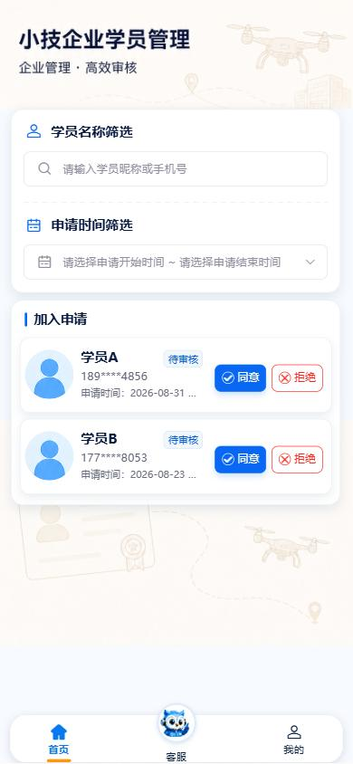
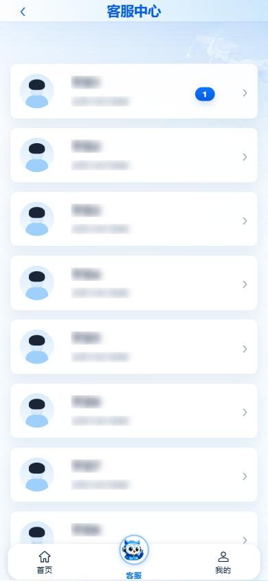
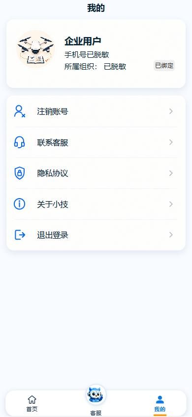

# 小技企业端操作手册

> 适用版本：小技 App 1.0.3（当前 H5 页面同步核对）  
> 适用对象：企业账号使用者、负责学员加入审核和学员沟通的企业工作人员  
> 核对日期：2026-08-31

## 1. 阅读说明

企业端与学员端共用“小技”App，通过登录页身份切换进入不同业务。企业端当前主导航为“首页 / 客服 / 我的”：首页是待审核学员管理，“客服”实际是企业与已审核学员的会话列表，不是企业联系平台客服。

证据口径：

- **已现场验证**：使用现有企业会话只读打开学员管理、学员会话列表和“我的”，通过 Chrome DevTools MCP 核对。
- **代码确认**：路由、按钮、接口和状态处理已从当前工程确认，但本次未执行同意、拒绝、发送消息、修改资料或退出。
- **需账号/权限复验**：短信登录、企业资质提交、审核结果变化和消息发送需要有效账号或会改变业务数据。

截图中的学员姓名、会话预览和企业资料已在浏览器 DOM 中做展示级脱敏；未修改接口或服务端数据。

## 2. 使用前准备

1. 准备已分配企业岗位/权限的手机号。
2. H5 使用短信验证码登录；本机号码一键登录仅适用于支持的正式 App 设备。
3. 确认当前账号属于正确企业或部门。
4. 审核前核对学员昵称、脱敏手机号和申请时间。当前页面没有二次确认，也没有拒绝原因输入框。
5. 只在授权范围内查看学员资料和会话，不转发个人信息。

## 3. 企业登录与进入

企业登录页与学员登录页共用同一界面，页首切换“企业登录”。

### 3.1 短信验证码登录

1. 打开“小技”登录页。
2. 点击页首“企业登录”。
3. 选择“短信验证码登录”。
4. 输入企业账号绑定的 11 位手机号。
5. 点击“获取验证码”，输入收到的 6 位验证码。
6. 勾选同意用户服务协议和隐私政策。
7. 点击“登录 / 注册”。
8. 登录成功后先进入通用首页，首页守卫立即转到“学员管理”。

成功结果：页面显示“小技企业学员管理”和底部“首页 / 客服 / 我的”。

### 3.2 本机号码一键登录

1. 选中“企业登录”。
2. 选择“其他手机号码登录”。
3. 同意协议后点击“本机号码一键登录”。
4. 在运营商授权页完成确认。

H5 不支持该方式；App 中如因 SIM 卡、移动网络或运营商服务失败，应改用短信验证码。

### 3.3 当前登录流程限制

当前登录逻辑不会根据“是否已有企业资质”自动跳转企业注册或审核进度，也不会因未关联企业岗位自动进入注册页。登录后未进入预期企业页面时，不要自行猜测直达地址，应联系系统管理员核对账号岗位和企业关联。

## 4. 首页与导航

| 导航 | 实际落点 | 用途 |
| --- | --- | --- |
| 首页 | 学员管理 | 查询和处理待审核加入申请 |
| 客服 | 学员会话列表 | 与已审核学员进行文字、图片和视频沟通 |
| 我的 | 企业账号页 | 查看企业用户信息、协议、关于和账号操作 |

## 5. 学员加入审核

### 5.1 列表范围

已现场验证页面结构和待审核卡片；未执行同意或拒绝。

当前接口固定查询 `auditStatus=1`，每次最多返回 200 条，因此主列表是“待审核加入申请”，不是完整学员档案或审核历史。处理后的记录刷新后通常从列表消失。

每张申请卡显示：

- 学员昵称。
- 脱敏手机号。
- 申请时间。
- 状态“待审核”。
- “同意”和“拒绝”操作。

### 5.2 按学员筛选

1. 在“学员名称筛选”区域点击输入框。
2. 输入学员昵称或手机号。
3. 查看过滤后的待审核卡片。
4. 清空输入内容可恢复列表。

### 5.3 按申请时间筛选

1. 点击“申请时间筛选”。
2. 选择申请开始时间。
3. 选择申请结束时间。
4. 核对页面显示的时间范围。
5. 查看范围内的待审核申请。

开始时间不应晚于结束时间。未找到记录时先清空姓名和时间条件，再确认是否确实没有待审核申请。

### 5.4 同意申请

代码确认，属于写操作，本次未执行。

1. 找到状态为“待审核”的目标学员。
2. 核对昵称、脱敏手机号和申请时间。
3. 点击“同意”。
4. 等待成功提示“已审核”。
5. 页面重新加载待审核列表，已通过记录通常从列表消失。

结果影响：学员组织状态变为已通过，可使用受限题库、三类考试和岗位详情。

### 5.5 拒绝申请

代码确认，属于写操作，本次未执行。

1. 找到状态为“待审核”的目标学员。
2. 再次核对申请人信息。
3. 点击“拒绝”。
4. 等待提示“已拒绝”。
5. 页面刷新，已拒绝记录通常从待审核列表消失。

当前页面没有二次确认弹窗，也没有拒绝原因输入框。点击即可能触发审核接口，操作前必须核对准确；手册不增加当前界面不存在的“填写拒绝原因”步骤。

### 5.6 审核状态与结果

| 企业操作 | 接口审核值 | 学员端结果 | 企业列表结果 |
| --- | --- | --- | --- |
| 同意 | `2` | 组织已绑定，受限能力解锁 | 刷新后通常移出待审核列表 |
| 拒绝 | `3` | 显示被拒绝，可重新申请 | 刷新后通常移出待审核列表 |

当前企业页不提供审核历史、学员详情页或拒绝原因维护。需要追溯时使用管理平台的正式查询能力或联系管理员。

## 6. 学员会话与沟通

### 6.1 打开学员会话列表

1. 点击底部“客服”。
2. 查看已审核学员列表。
3. 每张卡片显示学员名称、最后消息、时间和未读数。
4. 列表每页最多 50 人。
5. 使用“上一页 / 下一页”翻页；只有当前页满 50 条时“下一页”才可用。

注意：“客服”是企业与学员沟通，不是企业向“小技”平台客服发起咨询。

### 6.2 进入对话

1. 在列表中找到目标学员。
2. 点击学员卡片。
3. 已有会话时系统复用原会话；没有会话时进入对话时创建。
4. 核对标题显示的学员姓名，避免发错对象。
5. 查看历史消息。

### 6.3 发送文字、图片和视频

代码确认，属于写操作，本次未发送。

1. 输入文字，点击发送。
2. 需要附件时点击“+”。
3. 选择图片或视频。
4. 等待媒体上传完成后发送。
5. 图片可点击预览，视频可直接播放。
6. 保持页面在线以接收 WebSocket 实时消息。

发送前检查附件中是否含身份证、手机号、家庭住址、证书编号等敏感信息。发送错误时当前手册没有确认撤回能力，需立即联系管理员处理。

### 6.4 消息异常

| 现象 | 处理 |
| --- | --- |
| 列表为空 | 确认是否已有审核通过的学员，或返回首页检查待审核申请 |
| 下一页不可用 | 当前页不足 50 条，已到最后一页 |
| 实时消息未出现 | 重新进入会话加载历史；检查网络 |
| 媒体发送失败 | 检查文件权限、网络和文件大小，重新选择 |
| 进入了错误学员 | 不发送消息，立即返回列表重新选择 |

## 7. 我的与账号

已现场验证菜单和企业会话身份，截图中的昵称、手机号和组织已脱敏。

### 7.1 页面信息

企业身份下显示当前企业用户的昵称、脱敏手机号和部门/组织信息。企业资料卡不能进入学员资料编辑，也不显示学员练习记录或组织绑定入口。

当前可见菜单：

1. 注销账号。
2. 联系客服。
3. 隐私协议。
4. 关于小技。
5. 退出登录。

“联系客服”在企业身份下仍会进入学员会话列表。

### 7.2 注销账号

点击“注销账号”只会打开说明弹层并引导联系客服，前端不会直接删除企业账号。注销前应确认待审核申请、学员会话、企业资料和业务交接方式。

### 7.3 查看协议和关于信息

1. 点击“隐私协议”查看隐私政策。
2. 阅读完成后返回“我的”。
3. 点击“关于小技”查看产品信息。

### 7.4 退出登录

1. 点击“退出登录”。
2. 在确认弹窗中确认。
3. 系统调用企业退出接口。
4. 本地会话清理后返回登录页。

公共设备使用后必须退出登录。不要仅关闭页面而保留会话。

## 8. 企业注册与资质审核直达页面

本节为代码确认的页面能力，不属于当前常规上手主流程。当前登录页、企业首页和“我的”均没有可见入口，是否由原生壳、短信链接或后端策略进入尚未验证。

### 8.1 企业注册页

路由：`/pages/enterprise/register`

页面要求填写：

- 企业名称。
- 统一社会信用代码。
- 法人姓名和法人身份证号。
- 联系人姓名和联系人手机号。
- 营业执照照片。

代码确认的提交顺序：

1. 填写所有必填项，联系人手机号为 11 位。
2. 拍照或从相册选择营业执照。
3. 提交时先上传营业执照。
4. 保存企业审核资料。
5. 提交企业审核。
6. 成功后进入审核进度页 `status=reviewing`。

营业执照、法人证件和手机号属于敏感信息。没有正式入口或管理员明确指引时，不要通过手工修改网址提交。

### 8.2 审核进度页

路由：`/pages/enterprise/review`

页面显示“提交资料 / 审核中 / 审核结果”三步进度，状态包括：

| 状态 | 页面动作 |
| --- | --- |
| 待审核 | 仅显示进度和说明 |
| 审核中 | 仅显示进度和说明 |
| 已通过 | 点击“进入平台”进入企业学员管理 |
| 已驳回 | 查看驳回原因，点击“重新提交”回企业注册页 |

本次没有用网址参数模拟审核成功或驳回状态，也未提交企业资料。

## 9. 当前限制与边界

1. 登录成功后不会自动判断企业资质并转企业注册/审核页。
2. 学员管理页只查询待审核加入申请，不是完整学员档案。
3. 同意/拒绝没有二次确认。
4. 拒绝没有原因输入框。
5. 没有学员详情页和审核历史页。
6. 企业“客服”是学员沟通，不是平台客服。
7. “账号安全”菜单在模板中被注释，当前不可用。
8. 企业注册和审核进度页存在，但没有已确认的正式入站导航。

## 10. 常见问题速查

| 现象 | 原因判断 | 处理方式 |
| --- | --- | --- |
| 登录后未进入企业学员管理 | 账号岗位或企业关联异常 | 联系管理员核对企业岗位，不手工猜路由 |
| 找不到某位申请人 | 当前只查待审核，或筛选条件过窄 | 清空姓名和时间筛选后重查 |
| 审核后记录消失 | 已处理记录移出待审核列表 | 属于当前正常行为，不代表数据删除 |
| 无法填写拒绝原因 | 当前页面未实现该字段 | 审核前按企业流程线下核对，必要时联系管理员 |
| 客服列表没有学员 | 可能暂无已审核学员 | 先检查首页待审核申请 |
| 企业注册页找不到入口 | 当前前端没有可见入站导航 | 联系管理员确认正式入口和资质流程 |
| 页面自动回登录 | 会话过期 | 重新获取验证码登录 |

