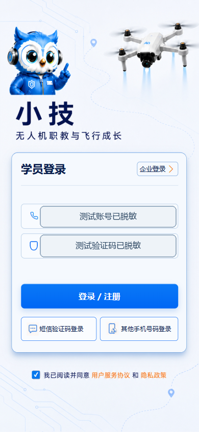
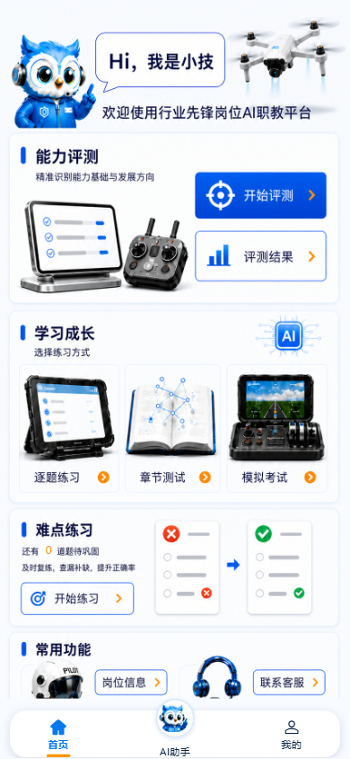
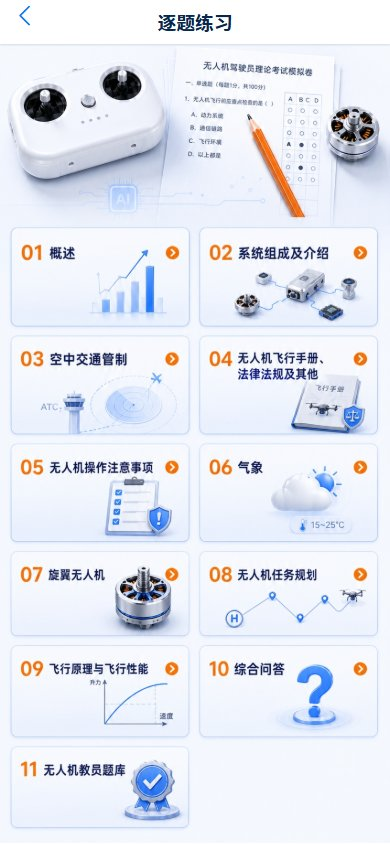
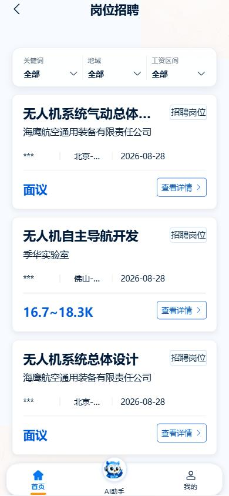
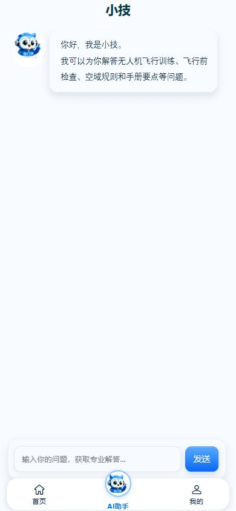

# 小技学员端操作手册

> 适用版本：小技 App 1.0.3（当前 H5 页面同步核对）  
> 适用对象：参加无人机职业学习、题库练习、考试、测评和求职的学员  
> 核对日期：2026-08-31

## 1. 阅读说明

本手册按学员实际使用顺序说明登录、首页导航、组织申请、练习与考试、测评与报告、岗位、AI 助手、客服和账号操作。

证据口径：

- **已现场验证**：在本地 H5 `http://localhost:5173/` 使用有效学员会话只读打开，并通过 Chrome DevTools MCP 核对页面。
- **代码确认**：路由、按钮、接口和状态处理已从当前工程确认，但本次没有执行会改变业务数据的操作。
- **需账号/权限复验**：需要短信验证码、组织审核、答题提交、报告生成或消息发送，因此没有在本次文档编制中执行。

安全提示：不要向他人提供短信验证码、身份证号、登录令牌或完整手机号。涉及真实姓名、身份证号、测评报告和聊天内容的页面不建议在公共场合展示。

## 2. 使用前准备

1. 准备可以接收短信验证码的手机号。
2. H5 环境使用短信验证码登录；“本机号码一键登录”只适用于安装了正式 App 的支持设备。
3. 如需使用受限题库、三类考试或打开岗位详情，应先完成组织申请并等待企业审核通过。
4. 首次拍照、选择图片或视频时，按系统提示授予相机、相册或存储权限。
5. 保持网络可用。报告生成、AI 解答和实时客服均依赖后端服务。

## 3. 登录与进入

### 3.1 短信验证码登录

1. 打开“小技”，进入登录页。
2. 确认页首选中“学员登录”。
3. 点击“短信验证码登录”。
4. 输入 11 位手机号，点击“获取验证码”。
5. 输入收到的 6 位验证码。
6. 勾选“我已阅读并同意”。需要查看协议时，分别点击“用户服务协议”或“隐私政策”。
7. 点击“登录 / 注册”。同一入口同时承接已有账号登录和新手机号注册。
8. 登录成功后进入学员首页。

成功结果：页面显示学员首页及“首页 / AI助手 / 我的”底部导航。

常见提示：

- 未勾选协议：提示“请先同意用户协议和隐私协议”。
- 手机号格式错误：页面阻止提交并提示检查号码。
- 验证码为空或不足 6 位：页面阻止提交。
- 验证码失效：重新获取验证码后再登录，不要连续重复点击。

### 3.2 本机号码一键登录

1. 在 App 登录页选中“其他手机号码登录”。
2. 阅读并同意用户协议和隐私政策。
3. 点击“本机号码一键登录”。
4. 根据运营商授权页完成确认。

限制：该能力依赖 SIM 卡、运营商移动网络、UniVerify 和云端配置，H5 不支持。失败时返回短信验证码方式。

### 3.3 会话过期

当接口返回未登录或令牌失效时，系统会清理失效会话并回到登录页。重新获取验证码登录即可；不要反复刷新受限页面。

## 4. 首页与导航

### 4.1 首页入口

首页提供以下业务入口：

1. 开始测评：选择“自我评测”或“职业规划评测”。
2. 评测结果：选择相应报告并查看生成状态或结果。
3. 逐题练习：按题目主题逐题训练。
4. 章节测试：按主题创建测试批次。
5. 模拟考试：选择理论、综合或教员考试模式。
6. 错题练习：按主题复练历史错题；首页同时显示错题总数。
7. 岗位信息：筛选招聘岗位并打开外部详情。
8. 联系客服：进入与“小技客服”的对话页。

### 4.2 底部导航

| 导航 | 用途 |
| --- | --- |
| 首页 | 返回上述功能入口 |
| AI助手 | 查询无人机训练、检查、空域规则和手册知识 |
| 我的 | 查看资料、组织状态、记录以及账号操作 |

## 5. 组织申请与权限解锁

### 5.1 申请加入组织

代码确认，需账号/权限复验。

1. 打开“我的”。
2. 点击“绑定组织”。受限题库、考试或岗位详情的提示弹层也可以引导到此页面。
3. 在“选择所属组织”中输入企业名称关键词。
4. 从查询结果中选择正确企业，点击“申请加入”。
5. 在确认表单中填写真实姓名、身份证号和性别。
6. 核对企业和个人信息，提交申请。
7. 页面提示“申请已提交”后等待企业审核。

不要选择名称相近但并非本人所属的企业。身份证号属于敏感信息，只在正式页面中填写。

### 5.2 组织状态

| 状态 | 页面表现 | 权限影响 | 后续动作 |
| --- | --- | --- | --- |
| 未绑定 | 可搜索组织或“暂不绑定组织” | 主题 1 以外的题库、全部考试和岗位详情受限 | 提交组织申请 |
| 待审核 | 显示已申请组织和等待审核 | 受限能力尚未解锁 | 等待企业处理 |
| 已通过 | 显示当前组织/已绑定 | 可进入受限题库、考试和岗位详情 | 正常使用 |
| 已拒绝 | 显示驳回状态，可能显示原因 | 受限能力尚未解锁 | 核对信息后重新申请 |
| 已跳过 | 可继续使用不受限能力 | 与未绑定相同 | 后续从“我的”重新申请 |

特殊规则：当前代码仅题目主题 ID 为 `1` 时不要求组织审核通过；其他主题均会检查组织状态。

## 6. 逐题练习、章节测试与错题练习

### 6.1 逐题练习

已现场验证到题目主题列表；创建批次、答题和提交步骤为代码确认，需账号复验。

1. 首页点击“逐题练习”。
2. 在“逐题练习”主题列表选择分类，例如“概述”“系统组成及介绍”“空中交通管制”等。
3. 受限主题会先检查组织审核状态；未通过时按提示申请组织。
4. 如存在未完成批次，系统继续上次进度；否则创建新的练习批次。
5. 在批次详情核对题目分类、题量、总分、答题时间和考试类型。
6. 点击“开始练习”。
7. 单选题点击选项后自动判题；多选题或文本题选择/填写后点击“提交”。
8. 逐题练习会显示“回答正确/回答错误”、正确答案、试题详解和答题摘要。
9. 点击“下一题”继续；最后一题点击“完成练习”。
10. 完成后进入“答题详情”，查看得分、正确数和错误数，再返回首页。

### 6.2 章节测试

1. 首页点击“章节测试”。
2. 选择测试主题。
3. 核对批次详情后点击“开始练习”。
4. 按题目顺序作答。
5. 最后一题提交后进入结果详情。

与逐题练习的区别：章节测试在作答过程中不展示逐题解析，完成后统一查看结果。

### 6.3 错题练习

1. 查看首页“错题练习”显示的错题总数。
2. 总数大于 0 时点击入口。
3. 在主题列表查看各主题错题数。
4. 选择有错题的主题，创建错题复练会话。
5. 按正常答题方式完成复练。

异常处理：总数为 0 时不会启动；某主题无错题时提示“当前暂无错题可练习”。

### 6.4 AI 深度解答

答题判定后，如页面显示“AI 深度解答”：

1. 点击“AI 深度解答”。
2. 核对错题回顾、你的选择和正确答案。
3. 等待流式解答；不支持流式时系统会回退到普通接口或知识库查询。
4. 需要时继续追问。

服务失败时使用“重新加载”，或稍后从该题再次进入。不要在问题中提交身份证号、手机号等个人信息。

## 7. 模拟考试

已现场验证考试模式页面；创建考试批次和交卷未执行。

1. 首页点击“模拟考试”。
2. 未绑定组织时，按提示先申请组织。
3. 审核通过后进入“选择考试模式”。
4. 在“理论考试 / 综合考试 / 教员考试”中选择一种模式。
5. 系统创建正式批次并进入详情页。
6. 核对题量、总分、答题时间和考试类型。
7. 点击开始答题，留意剩余时间。
8. 完成所有题目后按页面要求提交。
9. 时间归零时系统提示“考试时间已到，本次考试结束”，随后进入答题详情。

重要限制：当前代码中“理论考试”和“综合考试”的界面标签与内部模式值映射相反。手册不推断内部规则，参加正式考试前应以批次详情显示的考试类型、题量和时间为准。

## 8. 自我测评与职业规划评测

### 8.1 自我测评

代码确认，提交与报告生成需账号复验。

1. 首页点击“开始测评”。
2. 选择“自我评测”。
3. 如果已有完成记录，系统会询问是否重新测评；确认会重置已完成测评。
4. 首次进入填写基本资料：姓名和手机号必填，身份证号、毕业院校、专业选填。
5. 点击“下一步”保存资料并加载题目。
6. 普通题逐题作答；“核心量表”和“补充模块”按组作答。
7. 使用“上一题/上一组”“下一题/下一组”检查答案。
8. 最后一题点击“提交并生成报告”。
9. 页面提示报告生成中并返回首页。
10. 从“评测结果 > 自我评测报告”查看状态和结果。

### 8.2 职业规划评测

1. 首页点击“开始测评”。
2. 选择“职业规划评测”。
3. 已有记录时确认是否重新评测。
4. 逐题完成工作价值、兴趣倾向等题目。
5. 工作价值题中，“最看重的工作价值”只能选 3 项；“最不看重”不能与这 3 项重复。
6. 最后一题点击“提交并生成报告”。
7. 从“评测结果 > 职业规划评测报告”查看状态和结果。

### 8.3 报告状态

| 状态 | 含义 | 操作 |
| --- | --- | --- |
| 未完成 | 测评尚未提交 | 返回对应测评继续完成 |
| PENDING | 后端正在分析 | 保持网络，页面每 3 秒轮询一次 |
| SUCCESS | 报告已生成 | 阅读富文本报告 |
| FAILED | 生成失败 | 查看原因，点击重新生成 |

报告为异步真实计算结果。不要通过修改网址参数或缓存判断报告成功。

## 9. 练习记录与结果

1. 打开“我的”。
2. 点击“练习记录”。
3. 按练习分类筛选。
4. 按全部、近 7 天或近 30 天筛选时间范围。
5. 查看每条记录的标题、满分、实际得分、正确数、错误数和练习时间。

当前限制：记录卡没有点击进入详情的事件；完整答题详情主要在刚完成练习后自动打开。“自测记录”页面已注册，但“我的”页当前没有可见入口。

## 10. 岗位招聘

已现场验证岗位列表与筛选控件，未打开外部详情。

1. 首页点击“岗位信息”。
2. 使用“关键词”“地域”“工资区间”筛选。
3. 下拉刷新列表；滚动到底部加载更多，每页默认 10 条。
4. 查看岗位名称、公司、来源、地区、发布日期和薪资。
5. 需要时点击公司名展开完整公司名称。
6. 点击“查看详情”。
7. 组织审核通过后，系统打开后端提供的外部岗位链接；H5 在新窗口打开，App 调用系统浏览器。

异常处理：

- 组织未通过：按提示去绑定企业或联系客服。
- 无详情链接：提示“暂无岗位详情链接”。
- 第三方页面打不开：检查网络，稍后重试；第三方内容不由“小技”控制。

## 11. AI 助手

已现场验证空白会话与输入区，本次未发送问题。

1. 点击底部“AI助手”。
2. 在输入框填写无人机飞行训练、飞行前检查、空域规则或手册要点等问题。
3. 点击“发送”或使用键盘发送。
4. 查询期间等待“知识库查询中”。
5. 查看答案；存在引用时，继续查看知识来源和引用内容。
6. 服务失败时换一种明确问法重试。

建议每次只问一个具体问题，并提供机型、训练阶段或规则场景。AI 答案用于学习辅助，正式飞行应以法规、批准文件和教员要求为准。

## 12. 客服

学员可从首页“联系客服”、“我的 > 联系客服”，或组织/岗位限制提示进入客服对话。

1. 进入对话后查看欢迎语和历史消息。
2. 在输入框输入文字并发送。
3. 点击“+”选择图片或视频。
4. 媒体上传完成后发送；图片可预览，视频可播放。
5. 保持页面在线以接收 WebSocket 实时消息。

如实时连接不可用，仍可使用普通接口发送，并通过重新进入页面刷新历史消息。本次未打开真实聊天截图，以避免泄露会话内容。

## 13. 我的、资料与账号

### 13.1 查看和修改资料

1. 点击底部“我的”。
2. 查看头像、昵称、脱敏手机号、所属组织及绑定状态。
3. 点击资料卡或“更换头像”进入编辑。
4. 选择头像、修改昵称。
5. 点击保存，等待成功提示。

资料修改属于写操作，本次未执行。上传头像前确认图片中没有证件、地址或其他敏感内容。

### 13.2 注销账号

“注销账号”当前只显示说明弹层并引导联系客服，不会在前端直接删除账号。需要注销时通过客服核对流程和数据影响。

### 13.3 退出登录

1. 打开“我的”。
2. 点击“退出登录”。
3. 在确认弹窗中确认。
4. 系统调用学员退出接口、清理本地会话并返回登录页。

在公共设备上使用后必须退出登录，并关闭浏览器页面。

## 14. 当前不可作为常规入口的页面

以下页面在代码中存在，但“我的”页当前没有可见入站入口：

| 页面 | 路由 | 当前说明 |
| --- | --- | --- |
| 自测记录 | `/pages/practice/self-test-record` | 已注册，但模板未渲染入口 |
| 设置 | `/pages/profile/settings` | 处理函数存在，页面无可见按钮 |
| 绑定手机号 | `/pages/profile/phone-bind` | “账号安全”菜单被注释 |

不要依赖手工修改网址进入这些页面完成正式业务。

## 15. 常见问题速查

| 现象 | 原因判断 | 处理方式 |
| --- | --- | --- |
| 业务页自动回登录 | 会话过期或未登录 | 重新获取验证码登录 |
| 题库主题无法进入 | 组织未审核通过 | 申请组织并等待企业审核 |
| 考试入口提示绑定组织 | 三类考试均要求组织通过 | 完成组织申请 |
| 首页错题数为 0 | 当前无可复练错题 | 先完成练习，错题产生后再进入 |
| 报告长时间生成中 | 后端异步分析未完成 | 保持网络，稍后刷新报告页 |
| AI 或客服无响应 | 网络或服务暂时不可用 | 稍后重试，必要时重新进入页面 |
| 岗位详情未打开 | 未绑定组织或无外部链接 | 按提示绑定组织，或更换岗位 |

