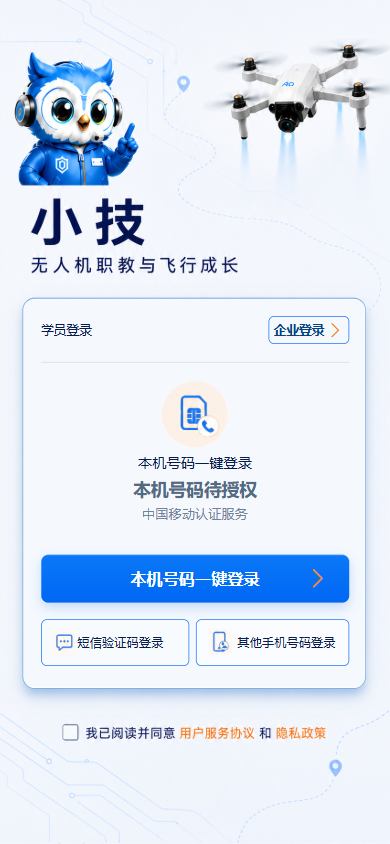
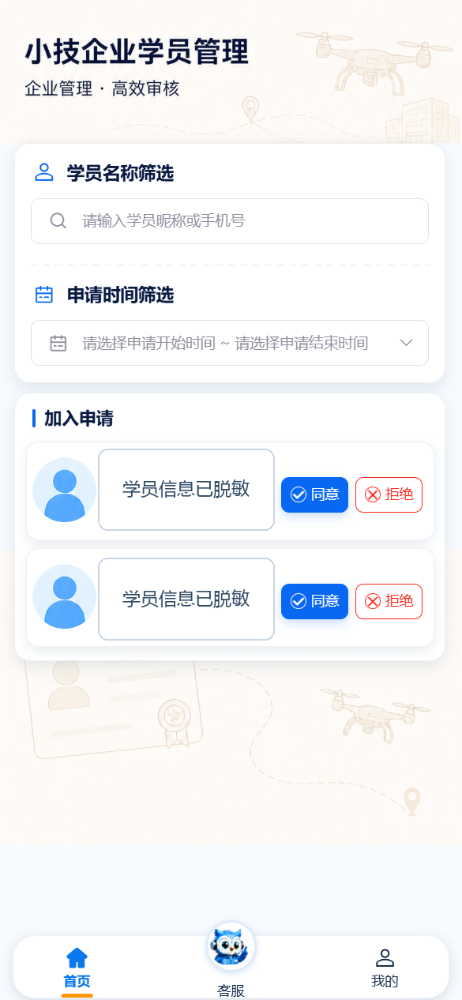
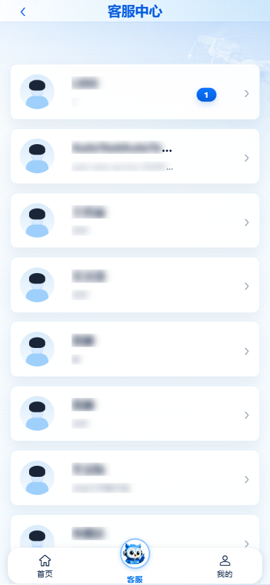
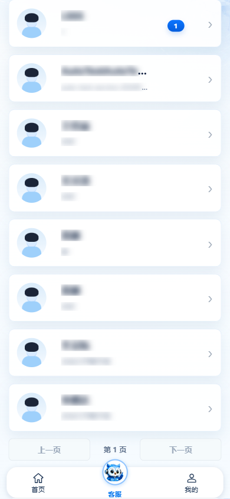
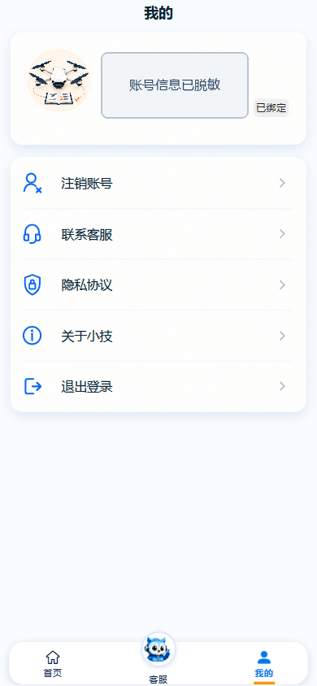

# 飞行学院教员端操作手册

> 适用版本：2026-08-31 项目现场  
> 适用对象：使用飞行学院 App 审核学员加入申请并与学员沟通的教员  
> 重要说明：当前项目没有独立的“教员登录”入口。教员使用“企业登录”，系统根据账号关联岗位识别教员身份。

## 1. 手册范围

本手册说明教员端当前可用的三项主要工作：

1. 从企业入口登录并确认教员身份。
2. 在首页查询、同意或拒绝学员加入申请。
3. 在客服中心查看已通过审核的学员并进行文本、图片或视频沟通。
4. 在“我的”查看账号与组织信息，并处理联系客服、协议、账号注销和退出登录。

本手册不包含学员端的练习、考试、自测、岗位浏览等能力。学员端出现的“教员考试”是一种考试模式，不是教员出题、监考或阅卷入口。

## 2. 使用前准备

教员登录前应由管理员确认：

- 登录手机号已在目标租户中关联后台用户。
- 后台用户至少关联一个岗位编码包含 `WT` 的岗位。
- 同一手机号在当前租户中的用户匹配唯一。
- 手机能够接收验证码，或已具备页面支持的其他登录条件。
- 账号所属企业、部门和教员岗位均为当前有效状态。

如账号、租户、岗位或验证码异常，应联系管理员核对正式账号记录。不要借用他人账号、猜测验证码或反复切换未知租户。

## 3. 登录教员端

### 3.1 选择正确身份

1. 打开飞行学院 App 或管理员提供的正式访问入口。
2. 在登录页顶部选择“企业登录”。
3. 根据设备和页面实际显示，选择本机号码一键登录、短信验证码登录或其他手机号码登录。
4. 阅读《用户服务协议》和《隐私政策》，确认同意后继续。
5. 按页面要求完成登录，等待系统进入企业学员管理首页。

图 1：企业登录入口。本图采自本地运行页面，未显示手机号、验证码、密码或 Token。

### 3.2 登录成功的判断

登录成功后应同时满足：

- 页面进入“小技企业学员管理”。
- 底部只显示“首页、客服、我的”三个入口。
- 首页能够加载学员加入申请或明确的空状态。

如果进入了练习、考试、岗位等学员导航，说明当前身份不是教员/企业身份，应退出并重新选择“企业登录”，同时由管理员核对 `WT` 岗位。

### 3.3 常见登录异常

| 现象 | 处理方式 |
| --- | --- |
| 收不到验证码 | 检查手机号、短信拦截和网络；仍失败时联系管理员，不连续频繁获取验证码。 |
| 提示账号不存在或无法匹配 | 由管理员核对手机号与后台用户、租户和岗位关系。 |
| 登录后身份错误 | 退出登录，由管理员确认岗位编码包含 `WT`，再重新登录。 |
| 页面持续加载或接口失败 | 切换稳定网络并重试一次；仍失败时记录时间、页面和提示内容交管理员。 |

## 4. 首页与导航

| 底部入口 | 主要用途 | 关键结果 |
| --- | --- | --- |
| 首页 | 查询并处理学员加入企业的申请 | 申请变为待审核、已通过或已拒绝 |
| 客服 | 查看已审核通过的学员并进入会话 | 查看历史消息、发送文本/图片/视频 |
| 我的 | 查看本人、手机号和所属组织 | 联系客服、查看协议、退出或注销账号 |

图 2：教员首页。手机号已由系统脱敏；截图中的记录为测试环境现场，不代表固定业务数据。

## 5. 审核学员加入申请

### 5.1 查询申请

1. 点击底部“首页”。
2. 在“学员名称筛选”中输入学员昵称或手机号，以定位特定申请。
3. 需要核对时间范围时，在“申请时间筛选”中选择开始时间和结束时间。
4. 查看申请卡片中的学员名称、脱敏手机号、申请时间和当前状态。
5. 清除筛选条件后可恢复查看全部当前可见申请。

### 5.2 同意申请

> 风险提示：同意会写入真实审核状态，并建立学员与企业的业务关系。只在确认申请人、目标企业和申请时间无误后操作。

1. 在状态为“待审核”的记录中点击“同意”。
2. 按页面提示确认操作。
3. 按钮显示“处理中”时不要重复点击或返回页面。
4. 等待处理完成，确认记录状态变为“已通过”。
5. 进入“客服”确认该学员随后可出现在已审核学员列表中。

### 5.3 拒绝申请

> 风险提示：拒绝会改变学员加入结果。应先核对申请对象，必要时按单位流程留存拒绝原因。

1. 在状态为“待审核”的记录中点击“拒绝”。
2. 按页面提示确认操作。
3. 等待“处理中”结束。
4. 确认记录状态变为“已拒绝”。

### 5.4 审核异常处理

- 状态未变化：先刷新或重新进入首页核对，不要立即连续点击。
- 提示无权限：停止操作，由管理员检查账号岗位、租户和接口权限。
- 同一记录已被处理：以刷新后的最新状态为准，不覆盖其他审核人的结果。
- 学员信息不一致：不要审核，记录申请时间和脱敏手机号后交管理员核对。

## 6. 客服学员列表

### 6.1 打开列表并定位会话

1. 点击底部“客服”。
2. 等待学员列表加载完成。
3. 根据学员名称、最近消息、最近消息时间和未读数判断需要处理的会话。
4. 点击目标学员卡片进入会话。

图 3：客服学员列表。姓名和最近消息已做模糊处理，不影响入口识别。

### 6.2 使用分页

客服列表每页固定请求 50 名学员：

1. 点击“下一页”查看后续学员。
2. 点击“上一页”返回前一页。
3. 中间的“第 N 页”表示当前页码。
4. 第一页不能点击“上一页”；当前页不足 50 条时不能继续进入下一页。

图 4：列表底部分页。列表姓名和消息已模糊处理。

列表为空时，先确认是否已有审核通过的学员；加载失败时按页面提示重试一次。不要把第二页以后的学员误认为不存在。

## 7. 与学员沟通

### 7.1 查看历史消息

1. 从客服列表进入目标学员会话。
2. 先核对页面上的学员身份和已有历史消息。
3. 需要查看较早内容时向上滚动，等待历史消息加载。
4. 历史消息加载失败时返回列表后重新进入；仍失败则记录学员、时间和错误提示。

### 7.2 发送文本

1. 点击消息输入框。
2. 输入清晰、必要的业务内容。
3. 发送前再次核对会话对象。
4. 点击“发送”，等待消息出现在会话区。
5. 返回列表时可通过最近消息确认发送结果。

已有会话会直接复用；学员尚无会话时，系统会在首次发送前自动创建会话。页面没有需要人工点击的“新建会话”按钮。

### 7.3 发送图片或视频

1. 点击图片或视频入口。
2. 从设备中选择需要发送的文件。
3. 发送前核对文件内容、会话对象和隐私范围。
4. 等待上传和发送完成，再检查消息类型和内容是否正确。
5. 图片可点击预览，视频可在会话中播放。

不得上传无授权的身份证件、个人隐私、企业内部资料或与业务无关的媒体。发送失败或实时连接异常时不要连续重复发送，应先返回列表核对最近消息。

## 8. “我的”与账号操作

“我的”页面展示姓名/昵称、脱敏手机号、所属组织或部门，以及账号相关菜单。

图 5：“我的”页面。本图为本地测试账号现场，手机号已由系统脱敏；名称和组织只用于说明字段位置。

### 8.1 可用菜单

- 注销账号：进入账号注销流程。注销可能导致账号和业务关系不可恢复，必须按单位流程确认后执行。
- 联系客服：联系平台客服处理账号或使用问题。
- 隐私协议：查看当前隐私政策。
- 关于小技：查看产品信息。
- 退出登录：结束当前登录会话并返回登录页。

当前版本未提供可操作的“账号安全”入口，企业/教员身份也不能通过点击头像修改头像。

### 8.2 安全退出

1. 点击底部“我的”。
2. 点击“退出登录”。
3. 按页面确认提示完成退出。
4. 确认页面返回登录页。

共用设备使用结束后必须退出登录。不要只关闭页面或切换到后台。

## 9. 状态与结果速查

| 状态/提示 | 含义 | 建议动作 |
| --- | --- | --- |
| 待审核 | 申请尚未形成最终结果 | 核对申请后同意或拒绝 |
| 处理中 | 审核请求正在提交 | 等待完成，不重复点击 |
| 已通过 | 学员已获准加入企业 | 可在客服列表继续沟通 |
| 已拒绝 | 学员加入申请被拒绝 | 无需重复处理；有争议时联系管理员 |
| 学员列表加载中 | 正在查询已审核学员 | 等待加载完成 |
| 加载失败 | 网络或服务请求异常 | 重试一次，仍失败则记录现场 |
| 实时连接异常 | WebSocket 实时链路不可用 | 核对消息结果，避免重复发送 |

## 10. 权限、安全与支持

- 教员只能处理本人账号和所属租户授权范围内的数据。
- 不通过地址栏、开发者工具或接口绕过不可见入口。
- 不借用管理员或其他教员账号处理日常业务。
- 审核、注销和发送媒体前必须核对对象与影响。
- 报障时提供环境、时间、页面、操作步骤和错误提示；不要提交密码、验证码、Token 或完整个人信息。

## 11. 当前限制

- 教员身份依赖后台 `WT` 岗位识别，没有独立教员路由集。
- 动态账号、租户和岗位状态会影响登录与可见数据。
- 会话实时消息依赖网络和 WebSocket 链路。
- 本手册未执行真实审核、发送消息、注销账号等写操作；相关结果说明依据当前页面和代码契约整理。

