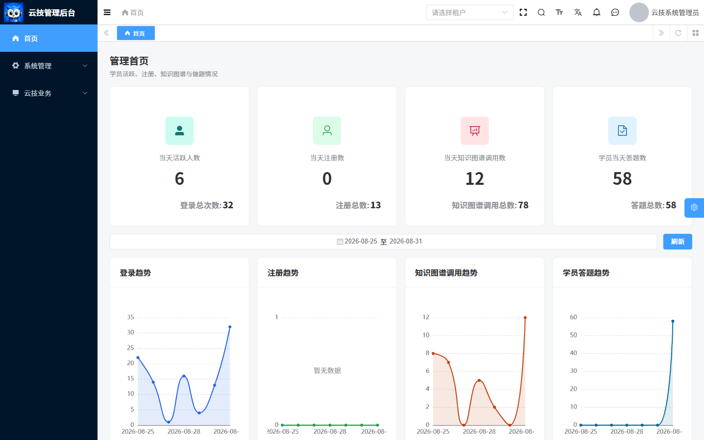
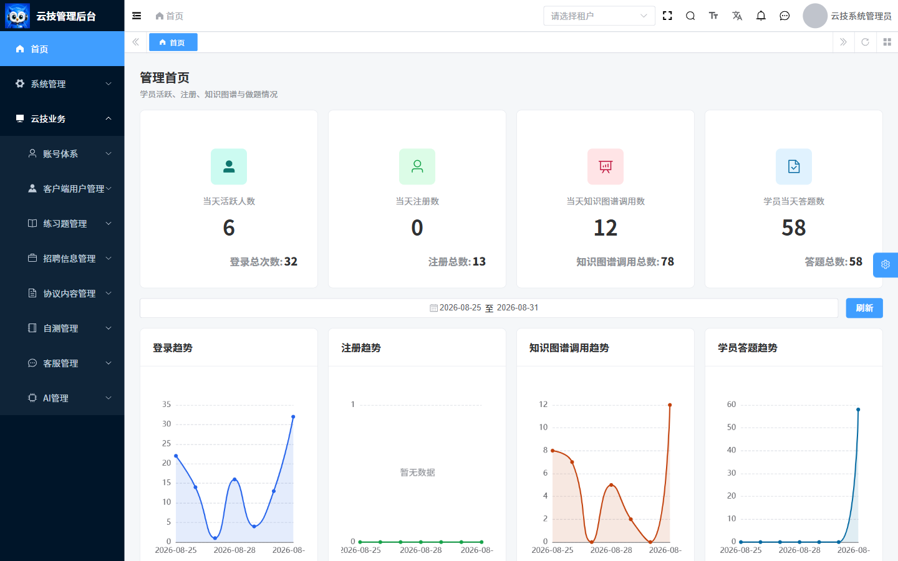
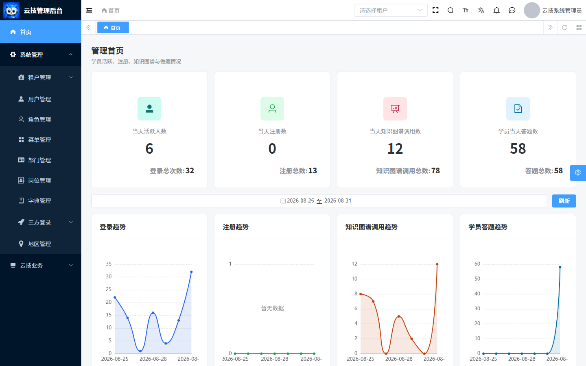
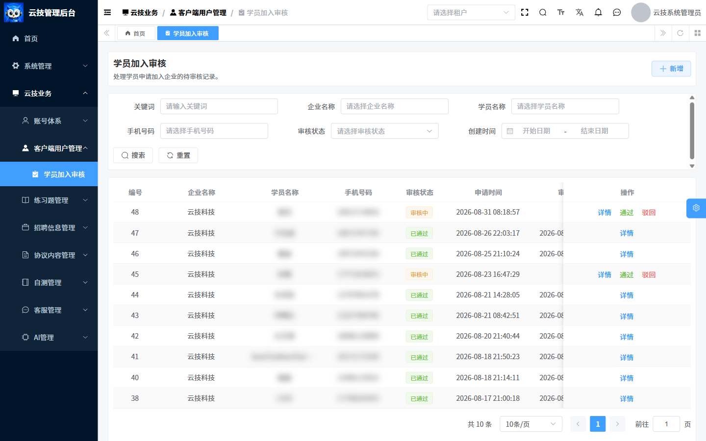
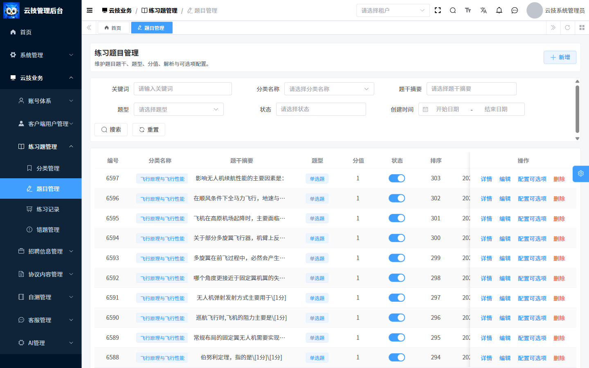

# 飞行学院管理平台操作手册

> 适用版本：2026-08-31 测试管理平台现场  
> 适用对象：平台管理员、租户管理员、业务审核人员、内容运营、客服和经授权的系统维护人员  
> 重要说明：管理平台菜单和按钮由登录账号的角色、菜单权限与数据权限动态下发，不同账号看到的内容可能不同。

## 1. 使用原则

1. 只使用本人正式账号，不借用超级管理员账号处理日常业务。
2. 登录后先核对右上角账号和左侧菜单是否符合职责。
3. 看不到菜单或按钮时联系权限管理员，不通过地址栏、开发者工具或手工接口绕过权限。
4. 删除、启停、审核、发布、采集、同步、密码重置和权限分配均属于高风险操作。
5. 高风险操作必须遵循最小权限、必要审批、操作前备份/记录、操作后二次核验。

## 2. 登录与进入

管理平台入口为 `https://xiaojiapp.caacyj.com/yunjikeji-admin/`。正式使用时以管理员发布的环境地址为准。

1. 打开管理平台地址，确认域名和环境无误。
2. 页面显示租户字段时，填写管理员提供的正式租户名称。
3. 填写用户名和密码。
4. 页面要求验证码时完成验证码。
5. 共用电脑取消“记住我”；受控个人设备按单位安全要求决定是否勾选。
6. 点击“登录”，等待系统加载完成并进入首页。
7. 核对右上角账号、当前租户和左侧菜单。

登录失败时，不要连续尝试未知租户或猜测密码。账号、密码、验证码、MFA、白名单或租户信息缺失时，应通过正式管理员处理。

## 3. 页面布局与动态导航

页面由左侧菜单、顶部工具区、页签/面包屑和主工作区组成：

- 左侧菜单：进入业务和系统管理功能。
- 面包屑：显示当前菜单层级。
- 顶部租户选择：仅在账号允许切换租户时使用；不得切换未知租户。
- 菜单搜索：按名称快速定位已授权菜单。
- 右上角账号区：个人中心、锁定屏幕和退出登录。

图 1：管理首页。统计数字是截图时点的测试环境结果，不是固定指标。

### 3.1 当前账号可见的业务一级菜单

当前截图账号展开“云技业务”后可见：账号体系、客户端用户管理、练习题管理、招聘信息管理、协议内容管理、自测管理、客服管理、AI 管理。

图 2：当前测试账号的云技业务菜单。其他账号的菜单、顺序和按钮可能不同。

### 3.2 当前账号可见的系统菜单

当前截图账号在“系统管理”下可见：租户管理、用户管理、角色管理、菜单管理、部门管理、岗位管理、字典管理、三方登录和地区管理。

图 3：当前测试账号的系统管理菜单。菜单可见不代表可以执行所有按钮操作。

## 4. 管理首页

首页展示四组当天指标和累计指标，并提供趋势图：

- 当天活跃人数、登录总次数和登录趋势。
- 当天注册数、注册总数和注册趋势。
- 当天知识图谱调用数、知识图谱调用总数和调用趋势。
- 学员当天答题数、答题总数和答题趋势。

### 4.1 查看趋势

1. 进入“首页”。
2. 选择趋势查询的开始日期和结束日期。
3. 点击“刷新”。
4. 等待四个趋势图更新。
5. 对比卡片与趋势图的日期口径；截图中的数字只代表当时后台汇总结果。

数据异常时先核对日期范围和租户，再记录指标名称、时间范围及截图交技术人员排查。

## 5. 通用列表操作

业务管理页面通常采用“筛选区 + 列表 + 分页 + 操作列”的结构。

### 5.1 查询

1. 打开目标菜单。
2. 填写关键词、状态、业务对象或创建时间等条件。
3. 点击“搜索”。
4. 核对列表和总条数。
5. 点击“重置”清除条件。

### 5.2 查看详情

1. 在列表中定位目标记录。
2. 点击“详情”。
3. 核对基础信息、状态、时间、关联对象和历史结果。
4. 关闭详情返回列表。只读核对时不要进入编辑或提交动作。

### 5.3 新增或编辑

1. 点击“新增”，或在目标记录右侧点击“编辑”。
2. 填写页面标记的必填字段。
3. 核对关联对象、状态、排序和生效范围。
4. 点击保存或提交。
5. 等待成功提示，再回到列表查询确认结果。

### 5.4 删除与启停

> 高风险：删除可能影响引用关系，启停可能立即改变客户端入口或服务可用性。

1. 先查看详情并确认记录、租户和引用关系。
2. 按流程完成审批和备份/现状记录。
3. 仅由有权限的责任人执行删除或切换状态。
4. 二次确认后等待成功提示。
5. 刷新列表，并从相关客户端或下游页面核验影响。

## 6. 客户端用户管理

### 6.1 学员加入审核

入口：云技业务 > 客户端用户管理 > 学员加入审核。

页面支持关键词、企业名称、学员名称、手机号、审核状态和创建时间查询，列表展示申请和审核时间。

图 4：学员加入审核列表。学员姓名和手机号已做模糊处理；截图未执行审核操作。

#### 通过申请

1. 使用筛选条件定位记录。
2. 点击“详情”，核对学员、企业、申请时间和当前状态。
3. 仅对“审核中”的记录点击“通过”。
4. 在确认框中再次核对并提交。
5. 等待成功提示，确认状态更新为“已通过”。

#### 驳回申请

1. 定位并打开记录详情。
2. 核对学员、企业和申请信息。
3. 点击“驳回”。
4. 按页面要求填写可追溯的原因并确认。
5. 确认状态更新为“已驳回”。

后台审核与教员 App 审核处理同一类学员与企业关系。操作前必须刷新最新状态，避免重复或相互覆盖。

### 6.2 企业审核

1. 进入企业审核页面并筛选待审核申请。
2. 打开详情，核对企业基本信息和资质材料。
3. 选择“通过”或“驳回”。
4. 驳回时填写明确原因。
5. 提交后确认提示和列表状态。

企业审核会影响企业后续使用，只能由具备审核职责的角色执行。资质图片、证件和联系方式不得用于无关用途。

## 7. 练习题管理

### 7.1 分类管理

分类管理维护一级分类、领域、排序和启停状态。

1. 新增分类时填写名称、领域、排序和状态。
2. 编辑前核对该分类下的题目数量与客户端使用情况。
3. 停用后检查客户端入口是否符合预期。
4. 删除前确认没有仍在使用的题目或业务引用。

### 7.2 题目管理

图 5：题目管理列表，显示分类、题干摘要、题型、分值、状态、排序及操作入口。

#### 新增/编辑题目

1. 进入“云技业务 > 练习题管理 > 题目管理”。
2. 点击“新增”，或在目标题目右侧点击“编辑”。
3. 选择分类并填写题干、题型、分值、解析、排序和状态。
4. 保存后返回列表定位该题目。
5. 点击“配置可选项”，维护选项内容和正确答案。
6. 完成后重新打开详情，核对题型、题干、分值、解析、选项和正确答案一致。

#### 删除题目

删除前必须检查练习记录、错题和答题明细引用。无法确认影响时不得删除，可先停用并按内容治理流程处理。

### 7.3 练习记录与错题管理

- 练习记录：查看学员得分、正确数、错误数和答题明细，主要用于只读核对。
- 错题管理：查看错题、学员答案、正确答案和判定结果，用于排查题目质量与学习薄弱项。

发现题目或答案问题时，应先记录题目编号和受影响记录，不直接修改历史答题结果。

## 8. 自测管理

### 8.1 自测题库和答案

1. 进入自测题库管理。
2. 新增或编辑题型、题干、排序和状态。
3. 进入答案维护，配置答案内容、分值或结果映射。
4. 保存后使用只读详情核对题干、答案与状态。

### 8.2 自测结果

自测结果用于查看用户结果、方向建议和 AI 报告。历史结果以只读核对为主，不应随意修改。排查异常时记录用户范围、提交时间、题库版本和报告状态。

## 9. 招聘信息与采集

### 9.1 岗位管理

岗位管理维护岗位名称、企业、来源平台、薪资范围、工作地点、发布时间和状态。

1. 查询并确认是否已有相同岗位。
2. 新增或编辑岗位基础信息。
3. 核对企业、来源、地点、薪资和发布时间。
4. 保存后从列表和客户端岗位入口核验。

### 9.2 采集配置与实例

采集相关页面包括采集配置、采集任务实例、采集岗位实例和飞书文档采集/审计。

#### 立即采集

> 高风险：立即采集会启动真实外部采集及后续解析/入库链路，禁止连续重复点击。

1. 打开采集配置，核对采集渠道、目录/关键词、数量规则和当前状态。
2. 新配置必须先保存并取得记录 ID；未保存时页面会提示先保存配置。
3. 经责任人确认后点击“立即采集”。
4. 等待“已触发立即采集”提示。
5. 到采集任务实例查看执行状态和采集数量。
6. 到采集岗位实例、文档详情、AI 解析和入库审计核对结果。

任务未完成时不要再次触发；失败时记录配置、实例编号、时间和错误信息。

## 10. 协议内容管理

协议管理维护用户协议、隐私协议等主数据及富文本版本。

### 10.1 新增或编辑版本

1. 进入协议主数据，定位协议类型。
2. 打开“版本管理”。
3. 新增或编辑版本号、正文及必要说明。
4. 保存草稿。
5. 由业务/法务责任人复核协议类型、版本号和完整正文。

### 10.2 发布协议

> 高风险：发布会改变 App 向用户展示的正式协议版本。

1. 确认审批和复核完成。
2. 点击发布。
3. 在“确认发布该协议版本？”对话框中再次核对。
4. 确认后等待“发布成功”。
5. 返回列表核对发布状态，并从客户端协议入口复验正文。

错误版本不得通过直接覆盖掩盖，应按正式版本治理流程处理。

## 11. AI 管理

### 11.1 知识库和知识条目

1. 在知识库列表新增或编辑名称、说明和启停状态。
2. 进入知识条目维护内容。
3. 保存后核对条目数量和状态。
4. 在知识库测试页选择目标知识库，输入不含敏感信息的测试问题。
5. 查看返回内容，核对是否命中正确知识范围。

停用或删除前必须确认关联智能体和客户端影响。

### 11.2 智能体

智能体管理维护关联知识库、提示词、回复策略和状态，并提供调用测试。

1. 新增或编辑智能体配置。
2. 核对关联知识库、提示词、回复策略和启停状态。
3. 保存后使用不含个人信息或企业机密的问题进行调用测试。
4. 比较测试结果与预期，再决定是否启用。

#### QwenPaw 同步

> 极高风险：同步结果可能包含新增、更新、删除和跳过，不能当作无副作用的刷新操作。

1. 操作前导出/记录当前配置并确认工作区来源。
2. 点击同步后，在“确认从 QwenPaw 工作区同步智能体？”对话框中复核。
3. 确认执行后，记录总数、新增数、更新数、删除数和跳过数。
4. 抽查关键智能体的知识库、提示词、状态和调用结果。

## 12. 客服管理

客服会话用于查看用户或企业端会话，并进入消息详情进行沟通。

1. 查询并打开目标会话。
2. 核对会话对象和历史消息。
3. 输入文本，或选择经授权的图片/视频。
4. 发送前再次确认对象和内容。
5. 发送后核对消息是否出现在会话中。

不得发送无授权隐私或企业机密。发送失败时先确认会话状态和最近消息，不连续重复发送。

## 13. 系统管理

### 13.1 租户管理

支持查询、新增、编辑、启停、导出和删除。租户启停或删除会影响整个租户用户访问，只能由平台级管理员执行。操作前确认影响范围并备份，操作后使用租户测试账号验证。

### 13.2 部门与岗位管理

- 部门管理：维护组织树、上级部门和状态。删除或调整上级前核对下级部门和关联用户。
- 岗位管理：维护岗位编码、名称和状态。教员身份依赖包含 `WT` 的岗位编码，修改前必须确认 App 身份影响。

### 13.3 用户管理

用户管理支持查询、新增、编辑、导入、导出、删除、重置密码和分配角色。

#### 新增/编辑用户

1. 核对租户和部门。
2. 填写用户名、姓名、手机号、部门、岗位和状态等页面必填项。
3. 分配最小必要角色。
4. 保存后使用该用户或测试账号验证登录和菜单。

#### 批量导入

1. 先下载当前页面提供的导入模板。
2. 使用最小数据集校验字段、租户和部门映射。
3. 备份现有数据或保留导入批次记录。
4. 小批量导入并检查结果后，再按审批范围继续。

#### 重置密码、删除和分配角色

这些均为高风险操作。重置后通过安全渠道通知本人；删除前确认业务归属和历史关联；角色分配后使用对应账号验证，不能只用超级管理员判断。

### 13.4 角色管理

角色管理支持新增、编辑、删除、菜单权限和数据权限分配。

1. 明确角色职责和最小权限范围。
2. 分配菜单权限，决定用户可进入的功能。
3. 分配数据权限，决定用户可查看或处理的数据范围。
4. 保存后使用该角色的测试账号验证菜单、按钮和数据边界。
5. 记录变更前后差异和验证结果。

### 13.5 菜单管理

菜单管理维护目录、菜单、按钮和权限标识。错误修改可能导致入口消失、按钮误开放或前端路由异常。

1. 修改前导出现状或记录菜单树和权限标识。
2. 新增权限标识时与后端授权规则保持一致。
3. 保存后刷新权限信息。
4. 使用最小权限测试账号验证路由、按钮和无权限场景。

### 13.6 其他系统菜单

- 字典管理：维护系统字典类型和字典项，修改前确认所有引用页面。
- 三方登录：维护外部登录配置，涉及密钥时通过正式密钥管理渠道处理，不写入手册或截图。
- 地区管理：维护区域基础数据，变更前核对地址与业务引用。

## 14. 高风险操作清单

| 操作 | 主要风险 | 操作前 | 操作后 |
| --- | --- | --- | --- |
| 企业/学员审核 | 改变企业或学员业务关系 | 核对对象、材料和最新状态 | 刷新状态并检查相关端结果 |
| 删除/启停资源 | 引用失效或入口不可用 | 查引用、审批、备份/记录现状 | 检查列表、客户端和下游功能 |
| 发布协议 | 向用户展示错误正式文本 | 业务/法务复核和版本确认 | 核对发布状态与客户端正文 |
| 立即采集 | 重复外部任务或错误入库 | 核对渠道、规则和未完成任务 | 查任务实例、岗位实例和审计 |
| QwenPaw 同步 | 批量新增、更新或删除 | 备份配置并确认来源 | 核对统计和抽测关键智能体 |
| 用户导入/删除/重置 | 账号不可用或权限错误 | 模板校验、影响评估、审批 | 用目标账号验证并安全通知 |
| 角色/菜单/数据权限 | 越权或功能消失 | 记录现状和最小权限设计 | 使用最小权限账号回归 |
| 租户/部门结构调整 | 大范围访问或数据归属异常 | 备份并核对上下级与关联用户 | 验证组织、账号和数据范围 |

## 15. 状态、异常与排查

| 现象 | 建议处理 |
| --- | --- |
| 菜单缺失 | 核对角色和动态菜单分配，不绕过菜单直达地址。 |
| 按钮缺失/置灰 | 核对按钮权限、记录状态和前置条件。 |
| 搜索无结果 | 重置筛选，核对租户、状态和时间范围。 |
| 保存后列表未更新 | 等待成功提示并刷新；仍无结果时记录请求时间和页面。 |
| 提示无权限 | 立即停止，由管理员核对角色、菜单、按钮及数据权限。 |
| 页面 404 | 返回首页并从实际菜单进入，说明当前地址或动态路由不存在。 |
| 审核/发布/同步处理中 | 等待完成，不重复点击或刷新提交。 |
| 504 或网关超时 | 记录完整入口、时间、操作和提示，由技术人员按调用链排查；不自行换地址或改配置。 |

## 16. 锁屏、退出与账号安全

### 16.1 临时锁屏

短时离开且仍需保留会话时，可在右上角账号菜单中选择“锁定屏幕”。返回后按页面要求解锁。

### 16.2 退出登录

1. 点击右上角头像或用户名。
2. 点击“退出登录”。
3. 在警告确认框中确认。
4. 确认系统清除当前页签并返回登录页。

共用设备必须退出登录，不可只关闭浏览器。账号密码、验证码、Token、密钥和内部地址不得写入文档、截图或工单正文。

## 17. 权限边界与当前限制

- 登录后菜单、角色、按钮权限和用户信息由动态权限接口下发。
- 代码中存在页面不代表当前账号一定可见；本手册菜单截图只代表截图账号现场。
- 部分项目通用资源接口未见细粒度后端权限注解，菜单或按钮隐藏不能等同于后端资源级授权完整；因此严禁通过技术手段绕过界面权限。
- 本次手册编制仅执行只读浏览和脱敏截图，未执行审核、发布、采集、同步、删除、导入、导出、重置密码或权限变更。
- 未在测试环境完成可回退写操作的流程，应在正式上线或培训演练前由责任人按审批流程复验。

