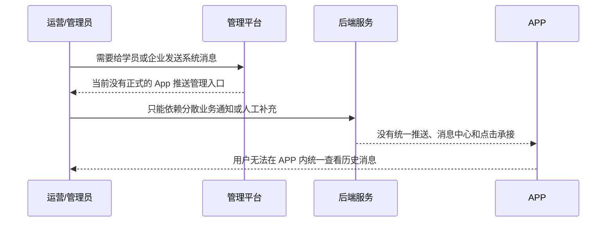
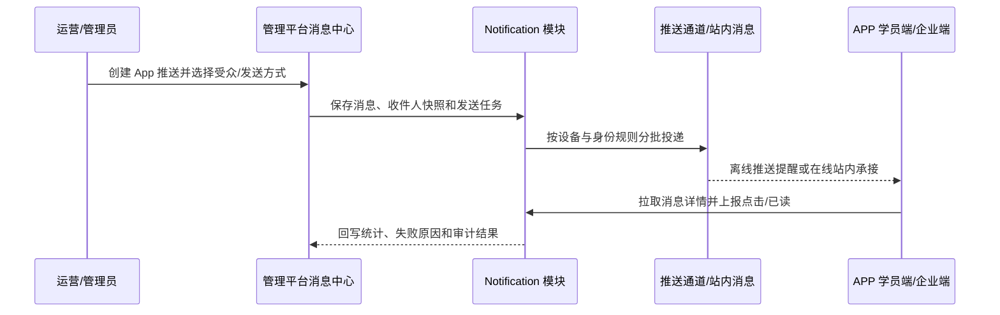

# [需求文档]REQ-042-20260809-消息推送与消息中心

## 1. 文档信息

| 项目 | 内容 |
| --- | --- |
| 需求编号 | `REQ-042` |
| 关联 Story | `Story-042` |
| 所属版本 | `vphase1-initial-delivery` |
| 创建日期 | `2026-08-09` |
| 优先级 | `P1` |
| 变更类型 | `新增功能` |
| 适用范围 | `yunjikeji-admin-server`、`yunjikeji-admin-ui`、`yunjikeji` APP 学员端/企业端、原生推送通道、APP 站内消息中心 |
| 关联出口条件位置 | `02-版本详细计划.md#正式验收入口` |
| 说明 | `本文只定义消息推送与消息中心需求，不重复定义程序设计、SQL 细节和版本出口条件。` |

## 2. 问题现象描述

> 本章只记录当前业务现场与读者会先看到的问题，不先展开实现方案。

### 2.1 现象一：管理平台缺少面向 APP 的统一消息发布入口

- 看到什么：
  当前版本正式目录中已存在客服会话、登录页、首页、练习页等需求与验收资产，但没有“消息推送与消息中心”的正式需求与验收入口；管理平台现有能力也没有一套可以面向 APP 学员端、企业端统一创建、定时发布、取消和追踪推送结果的正式模块。
- 容易误解成什么：
  容易把客服即时会话、系统运营通知和 APP 离线推送混为同一件事，以为复用客服聊天即可覆盖运营消息触达。
- 现场样本或证据：
  当前版本目录只有新建的 `REQ-042` 与 `PD-042` 骨架，`061-验收标准/01-验收执行详情/` 下此前不存在 `AC-PUSH-*` 正式验收详情文件。

### 2.2 现象二：APP 没有统一的消息中心与推送落点

- 看到什么：
  学员端与企业端共用同一个 uni-app 工程，但当前没有一套正式定义，规定通知点击后进入哪里、如何查看历史消息、如何处理未读数、如何上报已读与点击，也没有定义登录后设备如何注册、换绑和停用。
- 容易误解成什么：
  容易把“收到系统通知”误解成只要调用第三方推送 SDK 即可完成，忽略消息中心、设备绑定、点击承接和账号切换带来的真实业务链路。
- 现场样本或证据：
  当前版本已完成的 APP 任务主要围绕登录、新首页、练习、答题和我的页，没有一套正式文档定义 APP 消息中心与推送生命周期。

### 2.3 现象三：双身份与多租户场景下存在串号和越权风险

- 看到什么：
  本项目同时存在学员账号、企业账号、多租户隔离和同设备切换账号场景；如果只按 `user_id` 或只按设备 token 投递，容易把上一账号、其他租户或另一身份的消息误发到当前设备。
- 容易误解成什么：
  容易误以为“用户 ID 唯一”就能覆盖消息投递，不再额外处理身份类型、主体 ID、租户 ID 和设备换绑。
- 现场样本或证据：
  当前方案评审已明确：收件人键必须使用 `subject_type + subject_id + tenant_id`，不能只使用 `user_id`；客服业务继续保持独立，不与运营消息混发。

## 3. 问题分析

### 3.1 当前实际是什么

- 当前版本需要补齐一套独立的消息通知域，用于承接管理平台发起的系统消息、运营公告、活动提醒等非客服类消息。
- 该能力同时覆盖三段链路：管理平台创建与发布、后端消息/设备/投递管理、APP 推送接收与站内消息中心承接。
- APP 同时存在学员与企业两类身份，且消息既要支持在线站内查看，也要支持离线推送提醒。

### 3.2 当前不是什么

- 本次不重做客服即时通讯，不把客服会话消息并入运营推送域。
- 本次不建设 H5 Web Push；H5 首期只要求站内消息承接，不要求浏览器离线推送。
- 本次不把厂商通道账号、APNs Key、DCloud 控制台凭证写入仓库；这些属于后续人工依赖。

### 3.3 本次真正要解决什么

- 在管理平台现有消息中心体系下，补齐“App 推送管理”正式能力，支持创建、发布、定时、取消、统计和失败追踪。
- 在后端补齐独立通知模块和可靠投递链路，固化消息、收件人、设备和投递审计。
- 在 APP 补齐推送接收、站内消息列表、消息详情、未读数、点击跳转和已读回传。
- 在多租户、双身份和同设备切换账号场景下，保证消息不串租户、不串身份、不串旧账号。

## 4. 需求背景与目标

### 4.1 需求背景

- 当前版本已经完成登录、首页、练习、客服等若干前后台基础能力，但仍缺少一套正式的消息通知触达机制。
- 后续运营活动、系统公告、审核提醒、功能消息等都需要通过管理平台统一下发，并在 APP 端形成可追溯的消息中心。
- 如果继续依赖人工通知、客服代发或散落在页面内的临时提示，无法满足多角色、多租户、离线触达和事后审计的要求。

### 4.2 需求目标

- 建立独立的消息通知域，支持管理平台向 APP 学员端与企业端发送正式消息。
- 形成“推送提醒 + 站内消息中心 + 点击承接 + 状态审计”的完整闭环。
- 保证租户隔离、身份隔离、设备换绑和失败重试口径一致，可为后续技术实现和正式验收提供唯一输入。

## 5. 范围

### 5.1 本次范围

- 在管理平台现有消息中心体系下新增 `App 推送管理`，支持草稿、立即发送、定时发送、取消、发送统计和投递明细查询。
- 在后端新增独立消息通知模块，承接消息内容、受众快照、设备绑定、投递记录、发送任务和状态审计。
- 在 APP 学员端与企业端增加统一消息中心，支持通知点击进入消息详情、列表查看、未读数、单条已读和全部已读。
- 固化设备注册、换绑、停用、消息点击路由白名单、多租户与双身份隔离规则。

### 5.2 不在本次范围

- 不新增 H5 浏览器离线推送；H5 首期只承接站内消息查看。
- 不把客服聊天消息迁入本模块，也不改变现有客服即时通讯链路。
- 不在本轮落库第三方凭证、厂商秘钥申请结果或生产环境推送通道开通流程。

## 6. 业务流程与角色

### 6.1 当前链路

### 6.2 目标链路

### 6.3 角色与阅读视角

| 角色 | 最先关心什么 | 本次要先回答什么 |
| --- | --- | --- |
| 平台运营/管理员 | 能不能统一创建、发布、定时、取消和查统计 | 管理平台消息中心下新增 App 推送管理，并保留投递明细与状态统计 |
| 学员/企业用户 | 会不会收到不属于自己的消息，消息点开后能不能看详情 | 通过主体键、设备换绑和白名单路由保证只收到自己的消息并能进入真实详情 |
| 开发/测试 | 如何判断接口、数据和代码边界已经补齐 | 正式验收固定拆成 4 条业务项和 4 条技术项，分别约束交互、接口、数据和代码边界 |

## 7. 功能需求

### 7.1 管理端消息管理与发送

- 目标：
  在管理平台现有消息中心下提供 `App 推送管理`，由有权限的管理员创建、编辑、发布、定时发送、取消发送和查看发送统计。
- 处理规则：
  - 消息至少包含标题、摘要、正文、受众范围、发送方式、跳转目标和业务标识。
  - 发布前必须固化受众快照；定时消息在到达触发时间前可取消，取消后不得继续生成新投递任务。
  - 发送结果要区分草稿、待发送、发送中、成功、部分失败、失败和已取消，不得只保留“已发出”单一口径。
- 异常处理：
  - 受众为空、跳转配置非法或超出租户范围时，管理端不得发布成功。
  - 推送通道受理失败或部分失败时，管理端必须可见失败原因和失败数量。

### 7.2 收件人与身份隔离

- 目标：
  让同一台设备上的学员账号、企业账号和不同租户账号只收到各自应收消息。
- 处理规则：
  - 收件人主键必须使用 `subject_type + subject_id + tenant_id`。
  - 受众选择至少支持全部用户、指定租户、学员账号、企业账号、指定用户和后续可扩展分组/标签。
  - 客服消息与运营推送消息保持业务隔离，不共用发送入口和统计口径。
- 异常处理：
  - 账号切换、退出登录、设备换绑后，旧绑定关系必须停用，防止旧账号继续收消息。
  - 受众筛选超出租户权限时，后端必须拒绝落库或发送。

### 7.3 APP 推送接收与消息中心

- 目标：
  在 APP 学员端与企业端提供统一消息中心，承接离线推送、在线提醒和历史消息查看。
- 处理规则：
  - APP 收到通知后，点击消息先按 `messageId` 拉取真实详情，再进入白名单页面。
  - 消息中心至少支持列表、详情、未读数、单条已读和全部已读。
  - 通知载荷只允许下发 `messageId`、`routeKey`、`businessType`、`businessId` 等受控字段，不允许后台直接下发任意 URL。
- 异常处理：
  - 用户未登录点击通知时，先保存目标，登录完成后再跳转。
  - 路由白名单中不存在的 `routeKey` 必须回退到消息详情页，不得跳到未知页面。

### 7.4 设备生命周期与可靠投递

- 目标：
  让消息在设备注册、换绑、失效和多次重试场景下仍可被正确承接和追踪。
- 处理规则：
  - APP 登录成功后注册当前设备标识；退出登录、切换账号或 token 失效时停用旧绑定。
  - 后端要按设备维度记录投递任务、厂商受理结果、失败码和重试次数。
  - 推送通道受理成功只表示厂商已接单，不等于用户已读。
- 异常处理：
  - 设备 token/clientId 缺失、失效或被厂商拒绝时，需要记录失败原因并支持后续重试或清理失效设备。
  - 站内消息落库成功但离线推送失败时，消息仍须可在 APP 消息中心看到。

### 7.5 定时发送、统计与审计

- 目标：
  让运营、测试和开发能回溯消息从创建到用户查看的完整链路。
- 处理规则：
  - 管理端要能看到消息总量、待投递、已受理、失败、已读和点击等统计口径。
  - 四类核心记录至少包括消息主表、收件人表、设备表和投递表，并能够串联到同一条消息。
  - 发送任务、取消操作、失败重试和消息阅读都要留下可追溯审计信息。
- 异常处理：
  - 统计口径发生部分失败或设备失效时，不得把所有结果汇总成“成功”。
  - 历史消息被撤销或取消后，需要保留审计痕迹，不得直接物理抹除业务记录。

## 8. 非功能与安全要求

### 8.1 非功能要求

- 一致性：
  管理端消息状态、APP 消息状态、收件人状态和投递状态必须可映射，不能各自维护互相冲突的口径。
- 可追溯：
  必须能按消息、收件人、设备和租户追到创建人、发布时间、投递结果、点击时间和已读时间。
- 稳定性：
  定时发送、取消发送、失败重试和同设备切换账号必须幂等；站内消息落库不能依赖单次推送成功。

### 8.2 安全要求

| 安全类型 | 具体要求 | 实现方式 |
| --- | --- | --- |
| 认证授权 | 只有具备消息管理权限的管理端角色可创建、发布、取消和查看明细；APP 端只能读取当前登录主体的消息 | 管理端走既有后台权限体系；APP 接口按登录态、租户和主体键校验 |
| 敏感数据保护 | 推送载荷不得直接暴露富文本正文、敏感业务详情或任意外链；设备标识与厂商凭证不得写入公开仓库 | 通知载荷只下发受控业务键；详情由 APP 登录后回源查询；第三方凭证采用环境配置 |

## 9. 关联验收与出口说明

- 版本出口条件统一维护在 `02-版本详细计划.md#正式验收入口`。
- 本需求对应的正式验收入口为：
  - `061-验收标准/00-验收标准索引.md`
  - `061-验收标准/01-验收执行详情/AC-PUSH-001.md`
  - `061-验收标准/01-验收执行详情/AC-PUSH-002.md`
  - `061-验收标准/01-验收执行详情/AC-PUSH-003.md`
  - `061-验收标准/01-验收执行详情/AC-PUSH-004.md`
  - `061-验收标准/01-验收执行详情/AC-PUSH-101.md`
  - `061-验收标准/01-验收执行详情/AC-PUSH-102.md`
  - `061-验收标准/01-验收执行详情/AC-PUSH-201.md`
  - `061-验收标准/01-验收执行详情/AC-PUSH-301.md`
- 本文只提供验收输入来源：
  - 管理端创建、发布、定时、取消和统计规则
  - APP 推送接收、消息中心、点击跳转和已读规则
  - 主体键隔离、设备生命周期、四表审计和模块边界要求
  - H5 首期仅站内消息、客服业务保持独立、外部凭证属于人工依赖
- 如果本文发生变化，必须同步更新 `061-验收标准/` 的 `AC-PUSH-*` 正式验收项。

## 10. 修订历史

| 版本 | 修订日期 | 修订说明 |
| --- | --- | --- |
| `v1.0` | `2026-08-09` | `建立消息推送与消息中心正式需求文档，并补齐对应验收输入。` |
