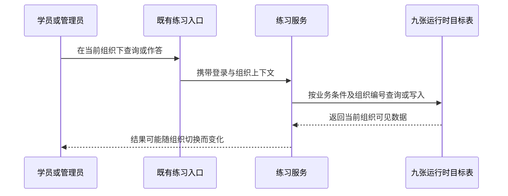
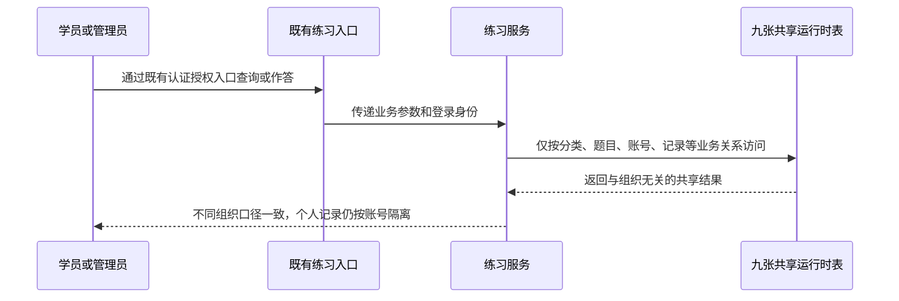

# [需求文档]REQ-050-20260817-练习数据跨组织共享

## 1. 文档信息

| 项目 | 内容 |
| --- | --- |
| 需求编号 | `REQ-050` |
| 关联 Story | `Story-050` |
| 所属版本 | `vphase1-initial-delivery` |
| 创建日期 | `2026-08-17` |
| 优先级 | `P1` |
| 变更类型 | `口径整改` |
| 适用范围 | 后台考题管理、APP 练习与错题链路、9 张运行时表及 2 张条件性兼容表 |
| 关联出口条件位置 | `02-版本详细计划.md#5-验收标准` |
| 说明 | 本文定义“考题整体与组织无关”的业务边界；运行时 9 表全局共享，2 张兼容表仅在物理存在且继续保留时处理。 |

## 2. 问题现象描述

> 本章只记录用户指令和源码盘点所确认的当前现场，不先展开技术方案。

### 2.1 相同练习内容会随组织上下文产生差异

- 看到什么：当前系统会在考题分类、步骤、题目、答案、子答案、用户练习记录、记录明细、错题明细和测评结果的查询或写入过程中附带组织编号。不同组织进入相同入口时，可能只能看到各自组织名下的数据。
- 容易误解成什么：容易把同一套题库理解为每个组织各自维护一份，或认为切换组织后题目和答案本来就应该变化。
- 现场样本或证据：2026-08-17 用户先要求已列练习表取消 `tenant_id` 限制和写入，随后明确追加“yj_practice_exercises也需要不要租户”和“即考题整体都不要租户”；最终源码盘点确认运行时 9 表范围以及自动租户拦截、显式查询条件和插入赋值风险。

### 2.2 用户练习历史同时受组织和用户关系约束

- 看到什么：当前练习记录、记录明细和错题明细除关联学员账号、练习记录外，还会附带组织条件；同一学员的记录可能因当前组织上下文不同而无法连续读取。
- 容易误解成什么：容易把“取消组织限制”误解为取消用户数据保护，导致任意用户都能查看或修改他人的练习历史。
- 现场样本或证据：现有记录链路同时使用 `customer_account_id`、`record_id`、题目关系和 `tenant_id`；本次只取消最后一项，其他业务关系必须保留。

### 2.3 用户将范围明确扩大为考题整体

- 看到什么：初始范围只覆盖部分练习表，用户随后连续补充题目主表和“考题整体”口径。
- 容易误解成什么：容易只增加 `yj_practice_exercises` 一张表，遗漏步骤、测评结果以及可能仍被正式 DDL 保留的兼容表。
- 现场样本或证据：范围扩大依据为用户原文“yj_practice_exercises也需要不要租户”和“即考题整体都不要租户”。最终盘点将 9 张生产 Java 运行时表纳入实施，并将 `yj_assessment_question`、`yj_assessment_answer` 定义为条件性数据库兼容表；这两张兼容表不得伪称已核验真实库存在。

## 3. 问题分析

### 3.1 当前实际是什么

- 9 张运行时目标表目前既可能被框架自动追加组织条件，也存在业务代码手工追加组织条件和写入组织编号的路径。
- 后台通用资源入口、后台练习记录入口和 APP 练习入口使用不同数据访问方式，必须统一落实同一共享口径。
- 错题明细的历史唯一性和脚本曾把组织编号作为组成部分；直接只删查询条件，可能产生跨组织重复或多行命中。

### 3.2 当前不是什么

- 本次不是取消登录认证、后台权限或学员身份校验。
- 本次不是让所有用户互相查看练习记录；用户数据仍按学员账号和练习记录关系隔离。
- 本次不把 `yj_agent_info`、知识库、客户账号、登录日志、统计表或独立 `yk_*` 旧模型改为全局表。
- 本次不取消未绑定组织登录门禁，也不修改前端全局认证 `tenant-id` 请求头；只有后端目标表操作不得依赖该组织值。
- 本次不要求修改前端业务参数或依赖项目；源码盘点未发现前端显式传递本次目标表的 `tenant_id`，依赖项目也无生产代码命中。

### 3.3 本次真正要解决什么

- 让 9 张运行时表在任何组织上下文下使用同一份数据，不再因组织编号过滤、回填或分组。
- 让 9 张运行时表新增数据由应用按业务字段写入，不再由应用提交 `tenant_id` 列和值。
- 对 2 张条件性兼容表，只在正式 DDL / 物理表确认存在且继续保留时，通过兼容 SQL 取消租户相关结构和写入口，不新增 Java 访问路径。
- 在取消组织维度后，继续以 `customer_account_id`、`record_id`、题目和明细关系保护用户练习数据，并处理错题唯一性风险。

## 4. 需求背景与目标

### 4.1 需求背景

- 本项目的练习题及其答案服务于所有组织，不需要各组织重复维护相同内容。
- 学员练习历史属于学员个人业务数据，其归属应由账号和记录关系表达，而不应依赖组织编号才能查询。
- 当前多种数据访问路径对组织条件处理不一致，需要一次性收口，避免只修某个页面后仍从其他入口写入或过滤组织编号。

### 4.2 需求目标

- 所有组织通过既有权限入口读取 9 张运行时目标表时，不因当前组织不同得到不同结果。
- 所有新增、更新、删除路径都不再使用 9 张运行时表的 `tenant_id` 作为条件，新增也不由应用写入该列。
- 用户练习记录仍只对关联学员和关联记录生效，非目标租户表继续保持原有隔离。

## 5. 范围

### 5.1 本次范围

以下 9 张表为运行时实施范围：

1. `yj_practice_category`
2. `yj_practice_setp`
3. `yj_practice_exercises`
4. `yj_practice_exercises_answer`
5. `yj_practice_exercises_answer_child`
6. `yj_user_practice_exercises_record`
7. `yj_user_practice_exercises_record_detail`
8. `yj_user_practice_exercises_wrong_record_detail`
9. `yj_assessment_result`

以下 2 张表为条件性数据库兼容范围：

1. `yj_assessment_question`
2. `yj_assessment_answer`

条件性兼容规则：只有正式 DDL 或目标环境物理表确认其存在且继续保留时，才由随版兼容 SQL 取消租户相关结构和写入口；不得新增 Java 访问路径，也不得把源码盘点等同于真实库核验。

范围内动作：

- 取消框架对 9 张运行时表自动追加的 `tenant_id` 条件。
- 删除后台、APP、Mapper、原生 JDBC 和动态资源入口中针对 9 张运行时表的显式 `tenant_id` 查询、更新、删除与写入逻辑。
- 七个现有目标 DO 全部改为非租户模型；`yj_practice_setp` 与 `yj_assessment_result` 的原生 JDBC / 动态资源显式租户逻辑同步清除。
- 复核练习记录与 `yj_customer_info` 的关联，改为依赖 `customer_account_id` 等业务关系，且不得造成重复行。
- 复核错题明细唯一键、历史建表/回填脚本和运行时去重逻辑，保证新口径不再依赖 `tenant_id`。
- 更新当前版本仍可能执行的 `050-执行脚本/20260610-yj-practice-data-migration.sql` 设计要求，使目标表 INSERT 列和值不包含 `tenant_id`；本轮文档任务不修改该 SQL。

### 5.2 不在本次范围

- 不修改前端页面、前端接口参数、依赖项目或 `uni_modules/**`。
- 不在本轮文档任务中删除目标表数据库字段、改写历史数据或执行生产数据库操作。
- 不取消认证、授权、学员归属校验、逻辑删除或其他非租户业务条件。
- 不回改旧零散任务历史 SQL / 回滚脚本；错题唯一键和查询索引通过新增随版幂等 DDL、校验及回滚入口处理，但本轮不创建或执行脚本。
- 不修改 `yj_agent_info`、知识库、客户账号、登录日志、统计表或独立 `yk_*` 旧模型。

## 6. 业务流程与角色

### 6.1 当前链路

### 6.2 目标链路

### 6.3 角色与阅读视角

| 角色 | 最先关心什么 | 本次要先回答什么 |
| --- | --- | --- |
| 后台管理员 | 不同组织是否看到同一套分类、步骤、题目和答案 | 题目主表在内的 9 张运行时表均不再按组织过滤，后台权限保持不变 |
| 学员 | 切换或绑定组织后能否继续看到自己的练习和错题 | 记录按学员账号、记录和题目关系读取，不再依赖组织编号 |
| 开发与测试 | 如何证明所有入口都没有残留租户逻辑 | 同时核对自动拦截、显式条件、插入列、旧 JDBC、唯一键和非目标表回归 |

## 7. 功能需求

### 7.1 考题运行时九表跨组织共享

- 目标：不同组织通过既有权限入口访问 9 张运行时目标表时，读取、更新和删除命中同一业务数据集合。
- 处理规则：
  - 9 张运行时表不得再以当前组织编号作为查询、更新或删除条件。
  - 组织请求头和登录上下文仍可用于认证、授权及其他非目标表，不得作为目标表数据过滤条件。
  - 逻辑删除、状态、分类、题目、账号和记录等原有业务条件继续生效。
- 异常处理：如果移除组织条件后出现一对多、重复行或唯一性冲突，必须停止写入，先形成真实数据风险清单，不得静默取任意一条或删除历史数据。

### 7.2 运行时九表新增不写组织编号

- 目标：9 张运行时表所有应用写入入口的新增语句不包含 `tenant_id` 列，也不通过对象、通用字段映射或上下文补写该值。
- 处理规则：
  - 后台通用增删改查、专用练习服务、APP 作答和错题同步都采用同一口径。
  - 更新请求不得允许用 `tenant_id` 定位或修改目标表记录。
  - 数据库保留字段及默认值不代表应用仍可显式写入该列。
- 异常处理：若数据库约束导致省略该列后无法写入，必须先以测试库证据说明约束问题，再提出随版 DDL；不得临时恢复应用写租户值绕过。

### 7.3 用户记录按业务关系隔离

- 目标：取消组织限制后，学员仍只能读取和操作自己的练习记录、记录明细和错题明细。
- 处理规则：
  - 练习记录以 `customer_account_id` 识别学员。
  - 记录明细以 `record_id` 关联练习记录，并通过记录归属反查学员。
  - 错题明细以 `customer_account_id + exercises` 维持同一学员同一题目的业务唯一性，不再包含组织编号。
- 异常处理：
  - 请求记录不属于当前学员时仍必须拒绝或返回不存在。
  - 历史数据若存在跨组织重复错题，不得在本次文档或代码任务中自动合并，需进入受控数据迁移流程。

### 7.4 条件兼容与非目标租户边界

- 目标：共享规则覆盖 9 张运行时表，并在 2 张兼容表真实存在时处理其数据库兼容；系统其他租户表继续隔离。
- 处理规则：
  - `yj_assessment_question`、`yj_assessment_answer` 不新增 Java 访问路径，仅在物理存在且继续保留时由兼容 SQL 处理。
  - 以前端全局认证 `tenant-id` 请求头访问不同组织时，目标表结果一致；未绑定组织登录门禁保持现状。
  - 以 `yj_customer_account` 对应 `CustomerAccountDO` 或另一张明确继承 `TenantBaseDO` 的非目标业务表做反证，确认自动租户条件仍生效。
- 异常处理：如实现导致其他表也失去租户条件，必须判定回归失败并回退本次实现。

## 8. 非功能与安全要求

### 8.1 非功能要求

- 一致性：后台、APP、Mapper 和 JDBC 路径必须使用同一共享口径，不允许入口之间结果不同。
- 可追溯：前置红灯、实现后 SQL 观测、构建和回归证据统一落入 `061-验收标准/03-测试验证/DEV-051~054/`。
- 稳定性：取消组织条件后不得产生重复列表、错题重复累计、错删他人记录或全表无条件更新/删除。
- 兼容性：前端请求和响应结构保持不变，历史记录不在本次自动迁移。

### 8.2 安全要求

| 安全类型 | 具体要求 | 实现方式 |
| --- | --- | --- |
| 认证授权 | 后台和 APP 仍使用既有登录、权限、未绑定组织门禁与角色校验；取消目标表租户条件不等于开放匿名访问 | 保留全局认证 `tenant-id` 请求头、Controller 权限与登录用户校验 |
| 用户数据保护 | 学员不得读取、修改或删除其他学员的记录和错题 | 使用 `customer_account_id`、`record_id` 与记录归属校验，不使用 `tenant_id` 替代用户归属 |
| 变更安全 | 不直接操作生产库，不自动清理跨组织重复数据 | 测试环境验证；发现重复即止损并提交受审迁移方案 |

## 9. 关联验收与出口说明

- 本需求的正式验收入口为：
  - `061-验收标准/00-验收标准索引.md`
  - `061-验收标准/01-验收执行详情/AC-PRACTICE-SHARED-001.md`
  - `061-验收标准/01-验收执行详情/AC-PRACTICE-SHARED-101.md`
  - `061-验收标准/01-验收执行详情/AC-PRACTICE-SHARED-201.md`
  - `061-验收标准/01-验收执行详情/AC-PRACTICE-SHARED-301.md`
  - `061-验收标准/01-验收执行详情/AC-PRACTICE-SHARED-401.md`
- 本文提供的验收输入包括：运行时 9 表、条件性兼容 2 表、跨组织共享结果、应用不写租户列、用户关系隔离、错题唯一性、非目标表回归和无前端/依赖项目改动。
- 用户 2026-08-17 的原始指令及两条追加原文“yj_practice_exercises也需要不要租户”“即考题整体都不要租户”共同构成本次范围授权，不等同于对后续实现、测试结果或本文档内容的事后审核通过。
- 本文发生变化时，必须同步更新 `PD-050`、四条功能验收与一条闭环项 `AC-PRACTICE-SHARED-*` 和 `02-版本详细计划.md`。

## 10. 修订历史

| 版本 | 修订日期 | 修订说明 |
| --- | --- | --- |
| `v1.0` | `2026-08-17` | 建立练习数据跨组织共享的初始需求边界。 |
| `v1.1` | `2026-08-17` | 根据用户两条追加输入扩大为考题整体：9 张运行时表和 2 张条件性兼容表。 |
