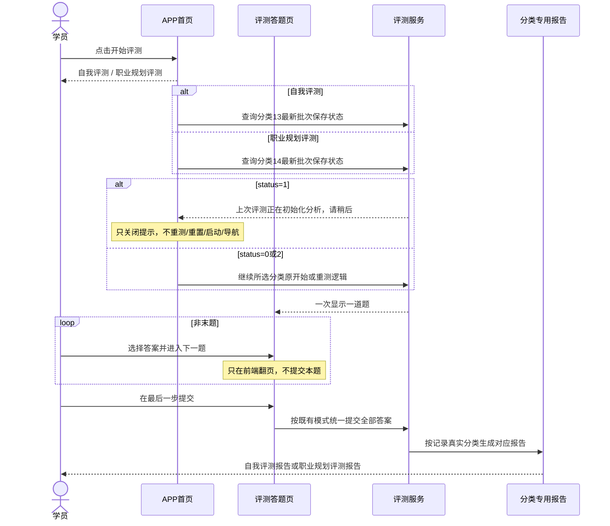

# [需求文档]REQ-052-20260829-APP职业规划评测与双评测隔离

## 1. 文档信息

| 项目 | 内容 |
| --- | --- |
| 需求编号 | `REQ-052` |
| 关联 Story | `Story-052` |
| 所属版本 | `vphase1-initial-delivery` |
| 创建日期 | `2026-08-29` |
| 优先级 | `P0` |
| 变更类型 | `新增职业规划评测 + 既有入口外围分流 + 双评测提交保存状态门禁` |
| 适用范围 | `APP 学员端首页、自我测评与职业规划评测提交、职业规划答题与报告、两份独立人工初始化工具` |
| 关联正式验收 | `061-验收标准/00-验收标准索引.md#story-052app职业规划评测与双评测隔离` |
| 当前门禁 | `DEV-069 人工审核返工中；再次审核通过前不得进入源码或数据库实施` |

## 2. 问题现象描述

### 2.1 首页只有一个评测入口

- 用户点击首页“开始评测”后，当前直接执行自我评测的完整既有流程，没有职业规划评测选择。
- 首页原“评测结果/自测报告”入口当前只展示自我评测报告，没有职业规划评测报告选择。

### 2.2 职业规划评测尚未形成独立闭环

- 分类14“职业规划评估”已经建立，但尚无可供业务使用的完整题目、答案和职业规划专用 Agent 记录。
- 当前程序同库只读事实为：数据库 `114.111.30.111:13306/yunjikeji`，分类14当前0题0答案；`yj_agent_info` 已占主键1、2、6、7，主键3、4、5空闲，`AUTO_INCREMENT=8`。
- 职业规划评测需要沿用自我评测现有的“一题一页、末题统一提交全部答案、提交后生成报告”体验，但必须使用分类14数据和职业规划专用报告能力。
- 两种评测的已完成判断、结果记录和报告不能互相命中。

### 2.3 既有自我评测不能被本需求改变

- 当前自我评测在非末题只切换下一题，不向后端保存本题；到最后一步才按原有顺序统一提交全部答案。
- 本需求不新增自我评测逐题保存、退出续答、最新未完成恢复或进程重启恢复，也不改变其已有完成提示、重置、报告生成、报告查询和重试行为；唯一新增边界是末题统一提交期间的批次保存状态跃迁，以及首页选择“自我评测”时对 `status=1` 的前置短路提示。
- 首页新增的两层选择只能包在原入口外部；选择“自我评测”或“自我评测报告”后，必须完整调用修改前的原逻辑，不能拆改、遗漏或改变请求顺序。

### 2.4 末题统一提交期间缺少可识别的保存状态

- 自我测评和职业规划评测在末题统一提交后，客户端按逐题串行 HTTP 持久化答案明细；完整写入与最终 `is_completed=1` 之间可能持续较长时间。
- 批次主记录在开始答题时已经创建，当前仅凭 `is_completed` 无法区分“尚未开始写答案”和“正在写入答案”；用户再次从首页进入时可能误触发重新测评、重置或新一轮启动。
- `yj_practice_catalog_batch` 已由人工增加 `status` 字段，需要正式定义 `0未开始 / 1写入中 / 2写入结束`；状态2只表示本次写入流程已退出，不等于业务完成。首页只在对应分类最新批次为1时明确提示“上次评测正在初始化分析，请稍后”。

## 3. 问题分析

### 3.1 保持不变的能力

- 自我评测固定对应分类13，首页选择“自我评测”后完整执行原“开始评测”行为。
- 自我评测答题继续一题一页，非末题仅翻页，最后一步统一提交全部答案。
- 首页选择“自我评测报告”后完整执行原报告入口的查询、展示、空状态、失败提示和重试行为。
- 分类13继续使用现有自我评测规则和现有 Agent 主键记录；除新增 `status=1` 首页前置门禁和 `0 -> 1 -> 2` 批次状态跃迁外，不因职业规划功能发生其他内部改造。

### 3.2 新增的平行能力

- 职业规划评测固定对应分类14，按自我评测同样的页面流程显示一题、翻页和在末题统一提交全部答案。
- 职业规划的已完成判断、重置、结果记录、报告生成、报告查询和报告重试只处理分类14。
- 报告生成必须从评测结果对应的真实记录和批次确认其属于分类14，再使用职业规划规则和职业规划专用 Agent。

### 3.3 数据初始化边界

- 题库导入和 Agent 插入是两个互相独立的 Python 手工程序，不属于应用业务调用链。
- 两个程序可以保存在项目仓库的独立人工工具目录，但应用不引用、不启动、不注入、不迁移、不定时执行，也不因未运行工具而影响正常构建或启动。
- 两个程序只连接当前程序实际运行配置所指向的同一数据库；连接参数由人工从当前程序真实运行配置确认后显式传入，不新增或切换数据库，不把凭据写入仓库。

### 3.4 保存状态边界

- 主表 record 在开始答题时已经创建，因此不得在 `startBatch`、启动接口或主记录插入阶段将 `status` 置1。
- 分类13/14均只在末题统一提交开始持久化第一条答案明细时，把批次 `status` 从0条件更新为1；两类评测完整保留各自既有完成流程，原流程结束后再单独更新 `status=2`。本需求不新增、替换、合并或修改任何 `is_completed` 判断、赋值、SQL或事务边界。
- 任一答案插入或持久化事务失败时，原异常必须继续返回；原事务回滚后必须通过独立事务只补偿写 `status=2`，补偿不得随原事务回滚、不得修改 `is_completed`，也不得被解释为业务完成。
- 状态不得从2回退为1。状态1下的同页幂等重试允许继续完成剩余答案写入；正常完成或服务端已捕获的持久化失败均结束于2。客户端进程中断、断网或请求未到服务端仍可能遗留1，本轮不增加TTL、状态3或批量接口。

## 4. 需求背景与目标

1. 首页继续只显示原有单个“开始评测”按钮；点击后弹出选择层，层内显示“自我评测”和“职业规划评测”两个选项。
2. 首页继续只显示原有单个“评测结果/自测报告”入口；点击后弹出报告选择层，层内显示“自我评测报告”和“职业规划评测报告”两个选项。
3. 两个自我评测按钮分别完整承接原开始评测和原报告入口逻辑，内部行为零变更、零遗漏。
4. 职业规划评测按相同的一题一页和末题统一提交模式完成分类14答题，并独立生成和展示职业规划报告。
5. 人工提前完成分类14题库和职业规划 Agent 初始化；业务运行时只读初始化结果，绝不创建或更新初始化数据。
6. 用户再次从首页选择任一评测时，能够先识别对应分类仍在写入的最新批次并短路原重测链路，避免保存期间误重置、重复启动或错误导航。

## 5. 范围

### 5.1 本次范围

- 原单个“开始评测”按钮点击后弹出的选择层及两个层内选项动作；不新增首页常驻评测按钮或独立选择页面。
- 原单个“评测结果/自测报告”入口点击后弹出的报告选择层及两个层内选项动作；不新增首页常驻报告按钮或独立选择页面。
- 分类13原开始评测、答题提交和报告入口的保护性零回归验证。
- 分类14平行的状态判断、启动、单题逐页显示、末题统一提交、重置、结果记录、报告生成、查询和重试。
- 分类14职业规划规则和职业规划专用 Agent 固定主键3只读调用。
- 两个独立 Python 人工工具：题库导入工具和 Agent 初始化工具；以及人工执行、备份、事务、回读和回执。
- `yj_practice_catalog_batch.status` 的正式字段定义、历史完成批次回填和分类13/14提交期状态跃迁。
- 首页“自我评测/职业规划评测”两个选择动作的对应分类 latest-status 前置检查，以及 `status=1` 独立提示弹窗。

### 5.2 明确排除

- 不改变分类13内部加载、翻页、逐项写入顺序、完成点、完成提示、重置、报告生成、报告查询或重试逻辑；仅允许新增保存状态跃迁和 `status=1` 入口门禁。
- 不实现分类13或14逐题实时提交、翻页等待保存、退出续答、`latest-only` 恢复或进程重启恢复。
- 不把分类14改成分类13，不共用分类13报告规则或 Agent 记录。
- 不新增业务表，不修改 `uni_modules/**`，不把任一初始化工具接入应用启动、构建、依赖注入、migration、资源初始化、定时任务或业务接口。
- 不新增或切换数据库连接；不在生产数据库执行集成测试或直接数据写入。

## 6. 业务流程与角色

| 角色 | 关注点 | 本次承接 |
| --- | --- | --- |
| 学员 | 新功能是否影响原自我评测 | 首页两个原单入口保持原位置和单入口形态，仅在点击后弹出选择层；内部体验和请求顺序不变 |
| 测试人员 | 两类结果是否串用 | 按分类、记录和批次交叉验证开始、提交、报告和重置 |
| 实施人员 | 初始化是否混入业务 | 两个独立手工程序，默认预检，人工显式写入，业务零引用 |

## 7. 功能需求

### 7.1 开始评测选择层

- 首页仍只显示原有单个“开始评测”按钮。点击该按钮后才弹出选择层，层内选项文案固定为“自我评测”“职业规划评测”；不得把两个选项常驻并列展示在首页，也不得跳转独立选择页面。
- 选择“自我评测”后，完整调用修改前 `startSelfTest` 所承接的全部逻辑；不得复制后删减，也不得改变其参数、请求顺序、提示或页面跳转。
- 选择“职业规划评测”后，以分类14进入新增平行流程；取消选择不创建、提交或重置任何记录。
- 关闭弹窗、点击取消或未选择任何选项时，只关闭选择层，不调用 `startSelfTest`、分类14启动或其他原业务动作。
- 用户选中“自我评测”或“职业规划评测”后，必须先查询对应分类最新批次保存状态；仅命中 `status=1` 时显示独立的初始化分析提示并终止本次选择动作，`status=0/2` 继续该分类原有 completed/restart/reset/start/navigation 判断，禁止把2直接当作评测完成。

### 7.2 两类答题提交模式

- 自我评测继续保持原实现：一题一页，非末题只翻页，最后一步统一提交全部答案。
- 职业规划评测严格仿写相同交互和提交时机：一题一页，非末题只翻页，最后一步统一提交全部答案。
- 本需求不把任何分类改造成每题翻页即写库；提交失败时沿用相应流程的明确错误提示，不伪造完成结果。

### 7.3 报告选择层

- 首页仍只显示原有单个“评测结果/自测报告”入口。点击后才弹出报告选择层，层内选项文案固定为“自我评测报告”“职业规划评测报告”；不得把两个报告选项常驻并列展示在首页，也不得跳转独立选择页面。
- 选择“自我评测报告”后，完整调用修改前 `openLatestSelfTestReport` 所承接的查询、空状态、展示、失败处理和重试逻辑。
- 选择“职业规划评测报告”后，只查询并展示分类14生成的职业规划报告；无报告、生成中、生成失败和重试状态不得借用分类13记录。
- 关闭弹窗、点击取消或未选择任何报告选项时，只关闭选择层，不调用任一报告查询、跳转、重试或其他原业务动作。

### 7.4 分类与报告隔离

- 分类13既有无参 `completed`、`latest-status`（或当前真实 latest 入口）、`reset`、`start`、`record`、`report`、`regenerate` 的请求参数、响应结构和业务语义全部保持不变；不得强迫既有自我评测调用改传新参数。
- 分类14通过新增的专用调用或显式分类参数走平行能力，其 `completed`、`latest-status`、`reset`、`start`、`record`、`report`、`regenerate` 只处理分类14，不能修改或复用旧无参 latest 的分类13语义。
- 报告路由按 `result -> record -> catalog batch -> category` 的真实关系确认分类。分类13继续走现有自我评测规则和 Agent；分类14走职业规划规则和职业规划专用 Agent。
- 职业规划完成校验与报告必须遵循源 schema 和规则：姓名、成果经历、12道 RIASEC 和刚好3项工作价值为必填；工作风格允许选择“本次不测”；最不看重项可不选，选择后不得与工作价值 Top3 重复；其他字段不自行扩大必填范围。
- 必填缺失、价值互斥冲突、题库不完整或答案不属于分类14时拒绝生成职业规划报告，并返回可定位的明确错误。

### 7.5 题库人工初始化工具

- 独立 Python 程序从 `D:\飞机\-APP--main (4)\-APP--main\skills\career-planning-coach` 提取职业规划题目和答案，写入分类14对应的 `yj_practice_exercises`、`yj_practice_exercises_answer`。
- 程序默认 dry-run，显式 `--apply` 才写入；写前校验源、分类和目标状态，完成备份，在单事务中写入，失败整体回滚，写后完整回读。
- 重复执行不得制造重复数据；发现部分数据、冲突或不一致立即中止并等待人工处理。

### 7.6 Agent 人工初始化工具

- 另一个独立 Python 程序从同一源目录的 `scripts/career-core.mjs` 提取 `SELF_SYSTEM_PROMPT` 原文并构建一条新的 `yj_agent_info` 记录，不能与题库工具共用同一入口。
- 当前分类13固定读取 `yj_agent_info.id=2`、`tenant_id=1`，该记录和调用方式保持不动。分类14固定使用 `yj_agent_info.id=3`，业务常量为 `CAREER_ASSESSMENT_AGENT_INFO_ID=3L`。
- 新记录字段固定为：`id=3`、名称“职业规划评测”、`tenant_id=1`、`status=1`、`knowledge_base_id=NULL`、`prompt_config=SELF_SYSTEM_PROMPT` 原文、`reply_strategy=NULL`、`agent_id=NULL`。运行时禁止按 `agent_id` 或名称选取 Agent。
- Agent人工初始化的冲突检查、写入和中止规则只属于独立工具及人工执行门禁，正式入口为DEV-076、DEV-077和对应数据验收项，不属于APP功能或业务接口。
- 系统运行时只以“人工已合法写入id=3并完成回读”为前置事实，按 `CAREER_ASSESSMENT_AGENT_INFO_ID=3L`固定只读；运行系统不负责Agent冲突判断、插入、更新或换号。
- 模型继续由 `yj_ai_model_config` 的 `practice_assessment` 场景提供，不写入或切换到 Agent 初始化记录中。

### 7.7 双评测提交保存状态门禁

- 批次 `status` 默认0。分类13/14在末题统一提交开始写入第一条答案明细时，将当前批次由0条件更新为1；已为1的同页幂等重试可继续，已为2时不得再次置1或重复写入。
- 主表 record 在开始答题时已创建，禁止在 `startBatch`、批次启动或主记录创建时提前置1，避免把正常答题过程误判为正在保存。
- 分类13现有统一答案保存完成逻辑、分类14现有 report-entry 完成逻辑分别保持原样；各自原流程完成后再执行只更新 `status=2` 的状态动作，不得把该更新合并进原 `is_completed` 语句或借 DEV-078 调整原完成事务。
- 任一答案插入或持久化事务失败时，原异常继续返回；原事务回滚后使用不参与原事务的独立事务只补偿 `status=2`，绝不更新 `is_completed`，补偿成功不得改写原失败结果。
- 首页 `status=1` 提示复用“是否需要重新测评”弹窗的视觉样式，但必须使用独立状态与独立关闭回调，文案固定为“上次评测正在初始化分析，请稍后”；不得复用原弹窗 resolver，也不得触发 reset、start 或 navigation。
- `status=0/2` 保持相应分类原 completed/restart/reset/start/navigation 判断，不得把2误判为完成，也不得因为新增字段改变分类14 report-entry 或分类13报告语义。

## 8. 非功能与安全要求

- 兼容性：分类13开始评测和报告入口的页面、交互、接口参数、请求顺序和结果必须保持修改前一致。
- 一致性：分类14页面选择、题库、结果记录、报告和固定 Agent ID=3 必须属于同一分类上下文。
- 可追溯：两个人工工具分别记录源哈希、dry-run、备份、事务、回读和人工确认；不能以聊天结论代替真实回执。
- 认证授权：仅当前登录学员可访问本人的评测记录和报告，分类参数不能绕过记录归属校验。
- 凭据保护：数据库连接参数由人工显式提供，不能写入代码、回执、日志或 Git。
- 状态一致性：`status` 只能 `0 -> 1 -> 2` 单向推进，不允许2回退为1；`is_completed` 继续完全按原流程判断和更新，不与本状态机合并或互相推导。
- 残余风险：当前客户端逐题串行 HTTP，进程或网络中断可能遗留 `status=1`。本轮不新增 TTL、状态3或批量新接口，只要求同一答题页幂等重试可继续到2，并把自动恢复作为后续设计输入。

## 9. 关联验收与出口说明

- 正式验收统一维护在 `061-验收标准/`，本文引用 `AC-CAREER-ASSESS-001`、`002`、`101`、`201`、`202`、`301`、`401`，并新增引用 `AC-ASSESSMENT-SAVE-001/101/201/301/401`。
- DEV-069 再次人工审核通过前，DEV-070 及后续源码、工具和数据库任务保持未开始。
- DEV-077 必须先在当前程序同一数据库对固定主键3完成dry-run、冲突检查、apply和回读；回读通过后，DEV-072才允许落 `CAREER_ASSESSMENT_AGENT_INFO_ID=3L`。
- 只有测试环境初始化、全量验收、用户复验、提交和远程推送全部完成后才能关闭 Story；本文档返工不代表功能完成。

## 10. 修订历史

| 版本 | 修订日期 | 修订说明 |
| --- | --- | --- |
| `v1.0` | `2026-08-29` | 建立职业规划评测和双入口初稿。 |
| `v1.1` | `2026-08-29` | 曾错误加入分类13/14逐题持久化和续答改造。 |
| `v2.0` | `2026-08-29` | 按人工审核反馈撤销逐题保存与续答范围；明确分类13内部零变更、分类14末题统一提交、报告二选一及两份独立人工初始化工具。 |
| `v2.3` | `2026-08-31` | 新增分类13/14末题统一提交保存状态门禁，明确首条答案明细置1、原完成流程结束后单独置2、失败独立补偿只写status、首页状态1独立提示及串行HTTP中断残余风险；`is_completed` 原逻辑不变。 |
