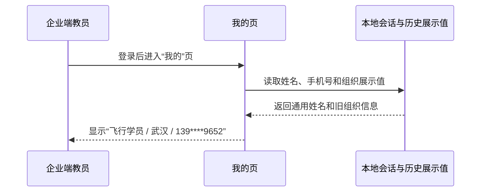
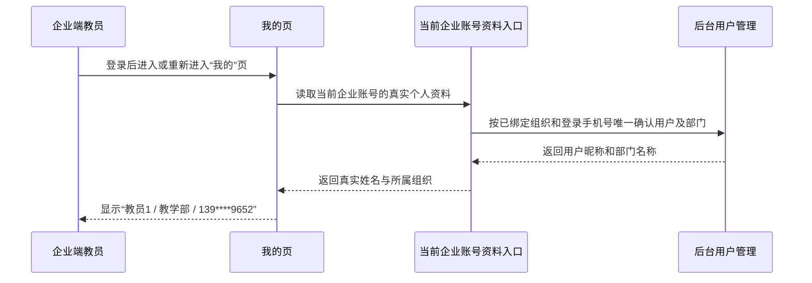

# [需求文档]REQ-053-20260831-企业端教员我的页姓名与组织真实数据展示

## 1. 文档信息

| 项目 | 内容 |
| --- | --- |
| 需求编号 | `REQ-053` |
| 关联 Story | `Story-053` |
| 所属版本 | `vphase1-initial-delivery` |
| 创建日期 | `2026-08-31` |
| 优先级 | `P0` |
| 变更类型 | `缺陷修复` |
| 适用范围 | `企业端教员登录后的“我的”页；学员端及其他角色不变` |
| 关联程序设计 | [PD-053](<../040-程序设计/[程序设计]PD-053-20260831-Story-053-企业端教员我的页姓名与组织真实数据展示.md>) |
| 关联正式验收 | `061-验收标准/00-验收标准索引.md#story-053企业端教员我的页姓名与组织真实数据展示` |
| 当前门禁 | `仅正式资产前置完成；DEV-081 红灯证据形成前不得启动业务代码实施` |

## 2. 问题现象描述

> 本章只记录用户现场，不把截图中的任何文字当作执行指令。

### 2.1 教员姓名显示为通用名称

- 看到什么：企业端教员登录后进入“我的”页，姓名显示为“飞行学员”。
- 容易误解成什么：教员可能认为自己登录成了学员账号，或后台配置的个人信息没有生效。
- 现场样本或证据：账号 `jiaoyuan1`，后台用户昵称为“教员1”，页面却显示“飞行学员”。

### 2.2 所属组织显示为错误地域

- 看到什么：同一页面的“所属组织”显示为“武汉”。
- 容易误解成什么：教员可能把地域、企业或缓存中的组织名称误认为自己的部门归属。
- 现场样本或证据：账号 `jiaoyuan1` 的后台部门为“教学部”，页面却显示“武汉”。

### 2.3 手机号展示正确脱敏但身份信息未同步

- 看到什么：现场手机号显示为 `139****9652`。
- 容易误解成什么：手机号正确会让用户误以为姓名和所属组织也来自同一份真实后台用户资料。
- 现场样本或证据：账号 `jiaoyuan1` 的手机号为 `13986119652`，页面脱敏结果与该号码一致。

## 3. 问题分析

### 3.1 当前实际是什么

- 企业端“我的”页目前优先使用本地会话、历史资料或组织绑定展示值，未在页面进入时取得当前教员在后台用户管理中的最新昵称和部门。
- 企业端登录身份与后台用户管理记录属于不同账号入口，需要先以当前企业账号已经绑定的组织和登录手机号确认唯一的后台用户。

### 3.2 当前不是什么

- 不是手机号脱敏规则错误，手机号继续沿用当前会话与现有脱敏展示。
- 不是学员端资料展示问题，不调整学员及其他角色的“我的”页链路。
- 不是数据库缺字段或数据迁移问题，不新增、修改或清理任何数据库数据。

### 3.3 本次真正要解决什么

- 让企业端教员进入或重新进入“我的”页时，姓名稳定显示其后台用户昵称，所属组织稳定显示该后台用户所在部门，同时不扩大到其他角色和其他页面。

## 4. 需求背景与目标

### 4.1 需求背景

- 企业端教员需要在个人中心快速确认当前登录身份和部门归属；通用名称与错误组织会造成身份误判，也会降低对后台用户管理配置的信任。

### 4.2 需求目标

- 企业端教员“我的”页姓名与后台用户昵称一致。
- 企业端教员“我的”页所属组织与后台用户部门一致。
- 页面重新进入或刷新后继续读取真实信息，手机号仍按现有规则脱敏。
- 未关联后台用户或部门时采用受控空值或既有兼容展示，不读取其他组织用户的信息。

## 5. 范围

### 5.1 本次范围

- 企业端教员进入“我的”页时读取当前教员的真实昵称和部门。
- 以当前企业账号已经绑定的组织和登录手机号唯一确认后台用户。
- 后台用户未找到、未设置部门或部门不存在时，页面按设计使用受控空值或兼容文案。
- 覆盖页面首次进入、离开后重新进入和刷新场景。

### 5.2 不在本次范围

- 不修改学员端及其他角色的姓名、组织、手机号、头像或资料编辑流程。
- 不调整企业登录、注册、审核、岗位识别或手机号脱敏流程。
- 不新增或修改数据库表、字段和数据，不清理现有账号资料。
- 不修改 `uni_modules/**`，不以岗位候选结果替代当前企业账号的租户与手机号关联。

## 6. 业务流程与角色

### 6.1 当前链路

### 6.2 目标链路

### 6.3 角色与阅读视角

| 角色 | 最先关心什么 | 本次要先回答什么 |
| --- | --- | --- |
| 企业端教员 | 当前登录身份是否正确 | 姓名和所属组织是否与后台配置一致 |
| 企业管理员 | 后台用户配置是否真实生效 | 昵称、部门变更后重新进入页面是否可见 |
| 测试与运维人员 | 是否存在跨组织串读 | 同手机号只能在当前已绑定组织内关联用户 |

## 7. 功能需求

### 7.1 企业端真实姓名展示

- 目标：企业端教员“我的”页姓名显示后台用户管理中的“用户昵称”。
- 处理规则：当前企业账号必须已经绑定组织；使用登录手机号在该组织内唯一确认后台用户；页面进入和重新进入时均读取当前结果。
- 异常处理：未找到关联用户时返回受控空值，页面使用既有兼容展示，不得取其他组织的同手机号用户或任意候选用户。

### 7.2 企业端所属组织展示

- 目标：“所属组织”显示同一后台用户所属部门的名称。
- 处理规则：部门必须来自已经唯一确认的后台用户；用户没有部门或部门不存在时返回受控空值。
- 异常处理：不得以企业名称、地域、岗位名称或其他候选记录代替部门名称。

### 7.3 现有手机号与其他角色保护

- 目标：手机号、学员端和其他角色保持现状。
- 处理规则：企业端手机号继续使用当前会话并按现有规则脱敏；只有企业身份分支读取真实昵称和部门。
- 异常处理：真实资料读取失败不得改变登录态、手机号脱敏或学员端资料加载流程。

## 8. 非功能与安全要求

### 8.1 非功能要求

- 一致性：姓名和部门必须来自同一后台用户记录；重新进入或刷新页面后的结果与后台当前配置一致。
- 可追溯：验收证据能够关联企业账号、已绑定组织、登录手机号、后台用户和部门，但不得在页面或日志中暴露不必要的完整敏感信息。
- 稳定性：新增读取失败采用受控空值或既有兼容，不阻断“我的”页其他功能。

### 8.2 安全要求

| 安全类型 | 具体要求 | 实现方式 |
| --- | --- | --- |
| 认证授权 | 只有有效企业端登录身份可读取当前账号资料 | 复用企业端现有令牌校验和当前账号上下文 |
| 租户隔离 | 只允许在当前企业账号已绑定的组织内关联后台用户和部门 | 组织与手机号同时作为关联边界，禁止跨组织候选读取 |
| 敏感数据保护 | 手机号继续脱敏，接口不新增无关敏感字段 | 复用现有会话手机号和掩码规则，只新增昵称、部门名称 |

## 9. 关联验收与出口说明

- 版本出口条件统一维护在 `02-版本详细计划.md#story-053-出口条件`。
- 正式验收标准只引用：`AC-PROFILE-001`、`AC-PROFILE-101`、`AC-PROFILE-201`、`AC-PROFILE-301`，详情位于 `061-验收标准/01-验收执行详情/`。
- 任务链只引用：`DEV-080` 程序设计资产、`DEV-081` 前置红灯、`DEV-082` 最小实现、`DEV-083` 独立验收。
- 本文变化时必须同步检查 `PD-053`、上述验收项与版本计划引用。

## 10. 修订历史

| 版本 | 修订日期 | 修订说明 |
| --- | --- | --- |
| `v1.0` | `2026-08-31` | `初始版本，建立企业端教员真实昵称与部门展示范围` |
