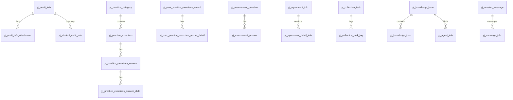

# yunjikeji-admin-server 后台管理平台程序设计

## 1. 技术实现时序

1. 读取 `doc/数据库表结构说明.md` 中补充的 `yj_*` 业务表，修正明显录入错误后生成幂等 MySQL DDL。
2. 执行 `050-执行脚本/20260608-yj-admin-business-tables.sql` 到 `application-local.yaml` 指向的测试库 `yunjikeji`。
3. 在 `yunjikeji-admin-server` 启动工程内新增后台管理端业务接口，包路径固定为 `cn.iocoder.yudao.server.controller.admin.yj` 与 `cn.iocoder.yudao.server.service.yj`。
4. 复用 Yudao 的 `/admin-api` 自动前缀、`CommonResult`、`PageResult`、全局异常处理和登录态过滤。
5. 首期按白名单表元数据提供后台管理端 CRUD、企业审核、学员加入审核、协议发布、客服消息发送接口，为前端页面先完成联调入口。

## 2. API 接口设计

统一资源路径：`/admin-api/yj/{resource}`。

| 页面/模块 | resource | 主要接口 |
| --- | --- | --- |
| 企业审核页 | `enterprise-audit` | `GET /page`, `GET /get`, `PUT /audit` |
| 企业审核附件 | `enterprise-audit-attachment` | `GET /page`, `POST /create`, `DELETE /delete` |
| 学员加入审核 | `student-audit` | `GET /page`, `PUT /audit` |
| 练习分类管理 | `practice-category` | `GET /page`, `POST /create`, `PUT /update`, `DELETE /delete` |
| 练习题目管理 | `practice-exercise` | `GET /page`, `POST /create`, `PUT /update`, `DELETE /delete` |
| 练习答案管理 | `practice-exercise-answer`, `practice-exercise-answer-child` | CRUD |
| 练习记录/错题管理 | `practice-record`, `practice-record-detail` | `GET /page`, `GET /get` |
| 自测题库 | `assessment-question`, `assessment-answer` | CRUD |
| 自测结果 | `assessment-result` | `GET /page`, `GET /get` |
| 岗位管理 | `post` | CRUD |
| 采集配置 | `collection-task`, `collection-task-log` | 任务 CRUD、日志分页/详情 |
| 协议管理 | `agreement`, `agreement-detail` | CRUD + `PUT /agreement-detail/publish` |
| 知识库管理 | `knowledge-base`, `knowledge-item` | CRUD |
| 智能体管理 | `agent` | CRUD |
| 客服管理 | `customer-session`, `customer-message` | 会话/消息分页 + `POST /customer-message/send` |

通用接口：

| 方法 | 路径 | 请求 | 响应 | 说明 |
| --- | --- | --- | --- | --- |
| `GET` | `/admin-api/yj/{resource}/page` | `pageNo`, `pageSize`, 资源字段筛选 | `PageResult<Map<String,Object>>` | 字段筛选仅允许白名单列，字符串字段默认模糊匹配，其余字段精确匹配 |
| `GET` | `/admin-api/yj/{resource}/get?id=` | `id` | `Map<String,Object>` | 仅返回未逻辑删除记录 |
| `POST` | `/admin-api/yj/{resource}/create` | JSON 对象 | `Long` | 只写入资源白名单列 |
| `PUT` | `/admin-api/yj/{resource}/update` | JSON 对象，必须含 `id` | `Boolean` | 只更新资源白名单列 |
| `DELETE` | `/admin-api/yj/{resource}/delete?id=` | `id` | `Boolean` | 逻辑删除，设置 `deleted = b'1'` |

专项接口：

| 方法 | 路径 | 请求字段 | 行为 |
| --- | --- | --- | --- |
| `PUT` | `/admin-api/yj/enterprise-audit/audit` | `id`, `auditStatus`, `auditReason` | 更新企业审核状态、原因和审核时间 |
| `PUT` | `/admin-api/yj/student-audit/audit` | `id`, `auditStatus`, `auditReason` | 更新学员加入审核状态、原因和审核时间 |
| `PUT` | `/admin-api/yj/agreement-detail/publish` | `id` | 将同协议下其他版本置为撤回，当前版本置为已发布 |
| `POST` | `/admin-api/yj/customer-message/send` | `sessionId`, `sessionFrom`, `sessionTo`, `messageType`, `content` | 新增消息并回写会话最近消息、最近时间和未读数量 |

错误码只引用全局错误码；资源不存在、字段不在白名单、缺少 `id` 等场景抛出 `BAD_REQUEST`。

## 3. 前置验证入口与红灯标准

| 验证项 | 执行入口 | 红灯标准 |
| --- | --- | --- |
| 数据库脚本 | `050-执行脚本/20260608-yj-admin-business-tables.sql` | 任一 `yj_*` 表不存在 |
| 编译验证 | `mvn -pl yunjikeji-admin-server -am -DskipTests package` | Java 编译失败或 Spring Bean 注入失败 |
| 接口契约 | Controller 方法签名与路径 | `/admin-api/yj/{resource}` 无法匹配，或资源未做白名单限制 |
| 数据安全 | `YjAdminTableRegistry` | 任意外部传入表名/列名可直接拼接 SQL |

## 4. 数据结构

接口入参统一使用 `Map<String,Object>` 承接后台管理表单数据，服务层按白名单转换为实际表列。出参统一返回数据库列名对应的 `Map<String,Object>`，便于后台管理前端在页面设计落地阶段快速映射字段。

## 5. 数据库表设计

本轮数据库新增表以 `050-执行脚本/20260608-yj-admin-business-tables.sql` 为准，覆盖：

公共字段统一为 `creator`, `create_time`, `updater`, `update_time`, `deleted`, `tenant_id`。当前版本把 FS-001 后台页面展示所需的自测题库、知识库、智能体和采集日志扩展表纳入后台管理白名单；AI 评估、知识召回和智能体对话执行链路不在本轮 `yunjikeji-admin-server` 后台管理平台范围内。
