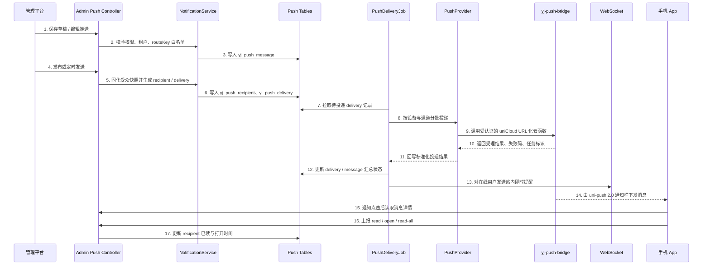
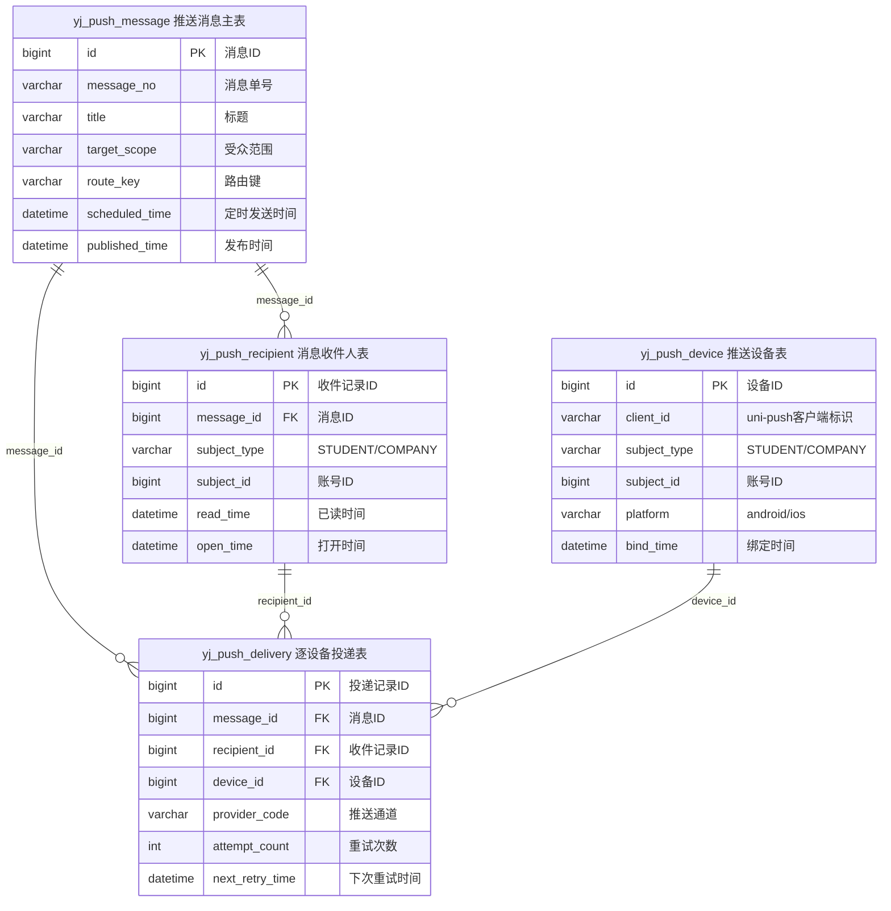

# [程序设计]PD-042-20260809-Story-042-消息推送与消息中心

**文档编号**：PD-042
**Story编号**：Story-042
**关联需求文档**：[REQ-042-20260809-消息推送与消息中心](../030-需求文档/[需求文档]REQ-042-20260809-消息推送与消息中心.md)
**关联版本计划**：[02-版本详细计划.md](../02-版本详细计划.md)
**关联版本出口条件**：参见 [061-验收标准/00-验收标准索引.md#story-042消息推送与消息中心](../061-验收标准/00-验收标准索引.md#story-042消息推送与消息中心) 中 `AC-PUSH-001`、`AC-PUSH-002`、`AC-PUSH-003`、`AC-PUSH-004`、`AC-PUSH-101`、`AC-PUSH-102`、`AC-PUSH-201`、`AC-PUSH-301`
**创建日期**：2026-08-09

## 1. 需求引用

**业务流程**：参见需求文档 [REQ-042](../030-需求文档/[需求文档]REQ-042-20260809-消息推送与消息中心.md)

**版本出口条件**：参见 [061-验收标准/00-验收标准索引.md#story-042消息推送与消息中心](../061-验收标准/00-验收标准索引.md#story-042消息推送与消息中心)；本设计内所有接口、验证点和数据承接均以 `AC-PUSH-001`、`AC-PUSH-002`、`AC-PUSH-003`、`AC-PUSH-004`、`AC-PUSH-101`、`AC-PUSH-102`、`AC-PUSH-201`、`AC-PUSH-301` 为正式映射口径。

## 2. 技术实现时序

实现要点：

1. 后端新增独立 Maven 模块 `yunjikeji-module-notification`，包路径 `com.huiyitech.notification`，启动工程增加 `scanBasePackages` 与 `MapperScan`。
2. 管理端只负责消息编辑、发送、取消、重试、统计，不直接调用具体推送 SDK；后端 Java 侧只调用项目自有、受认证的云函数 URL。
3. `yj_push_delivery` 是可靠投递事实源；Quartz/Worker 按状态拉取待发记录，不能只依赖进程内异步。
4. `PushProvider` 先定义 `NoopPushProvider`、`MockPushProvider`、`UniCloudHttpPushProvider` 三类边界；不再假设存在官方 Java/Spring 直连 UniPush SDK。
5. WebSocket 只做在线补充提醒，离线通知以厂商推送回执为准；“厂商已受理”不等于“用户已阅读”。
6. App 点击推送后必须二次走消息详情接口，不能直接信任通知栏透传正文。
7. App 仓正式云函数资产目录预留为 `code/develop/yunjikeji/uniCloud-aliyun/cloudfunctions/yj-push-bridge/`，职责仅包括调用 `uniCloud.getPushManager(...).sendMessage(...)`、鉴权、参数白名单和结果标准化。
8. 推送凭证、云函数 URL、调用签名密钥全部外置配置；缺少配置时后端只允许走 `NoopPushProvider`，并明确记录“未实际推送”，不能冒充成功下发。

官方边界依据：

1. DCloud `uniCloud` push 文档的服务端入口位于 `uniCloud.getPushManager(...).sendMessage(...)`，属于云端扩展库能力，而非 Java SDK：<https://doc.dcloud.net.cn/uniCloud/uni-cloud-push/api.html>
2. DCloud `uni-push 2.0` 接入指南明确提供“云函数 URL 化（服务端 api）”给传统服务器场景使用：<https://ask.dcloud.net.cn/article/40283>
3. `uni-app` 推送客户端文档区分了客户端 API 与服务端 API；App 侧仅负责获取 `clientId`、监听点击与接收事件：<https://uniapp.dcloud.net.cn/api/plugins/push>

## 3. API 接口设计

### 接口清单

| 接口名称 | HTTP方法 | 接口路径 | 对应出口条件ID | 说明 |
| --- | --- | --- | --- | --- |
| 推送消息分页 | GET | /admin-api/notification/push/page | AC-PUSH-001 / AC-PUSH-003 / AC-PUSH-101 | 管理平台列表页 |
| 推送消息详情 | GET | /admin-api/notification/push/get | AC-PUSH-001 / AC-PUSH-101 | 草稿/发布详情与受众快照回看 |
| 新增推送消息 | POST | /admin-api/notification/push/create | AC-PUSH-001 / AC-PUSH-101 | 保存草稿 |
| 更新推送消息 | PUT | /admin-api/notification/push/update | AC-PUSH-001 / AC-PUSH-101 | 编辑未发布消息 |
| 删除推送消息 | DELETE | /admin-api/notification/push/delete?id={id} | AC-PUSH-001 / AC-PUSH-101 | 仅草稿允许删除 |
| 发布推送消息 | POST | /admin-api/notification/push/publish | AC-PUSH-001 / AC-PUSH-003 / AC-PUSH-101 | 立即发送或定时发送 |
| 取消推送消息 | POST | /admin-api/notification/push/cancel | AC-PUSH-003 / AC-PUSH-101 | 取消待发送/发送中任务 |
| 重试推送消息 | POST | /admin-api/notification/push/retry | AC-PUSH-003 / AC-PUSH-102 / AC-PUSH-201 | 失败或部分失败重试 |
| 投递明细分页 | GET | /admin-api/notification/push/delivery-page | AC-PUSH-003 / AC-PUSH-201 | 逐设备投递查询 |
| 推送统计 | GET | /admin-api/notification/push/statistics | AC-PUSH-003 / AC-PUSH-201 | 汇总已读/打开/失败统计 |
| 设备绑定 | POST | /app-api/yj/notification/devices/bind | AC-PUSH-004 / AC-PUSH-102 | App 启动或登录后绑定设备 |
| 设备解绑 | POST | /app-api/yj/notification/devices/unbind | AC-PUSH-004 / AC-PUSH-102 | 退出登录或切换账号解绑 |
| 消息分页 | GET | /app-api/yj/notification/messages/page | AC-PUSH-002 / AC-PUSH-101 | App 消息中心列表 |
| 消息详情 | GET | /app-api/yj/notification/messages/{id} | AC-PUSH-002 / AC-PUSH-101 | 详情页与点击落地 |
| 未读统计 | GET | /app-api/yj/notification/messages/unread | AC-PUSH-002 / AC-PUSH-101 | 红点与角标 |
| 单条已读 | POST | /app-api/yj/notification/messages/{id}/read | AC-PUSH-002 / AC-PUSH-101 | 阅读详情后标记 |
| 全部已读 | POST | /app-api/yj/notification/messages/read-all | AC-PUSH-002 / AC-PUSH-101 | 批量已读 |
| 打开上报 | POST | /app-api/yj/notification/messages/{id}/open | AC-PUSH-002 / AC-PUSH-102 | 通知点击落地统计 |

### 接口详细定义

#### 3.1 推送消息分页

- **路径**：`GET /admin-api/notification/push/page`
- **认证**：Admin Bearer Token

**请求参数**：

| 参数名 | 类型 | 必填 | 说明 |
| --- | --- | --- | --- |
| pageNo | Integer | 是 | 页码 |
| pageSize | Integer | 是 | 每页条数 |
| title | String | 否 | 标题模糊查询 |
| status | Integer | 否 | 0草稿/10待发送/20发送中/30全部受理/40部分失败/50失败/60已取消 |
| targetScope | String | 否 | ALL / TENANT / STUDENT / COMPANY / SPECIFIED / TAG |
| sendChannel | String | 否 | APP_PUSH / APP_PUSH_AND_WS |
| publishTimeStart | String | 否 | 发布时间起，格式 `yyyy-MM-dd HH:mm:ss` |
| publishTimeEnd | String | 否 | 发布时间止，格式 `yyyy-MM-dd HH:mm:ss` |

**响应参数**：

| 参数名 | 类型 | 说明 |
| --- | --- | --- |
| list | Array | 推送消息分页数据 |
| total | Long | 总条数 |
| list[].id | Long | 消息 ID |
| list[].title | String | 标题 |
| list[].status | Integer | 消息状态 |
| list[].scheduledTime | String | 定时发送时间 |
| list[].publishedTime | String | 发布时间 |
| list[].acceptedCount | Integer | 厂商受理数 |
| list[].readCount | Integer | 已读数 |
| list[].openCount | Integer | 打开数 |

**错误码**：参见后端统一错误码定义与模块内 `ErrorCodeConstants`

本接口特有业务错误：

| 错误码 | HTTP状态码 | 说明 |
| --- | --- | --- |
| 1-023-042-001 | 400 | 查询状态枚举非法 |

#### 3.2 推送消息详情

- **路径**：`GET /admin-api/notification/push/get?id={id}`
- **认证**：Admin Bearer Token

**请求参数**：

| 参数名 | 类型 | 必填 | 说明 |
| --- | --- | --- | --- |
| id | Long | 是 | 消息 ID |

**响应参数**：

| 参数名 | 类型 | 说明 |
| --- | --- | --- |
| id | Long | 消息 ID |
| messageNo | String | 业务单号 |
| title | String | 标题 |
| summary | String | 摘要 |
| content | String | 正文 |
| coverUrl | String | 封面 |
| targetScope | String | 受众范围 |
| targetSnapshot | Object | 受众快照 |
| routeKey | String | 跳转白名单键 |
| routeParams | Object | 跳转参数 |
| statistics | Object | 收件/受理/已读/打开/失败统计 |

本接口特有业务错误：

| 错误码 | HTTP状态码 | 说明 |
| --- | --- | --- |
| 1-023-042-002 | 404 | 推送消息不存在 |

#### 3.3 新增推送消息

- **路径**：`POST /admin-api/notification/push/create`
- **认证**：Admin Bearer Token

**请求参数**：

| 参数名 | 类型 | 必填 | 说明 |
| --- | --- | --- | --- |
| title | String | 是 | 标题，1~120 字符 |
| summary | String | 否 | 摘要，0~255 字符 |
| content | String | 是 | 富文本或纯文本正文 |
| coverUrl | String | 否 | 封面地址 |
| messageCategory | String | 是 | SYSTEM / OPERATION |
| sendChannel | String | 是 | APP_PUSH / APP_PUSH_AND_WS |
| targetScope | String | 是 | ALL / TENANT / STUDENT / COMPANY / SPECIFIED / TAG |
| targetSnapshot | Object | 是 | 受众筛选条件快照 |
| routeKey | String | 是 | 白名单路由键 |
| routeParams | Object | 否 | 路由参数 JSON |
| businessType | String | 否 | 业务类型 |
| businessId | String | 否 | 业务标识 |

**响应参数**：

| 参数名 | 类型 | 说明 |
| --- | --- | --- |
| id | Long | 消息 ID |

本接口特有业务错误：

| 错误码 | HTTP状态码 | 说明 |
| --- | --- | --- |
| 1-023-042-003 | 400 | routeKey 不在白名单 |
| 1-023-042-004 | 400 | 受众快照为空或超范围 |

#### 3.4 更新推送消息

- **路径**：`PUT /admin-api/notification/push/update`
- **认证**：Admin Bearer Token

**请求参数**：同“新增推送消息”，另含 `id`

**响应参数**：

| 参数名 | 类型 | 说明 |
| --- | --- | --- |
| success | Boolean | 是否更新成功 |

本接口特有业务错误：

| 错误码 | HTTP状态码 | 说明 |
| --- | --- | --- |
| 1-023-042-005 | 400 | 非草稿消息不可编辑 |

#### 3.5 删除推送消息

- **路径**：`DELETE /admin-api/notification/push/delete?id={id}`
- **认证**：Admin Bearer Token

**请求参数**：

| 参数名 | 类型 | 必填 | 说明 |
| --- | --- | --- | --- |
| id | Long | 是 | 消息 ID |

**响应参数**：

| 参数名 | 类型 | 说明 |
| --- | --- | --- |
| success | Boolean | 是否删除成功 |

本接口特有业务错误：

| 错误码 | HTTP状态码 | 说明 |
| --- | --- | --- |
| 1-023-042-006 | 400 | 已发布消息不可删除 |

#### 3.6 发布推送消息

- **路径**：`POST /admin-api/notification/push/publish`
- **认证**：Admin Bearer Token

**请求参数**：

| 参数名 | 类型 | 必填 | 说明 |
| --- | --- | --- | --- |
| id | Long | 是 | 消息 ID |
| publishType | String | 是 | IMMEDIATE / SCHEDULED |
| scheduledTime | String | 否 | 定时发送时间；`publishType=SCHEDULED` 时必填 |
| idempotencyKey | String | 是 | 发布幂等键 |

**响应参数**：

| 参数名 | 类型 | 说明 |
| --- | --- | --- |
| taskId | Long | 消息 ID，作为任务主键 |
| status | Integer | 发布后的消息状态 |

本接口特有业务错误：

| 错误码 | HTTP状态码 | 说明 |
| --- | --- | --- |
| 1-023-042-007 | 400 | 定时发送时间早于当前时间 |
| 1-023-042-008 | 409 | 幂等键重复或消息已发布 |

#### 3.7 取消推送消息

- **路径**：`POST /admin-api/notification/push/cancel`
- **认证**：Admin Bearer Token

**请求参数**：

| 参数名 | 类型 | 必填 | 说明 |
| --- | --- | --- | --- |
| id | Long | 是 | 消息 ID |
| reason | String | 否 | 取消原因 |

**响应参数**：

| 参数名 | 类型 | 说明 |
| --- | --- | --- |
| success | Boolean | 是否取消成功 |

本接口特有业务错误：

| 错误码 | HTTP状态码 | 说明 |
| --- | --- | --- |
| 1-023-042-009 | 400 | 草稿或已完成消息不可取消 |

#### 3.8 重试推送消息

- **路径**：`POST /admin-api/notification/push/retry`
- **认证**：Admin Bearer Token

**请求参数**：

| 参数名 | 类型 | 必填 | 说明 |
| --- | --- | --- | --- |
| id | Long | 是 | 消息 ID |
| retryScope | String | 是 | FAILED_ONLY / ALL_PENDING |
| idempotencyKey | String | 是 | 重试幂等键 |

**响应参数**：

| 参数名 | 类型 | 说明 |
| --- | --- | --- |
| resetCount | Integer | 被重置为待投递的 delivery 数 |

本接口特有业务错误：

| 错误码 | HTTP状态码 | 说明 |
| --- | --- | --- |
| 1-023-042-010 | 400 | 消息当前状态不允许重试 |

#### 3.9 投递明细分页

- **路径**：`GET /admin-api/notification/push/delivery-page`
- **认证**：Admin Bearer Token

**请求参数**：

| 参数名 | 类型 | 必填 | 说明 |
| --- | --- | --- | --- |
| pageNo | Integer | 是 | 页码 |
| pageSize | Integer | 是 | 每页条数 |
| messageId | Long | 是 | 消息 ID |
| subjectType | String | 否 | STUDENT / COMPANY |
| status | Integer | 否 | delivery 状态 |
| providerCode | String | 否 | noop / mock / unicloud-http |
| failureCode | String | 否 | 失败码筛选 |

**响应参数**：

| 参数名 | 类型 | 说明 |
| --- | --- | --- |
| list | Array | 投递记录 |
| list[].recipientId | Long | 收件人记录 ID |
| list[].deviceId | Long | 设备记录 ID |
| list[].providerCode | String | 推送通道 |
| list[].status | Integer | 逐设备状态 |
| list[].attemptCount | Integer | 已重试次数 |
| list[].failureCode | String | 厂商失败码 |
| list[].failureMessage | String | 失败描述 |

#### 3.10 推送统计

- **路径**：`GET /admin-api/notification/push/statistics?messageId={id}`
- **认证**：Admin Bearer Token

**请求参数**：

| 参数名 | 类型 | 必填 | 说明 |
| --- | --- | --- | --- |
| messageId | Long | 是 | 消息 ID |

**响应参数**：

| 参数名 | 类型 | 说明 |
| --- | --- | --- |
| totalRecipientCount | Integer | 收件人数 |
| totalDeviceCount | Integer | 设备数 |
| acceptedCount | Integer | 厂商受理数 |
| readCount | Integer | 已读人数 |
| openCount | Integer | 打开人数 |
| failedCount | Integer | 最终失败设备数 |

#### 3.11 设备绑定

- **路径**：`POST /app-api/yj/notification/devices/bind`
- **认证**：App Bearer Token

**请求参数**：

| 参数名 | 类型 | 必填 | 说明 |
| --- | --- | --- | --- |
| clientId | String | 是 | uni-push 2.0 `clientId` |
| pushToken | String | 否 | 厂商通道 token 或云端登记 token |
| platform | String | 是 | android / ios |
| subjectType | String | 是 | STUDENT / COMPANY |
| subjectId | Long | 是 | `yj_customer_account.id` 或 `yj_company_account_front.id` |
| tenantId | Long | 是 | 账号所属租户 |
| appVersion | String | 否 | App 版本 |
| osVersion | String | 否 | 系统版本 |
| manufacturer | String | 否 | 厂商标识 |
| deviceModel | String | 否 | 设备型号 |

**响应参数**：

| 参数名 | 类型 | 说明 |
| --- | --- | --- |
| deviceId | Long | 设备记录 ID |
| bindTime | String | 绑定时间 |

本接口特有业务错误：

| 错误码 | HTTP状态码 | 说明 |
| --- | --- | --- |
| 1-023-042-011 | 400 | 登录账号与 subjectType/subjectId/tenantId 不一致 |

#### 3.12 设备解绑

- **路径**：`POST /app-api/yj/notification/devices/unbind`
- **认证**：App Bearer Token

**请求参数**：

| 参数名 | 类型 | 必填 | 说明 |
| --- | --- | --- | --- |
| clientId | String | 是 | uni-push 2.0 `clientId` |

**响应参数**：

| 参数名 | 类型 | 说明 |
| --- | --- | --- |
| success | Boolean | 是否解绑成功 |

#### 3.13 消息分页

- **路径**：`GET /app-api/yj/notification/messages/page`
- **认证**：App Bearer Token

**请求参数**：

| 参数名 | 类型 | 必填 | 说明 |
| --- | --- | --- | --- |
| pageNo | Integer | 是 | 页码 |
| pageSize | Integer | 是 | 每页条数 |
| readStatus | String | 否 | UNREAD / READ / OPENED |

**响应参数**：

| 参数名 | 类型 | 说明 |
| --- | --- | --- |
| list | Array | 消息列表 |
| list[].id | Long | recipient 记录 ID |
| list[].messageId | Long | 消息主表 ID |
| list[].title | String | 标题 |
| list[].summary | String | 摘要 |
| list[].coverUrl | String | 封面 |
| list[].routeKey | String | 路由键 |
| list[].status | Integer | 0待接收/10已受理/20已读/30已打开 |
| list[].publishedTime | String | 发布时间 |

#### 3.14 消息详情

- **路径**：`GET /app-api/yj/notification/messages/{id}`
- **认证**：App Bearer Token

**请求参数**：

| 参数名 | 类型 | 必填 | 说明 |
| --- | --- | --- | --- |
| id | Long | 是 | recipient 记录 ID |

**响应参数**：

| 参数名 | 类型 | 说明 |
| --- | --- | --- |
| id | Long | recipient 记录 ID |
| messageId | Long | 消息主表 ID |
| title | String | 标题 |
| content | String | 正文 |
| routeKey | String | 跳转白名单键 |
| routeParams | Object | 跳转参数 |
| businessType | String | 业务类型 |
| businessId | String | 业务 ID |
| readTime | String | 已读时间 |
| openTime | String | 打开时间 |

#### 3.15 未读统计

- **路径**：`GET /app-api/yj/notification/messages/unread`
- **认证**：App Bearer Token

**响应参数**：

| 参数名 | 类型 | 说明 |
| --- | --- | --- |
| unreadCount | Integer | 未读总数 |

#### 3.16 单条已读

- **路径**：`POST /app-api/yj/notification/messages/{id}/read`
- **认证**：App Bearer Token

**请求参数**：无 body

**响应参数**：

| 参数名 | 类型 | 说明 |
| --- | --- | --- |
| success | Boolean | 是否标记成功 |

#### 3.17 全部已读

- **路径**：`POST /app-api/yj/notification/messages/read-all`
- **认证**：App Bearer Token

**请求参数**：

| 参数名 | 类型 | 必填 | 说明 |
| --- | --- | --- | --- |
| beforeTime | String | 否 | `yyyy-MM-dd HH:mm:ss`，仅批量已读指定时间之前消息；缺省表示当前账号全部未读 |

**响应参数**：

| 参数名 | 类型 | 说明 |
| --- | --- | --- |
| updatedCount | Integer | 本次更新条数 |

#### 3.18 打开上报

- **路径**：`POST /app-api/yj/notification/messages/{id}/open`
- **认证**：App Bearer Token

**请求参数**：

| 参数名 | 类型 | 必填 | 说明 |
| --- | --- | --- | --- |
| clientId | String | 否 | 当前点击设备 `clientId` |

**响应参数**：

| 参数名 | 类型 | 说明 |
| --- | --- | --- |
| success | Boolean | 是否上报成功 |

本接口特有业务错误：

| 错误码 | HTTP状态码 | 说明 |
| --- | --- | --- |
| 1-023-042-012 | 403 | 当前消息不属于当前登录账号 |

## 4. 前置验证入口与红灯标准

| 验证点 | 用例路径 / 脚本路径 | 执行命令 | 预期红灯原因 | 对应出口条件ID |
| --- | --- | --- | --- | --- |
| 管理端草稿新增与发布主链路 | `code/develop/yunjikeji-admin-server/yunjikeji-module-notification/src/test/java/com/huiyitech/notification/service/PushMessageServiceImplTest.java` | `mvn -pl yunjikeji-module-notification -Dtest=PushMessageServiceImplTest test` | 当前模块尚未创建，草稿保存、受众快照生成、publish 幂等与 delivery 初始化都应先红灯 | AC-PUSH-001 / AC-PUSH-101 / AC-PUSH-301 |
| routeKey 白名单校验 | `code/develop/yunjikeji-admin-server/yunjikeji-module-notification/src/test/java/com/huiyitech/notification/service/NotificationRouteWhitelistTest.java` | `mvn -pl yunjikeji-module-notification -Dtest=NotificationRouteWhitelistTest test` | 未实现白名单前，任意 routeKey 都会错误放行 | AC-PUSH-101 / AC-PUSH-102 |
| 设备换绑 / 解绑 / 跨租户校验 | `code/develop/yunjikeji-admin-server/yunjikeji-module-notification/src/test/java/com/huiyitech/notification/service/PushDeviceServiceImplTest.java` | `mvn -pl yunjikeji-module-notification -Dtest=PushDeviceServiceImplTest test` | 未校验 subjectType + subjectId + tenantId 前，设备会串号或残留旧绑定 | AC-PUSH-004 / AC-PUSH-102 / AC-PUSH-201 |
| Worker 重试与取消链路 | `code/develop/yunjikeji-admin-server/yunjikeji-module-notification/src/test/java/com/huiyitech/notification/job/PushDeliveryJobTest.java` | `mvn -pl yunjikeji-module-notification -Dtest=PushDeliveryJobTest test` | 未实现 delivery 状态机时，失败任务不会重试，取消也无法阻断已排队记录 | AC-PUSH-003 / AC-PUSH-102 / AC-PUSH-201 |
| App 消息中心已读 / 打开上报 | `code/develop/yunjikeji/src/utils/__tests__/notification-route.spec.js` | `npm run test:unit -- notification-route` | 未实现 recipient 读开状态更新与路由映射前，消息详情和跳转都不能闭环 | AC-PUSH-002 / AC-PUSH-101 / AC-PUSH-102 |
| 管理端投递明细与统计口径 | `code/develop/yunjikeji-admin-server/yunjikeji-module-notification/src/test/java/com/huiyitech/notification/controller/admin/PushAdminControllerTest.java` | `mvn -pl yunjikeji-module-notification -Dtest=PushAdminControllerTest test` | 未聚合 message / recipient / delivery 前，统计口径会与明细不一致 | AC-PUSH-003 / AC-PUSH-201 / AC-PUSH-301 |
| Java 云函数桥接与 Noop 降级 | `code/develop/yunjikeji-admin-server/yunjikeji-module-notification/src/test/java/com/huiyitech/notification/provider/UniCloudHttpPushProviderTest.java` / `code/develop/yunjikeji/uniCloud-aliyun/cloudfunctions/yj-push-bridge/` | `mvn -pl yunjikeji-module-notification -Dtest=UniCloudHttpPushProviderTest test` | 若仍按不存在的官方 Java SDK 设计，或云函数 URL/签名缺失时仍返回“已推送”，则服务端边界与真实官方能力不一致 | AC-PUSH-101 / AC-PUSH-102 / AC-PUSH-301 |

红灯要求：

1. 发布前必须拦截无标题、空正文、空受众、非法 routeKey、定时早于当前时间、跨租户受众。
2. 设备绑定必须拦截当前 token 与 `subjectType + subjectId + tenantId` 不一致的请求。
3. App 详情读取、已读、打开上报必须校验 recipient 所属账号；不能直接按 messageId 全表查询。
4. Worker 必须只消费 `status=0` 或满足重试窗口的 delivery；取消状态消息不得继续投递。
5. 云函数 URL、appId、签名密钥或运行环境未配置时，Provider 必须退化为 `NoopPushProvider` 并显式标记“未实际推送”；不得把未调用云函数的记录写成已受理。
6. `NoopPushProvider` 命中时必须写入一次投递尝试审计，最终状态直接落为失败，不进入无限重试。

## 5. 数据结构

### 5.1 管理端请求对象

#### AdminPushCreateReqVO / AdminPushUpdateReqVO

| 字段名 | 类型 | 必填 | 校验规则 | 说明 |
| --- | --- | --- | --- | --- |
| id | Long | 更新时是 | `> 0` | 更新场景主键 |
| title | String | 是 | 1~120 字符 | 消息标题 |
| summary | String | 否 | ≤255 字符 | 列表摘要 |
| content | String | 是 | 非空 | 消息正文 |
| coverUrl | String | 否 | URL 长度 ≤500 | 封面地址 |
| messageCategory | String | 是 | SYSTEM / OPERATION | 消息分类 |
| sendChannel | String | 是 | APP_PUSH / APP_PUSH_AND_WS | 发送通道 |
| targetScope | String | 是 | ALL / TENANT / STUDENT / COMPANY / SPECIFIED / TAG | 受众范围 |
| targetSnapshot | Object | 是 | JSON 非空 | 受众条件快照 |
| routeKey | String | 是 | 白名单枚举 | 跳转路由键 |
| routeParams | Object | 否 | JSON 序列化后 ≤2000 字符 | 路由参数 |
| businessType | String | 否 | ≤50 字符 | 业务类型 |
| businessId | String | 否 | ≤64 字符 | 业务标识 |

#### AdminPushPublishReqVO

| 字段名 | 类型 | 必填 | 校验规则 | 说明 |
| --- | --- | --- | --- | --- |
| id | Long | 是 | `> 0` | 消息 ID |
| publishType | String | 是 | IMMEDIATE / SCHEDULED | 发布方式 |
| scheduledTime | String | 定时时是 | 晚于当前时间 | 定时发送时间 |
| idempotencyKey | String | 是 | 1~64 字符 | 幂等键 |

#### AdminPushRetryReqVO

| 字段名 | 类型 | 必填 | 校验规则 | 说明 |
| --- | --- | --- | --- | --- |
| id | Long | 是 | `> 0` | 消息 ID |
| retryScope | String | 是 | FAILED_ONLY / ALL_PENDING | 重试范围 |
| idempotencyKey | String | 是 | 1~64 字符 | 重试幂等键 |

### 5.2 App 请求对象

#### AppNotificationDeviceBindReqVO

| 字段名 | 类型 | 必填 | 校验规则 | 说明 |
| --- | --- | --- | --- | --- |
| clientId | String | 是 | 1~100 字符 | 推送客户端标识 |
| pushToken | String | 否 | ≤255 字符 | 厂商 token |
| platform | String | 是 | android / ios | 平台 |
| subjectType | String | 是 | STUDENT / COMPANY | 账号身份 |
| subjectId | Long | 是 | `> 0` | `yj_customer_account.id` 或 `yj_company_account_front.id` |
| tenantId | Long | 是 | `>= 0` | 租户编号 |
| manufacturer | String | 否 | ≤50 字符 | 厂商 |
| deviceModel | String | 否 | ≤100 字符 | 型号 |
| appVersion | String | 否 | ≤30 字符 | App 版本 |
| osVersion | String | 否 | ≤30 字符 | 系统版本 |

#### AppNotificationReadAllReqVO

| 字段名 | 类型 | 必填 | 校验规则 | 说明 |
| --- | --- | --- | --- | --- |
| beforeTime | String | 否 | `yyyy-MM-dd HH:mm:ss` | 仅批量已读指定时间之前消息，缺省表示当前账号全部未读 |

### 5.3 响应对象

#### AppNotificationMessageRespVO

| 字段名 | 类型 | 说明 |
| --- | --- | --- |
| id | Long | recipient 记录 ID |
| messageId | Long | 消息主表 ID |
| title | String | 标题 |
| summary | String | 摘要 |
| content | String | 正文，列表接口可为空 |
| coverUrl | String | 封面 |
| routeKey | String | 跳转白名单键 |
| routeParams | Object | 跳转参数 |
| businessType | String | 业务类型 |
| businessId | String | 业务 ID |
| status | Integer | 0待接收/10已受理/20已读/30已打开 |
| publishedTime | String | 发布时间 |
| readTime | String | 已读时间 |
| openTime | String | 打开时间 |

#### AdminPushStatisticsRespVO

| 字段名 | 类型 | 说明 |
| --- | --- | --- |
| totalRecipientCount | Integer | 收件人数 |
| totalDeviceCount | Integer | 设备数 |
| acceptedCount | Integer | 厂商受理数 |
| deliveredCount | Integer | 厂商送达回执数，可为空 |
| readCount | Integer | 已读人数 |
| openCount | Integer | 打开人数 |
| failedCount | Integer | 最终失败设备数 |

### 5.4 枚举与白名单

#### routeKey 白名单

| routeKey | 说明 | routeParams 约束 |
| --- | --- | --- |
| message_center | 打开消息中心 | 无 |
| practice_home | 学员端练习首页 | 无 |
| practice_record | 学员端练习记录详情 | `recordId` 必填 |
| knowledge_chat | AI 对话页 | `agentId` 可选 |
| post_detail | 招聘岗位详情 | `postId` 必填 |
| customer_service | 在线客服页 | 无 |
| assessment_result | 测评结果页 | `resultId` 必填 |
| company_student_audit | 企业端学员审核详情 | `auditId` 必填 |

#### subjectType 口径

| 值 | 说明 | 关联主表 |
| --- | --- | --- |
| STUDENT | 学员端登录账号 | `yj_customer_account` |
| COMPANY | 企业端登录账号 | `yj_company_account_front` |

设计约束：

1. 不能只存 `user_id`；App 两种身份都使用 `MEMBER` 类型令牌，必须同时落 `subject_type + subject_id + tenant_id` 才能避免串号。
2. `routeKey` 只能从白名单选择；管理端不能直接下发任意 URL。
3. `targetSnapshot`、`routeParams`、`payloadSnapshot` 一律存 JSON 字符串快照，供追溯和重试复用。
4. Java 服务不直接接入 UniPush Java SDK；统一通过 `UniCloudHttpPushProvider` 调用 `yj-push-bridge` 云函数，并由云函数内部调用 DCloud 官方云端推送能力。

## 6. 数据库表设计

本节只保留当前需求实际涉及的内容，并完整复用 `../../30-开发阶段/30-0500-database-management/assets/table-design-template.md` 的 标题 + 公共字段统一说明 + Mermaid ER 图 结构。

### 消息推送与消息中心数据关系图

公共字段统一说明：

- 除特殊说明外，四张业务表统一包含：`id`、`status`、`creator`、`create_time`、`updater`、`update_time`、`deleted`、`tenant_id`
- 关系图中不再在每张表内重复展开公共字段：`status / creator / create_time / updater / update_time / deleted / tenant_id`
- `status` 在四张表中承担业务状态字段职责：消息状态、收件状态、设备状态、逐设备投递状态分别在对应表注释中定义

### 6.1 yj_push_message

| 字段名 | 类型 | 必填 | 默认值 | 说明 |
| --- | --- | --- | --- | --- |
| id | bigint | 是 | 自增 | 消息 ID |
| message_no | varchar(40) | 是 | 无 | 消息业务单号，管理端与厂商回执追踪键 |
| tenant_id | bigint | 是 | 0 | 租户编号；全员推送场景仍保留创建租户 |
| title | varchar(120) | 是 | 无 | 标题 |
| summary | varchar(255) | 否 | null | 摘要 |
| content | text | 是 | 无 | 正文 |
| cover_url | varchar(500) | 否 | null | 封面地址 |
| message_category | varchar(20) | 是 | OPERATION | SYSTEM / OPERATION |
| send_channel | varchar(20) | 是 | APP_PUSH | APP_PUSH / APP_PUSH_AND_WS |
| target_scope | varchar(20) | 是 | ALL | 受众范围 |
| target_snapshot_json | longtext | 否 | null | 受众快照 JSON |
| route_key | varchar(50) | 是 | 无 | 白名单路由键 |
| route_params_json | text | 否 | null | 路由参数 JSON |
| business_type | varchar(50) | 否 | null | 业务类型 |
| business_id | varchar(64) | 否 | null | 业务 ID |
| scheduled_time | datetime | 否 | null | 定时发送时间 |
| published_time | datetime | 否 | null | 实际发布时间 |
| completed_time | datetime | 否 | null | 最终完成时间 |
| cancelled_time | datetime | 否 | null | 取消时间 |
| published_by | varchar(64) | 否 | '' | 发布操作人 |
| cancelled_by | varchar(64) | 否 | '' | 取消操作人 |
| total_recipient_count | int | 是 | 0 | 收件人数 |
| total_device_count | int | 是 | 0 | 设备数 |
| accepted_count | int | 是 | 0 | 厂商受理数 |
| read_count | int | 是 | 0 | 已读人数 |
| open_count | int | 是 | 0 | 打开人数 |
| status | tinyint | 是 | 0 | 0草稿/10待发送/20发送中/30全部受理/40部分失败/50失败/60已取消 |
| creator | varchar(64) | 否 | '' | 创建者 |
| create_time | datetime | 是 | CURRENT_TIMESTAMP | 创建时间 |
| updater | varchar(64) | 否 | '' | 更新者 |
| update_time | datetime | 是 | CURRENT_TIMESTAMP | 更新时间 |
| deleted | bit(1) | 是 | b'0' | 逻辑删除 |

索引设计：

1. `uk_push_message_no(message_no)`：业务单号唯一。
2. `idx_push_message_tenant_status(tenant_id, status)`：管理端列表按租户和状态分页。
3. `idx_push_message_status_schedule(status, scheduled_time)`：Worker 拉取待发送与定时消息。
4. `idx_push_message_business(business_type, business_id)`：同业务对象反查推送。
5. `idx_push_message_published_time(published_time)`：管理端按发布时间区间查询。

### 6.2 yj_push_recipient

| 字段名 | 类型 | 必填 | 默认值 | 说明 |
| --- | --- | --- | --- | --- |
| id | bigint | 是 | 自增 | 收件记录 ID |
| message_id | bigint | 是 | 无 | 关联消息 ID |
| tenant_id | bigint | 是 | 0 | 收件账号所属租户 |
| subject_type | varchar(20) | 是 | 无 | STUDENT / COMPANY |
| subject_id | bigint | 是 | 无 | 账号 ID |
| display_name | varchar(100) | 否 | null | 收件人名称快照 |
| mobile_mask | varchar(32) | 否 | null | 手机号脱敏快照 |
| payload_snapshot_json | text | 否 | null | 个性化变量快照 |
| first_accepted_time | datetime | 否 | null | 首次受理时间 |
| read_time | datetime | 否 | null | 首次已读时间 |
| open_time | datetime | 否 | null | 首次打开时间 |
| status | tinyint | 是 | 0 | 0待接收/10已受理/20已读/30已打开/40已撤回 |
| creator | varchar(64) | 否 | '' | 创建者 |
| create_time | datetime | 是 | CURRENT_TIMESTAMP | 创建时间 |
| updater | varchar(64) | 否 | '' | 更新者 |
| update_time | datetime | 是 | CURRENT_TIMESTAMP | 更新时间 |
| deleted | bit(1) | 是 | b'0' | 逻辑删除 |

索引设计：

1. `uk_push_recipient_message_subject(message_id, tenant_id, subject_type, subject_id)`：同一消息对同一身份只保留一条收件记录。
2. `idx_push_recipient_subject(tenant_id, subject_type, subject_id, status)`：App 消息中心分页。
3. `idx_push_recipient_message(message_id)`：管理端统计与回写。
4. `idx_push_recipient_read(status, read_time)`：未读统计与已读时间筛选。

### 6.3 yj_push_device

| 字段名 | 类型 | 必填 | 默认值 | 说明 |
| --- | --- | --- | --- | --- |
| id | bigint | 是 | 自增 | 设备记录 ID |
| tenant_id | bigint | 是 | 0 | 当前绑定租户 |
| subject_type | varchar(20) | 是 | 无 | STUDENT / COMPANY |
| subject_id | bigint | 是 | 无 | 账号 ID |
| client_id | varchar(100) | 是 | 无 | uni-push 2.0 clientId |
| push_token | varchar(255) | 否 | null | 厂商通道 token 或云端登记 token |
| platform | varchar(20) | 是 | 无 | android / ios |
| manufacturer | varchar(50) | 否 | null | 厂商名称 |
| device_model | varchar(100) | 否 | null | 设备型号 |
| app_id | varchar(100) | 否 | null | 应用标识 |
| app_version | varchar(30) | 否 | null | App 版本 |
| os_version | varchar(30) | 否 | null | 系统版本 |
| rom_channel | varchar(30) | 否 | null | 厂商通道标识 |
| last_active_time | datetime | 否 | null | 最近活跃时间 |
| bind_time | datetime | 否 | null | 首次绑定时间 |
| unbind_time | datetime | 否 | null | 最近解绑时间 |
| invalid_time | datetime | 否 | null | 标记失效时间 |
| invalid_reason | varchar(255) | 否 | null | 失效原因 |
| status | tinyint | 是 | 0 | 0启用/10已解绑/20失效 |
| creator | varchar(64) | 否 | '' | 创建者 |
| create_time | datetime | 是 | CURRENT_TIMESTAMP | 创建时间 |
| updater | varchar(64) | 否 | '' | 更新者 |
| update_time | datetime | 是 | CURRENT_TIMESTAMP | 更新时间 |
| deleted | bit(1) | 是 | b'0' | 逻辑删除 |

索引设计：

1. `uk_push_device_client_id(client_id)`：一个 clientId 始终只对应一条当前设备记录，换绑时直接更新。
2. `idx_push_device_subject(tenant_id, subject_type, subject_id, status)`：按账号查询全部设备。
3. `idx_push_device_status_active(status, last_active_time)`：清理失效设备与拉取活跃设备。
4. `idx_push_device_platform_status(platform, status)`：分平台投递与问题排查。

### 6.4 yj_push_delivery

正式 SQL 入口：`050-执行脚本/20260809120000-ddl-create_yj_push_tables.sql`

| 字段名 | 类型 | 必填 | 默认值 | 说明 |
| --- | --- | --- | --- | --- |
| id | bigint | 是 | 自增 | 投递记录 ID |
| message_id | bigint | 是 | 无 | 消息 ID |
| recipient_id | bigint | 是 | 无 | 收件记录 ID |
| device_id | bigint | 是 | 无 | 设备 ID |
| tenant_id | bigint | 是 | 0 | 租户编号 |
| subject_type | varchar(20) | 是 | 无 | STUDENT / COMPANY |
| subject_id | bigint | 是 | 无 | 账号 ID |
| provider_code | varchar(30) | 是 | noop | noop / mock / unicloud-http |
| provider_message_id | varchar(100) | 否 | null | 云函数返回的 push 任务标识或厂商消息 ID |
| provider_request_id | varchar(100) | 否 | null | Java 调云函数请求追踪 ID |
| payload_snapshot_json | text | 否 | null | 下发给 Provider/云函数的快照 |
| attempt_log_json | longtext | 否 | null | 每次投递尝试审计日志，至少记录 attemptNo / providerCode / providerRequestId / requestTime / responseTime / resultStatus / failureCode / failureMessage |
| attempt_count | int | 是 | 0 | 已尝试次数 |
| max_attempt_count | int | 是 | 3 | 最大重试次数 |
| next_retry_time | datetime | 否 | null | 下次重试时间 |
| last_attempt_time | datetime | 否 | null | 最近尝试时间 |
| accepted_time | datetime | 否 | null | 厂商受理时间 |
| delivered_time | datetime | 否 | null | 厂商送达回执时间 |
| failure_code | varchar(64) | 否 | null | 厂商失败码；Noop 固定为 `NOOP_PROVIDER_DISABLED` |
| failure_message | varchar(255) | 否 | null | 厂商失败描述；Noop 写明缺失配置项 |
| status | tinyint | 是 | 0 | 0待投递/10投递中/20已受理/30已送达回执/40失败/50已取消 |
| creator | varchar(64) | 否 | '' | 创建者 |
| create_time | datetime | 是 | CURRENT_TIMESTAMP | 创建时间 |
| updater | varchar(64) | 否 | '' | 更新者 |
| update_time | datetime | 是 | CURRENT_TIMESTAMP | 更新时间 |
| deleted | bit(1) | 是 | b'0' | 逻辑删除 |

索引设计：

1. `uk_push_delivery_message_device(message_id, device_id)`：同一消息对同一设备只投递一次。
2. `idx_push_delivery_status_retry(status, next_retry_time)`：Worker 拉取待投递和待重试记录。
3. `idx_push_delivery_recipient(recipient_id, status)`：按收件人回写进度。
4. `idx_push_delivery_provider(provider_code, provider_request_id)`：按厂商请求号排障。
5. `idx_push_delivery_message(message_id)`：管理端按消息聚合统计。

补充语义：

1. `attempt_count` 表示已落库的尝试次数，每触发一次 Provider 调用或 Noop 降级判定都必须 +1。
2. `attempt_log_json` 保存完整尝试审计快照；`attempt_count`、`last_attempt_time`、`failure_code`、`failure_message` 只保留最新聚合状态。
3. `NoopPushProvider` 命中时，delivery 必须：
   - `provider_code=noop`；
   - `status=40` 最终失败；
   - `failure_code=NOOP_PROVIDER_DISABLED`；
   - `next_retry_time=null`，默认不自动重试；
   - 统计口径计入 `failedCount`，不得计入 `acceptedCount`。
4. `MockPushProvider` 允许按测试场景返回成功、失败或可重试结果，但也必须写入 `attempt_log_json`。

### 6.5 Provider、云函数与配置边界

1. 后端模块内保留 `PushProvider` SPI，但正式实现调整为：
   - `NoopPushProvider`：无云函数配置时启用，不实际推送，但必须落一次失败审计，且最终状态为失败；
   - `MockPushProvider`：测试环境联调与失败演练；
   - `UniCloudHttpPushProvider`：通过 HTTPS 调用 `yj-push-bridge` 云函数。
2. `yj-push-bridge` 云函数正式资产路径：`code/develop/yunjikeji/uniCloud-aliyun/cloudfunctions/yj-push-bridge/`。
3. `yj-push-bridge` HTTP 契约：
   - 方法：`POST`
   - URL 语义：`${bridgeBaseUrl}/push/send`
   - 请求头：
     - `Content-Type: application/json`
     - `X-YJ-App-Id`：调用方应用标识
     - `X-YJ-Timestamp`：毫秒时间戳
     - `X-YJ-Nonce`：单次随机串
     - `X-YJ-Signature`：签名值
   - 签名原文：`appId + "\n" + timestamp + "\n" + nonce + "\n" + requestBodySha256Hex`
   - 签名算法：`HmacSHA256(signSecret, signPayload)`，结果转十六进制小写
   - 防重放：
     - `timestamp` 与云函数服务端当前时间差超过 300 秒直接拒绝；
     - `nonce` 在 300 秒窗口内不得重复使用，重复时返回鉴权失败；
     - 鉴权失败、签名错误、白名单校验失败都不得落为“已受理”。
4. `yj-push-bridge` 请求 / 响应 DTO：
   - 请求体 `PushBridgeSendReqDTO`
     - `providerRequestId`：Java 侧请求追踪号
     - `messageId` / `recipientId` / `deviceId`
     - `clientId`
     - `pushToken`
     - `platform`
     - `title`
     - `content`
     - `routeKey`
     - `routeParams`
     - `payloadSnapshot`
   - 成功响应 `PushBridgeSendRespDTO`
     - `success`：布尔值
     - `accepted`：是否已被云端受理
     - `providerMessageId`
     - `providerRequestId`
     - `requestTime`
     - `responseTime`
     - `failureCode`
     - `failureMessage`
   - 失败响应统一返回相同字段结构，`success=false`
5. `yj-push-bridge` 错误映射：
   - HTTP `200` + `accepted=true`：Java 侧落 `status=20`
   - HTTP `200` + `accepted=false`：Java 侧落 `status=40` 或按错误类型进入重试
   - HTTP `400`：请求参数错误，落最终失败，不自动重试
   - HTTP `401/403`：签名或白名单错误，落最终失败，不自动重试
   - HTTP `429`：限流，按重试策略回写 `next_retry_time`
   - HTTP `5xx` / 网络超时：视为临时失败，允许重试，`failure_code` 记录 `BRIDGE_HTTP_5XX` 或 `BRIDGE_TIMEOUT`
6. 云函数职责只包括：
   - 校验来自 Java 服务的签名、时间戳和调用来源；
   - 调用 `uniCloud.getPushManager(...).sendMessage(...)`；
   - 对返回结果做标准化，回传 `providerMessageId`、`accepted`、`failureCode`、`failureMessage`。
7. 后端配置项至少包括：`bridgeBaseUrl`、`appId`、`signSecret`、调用超时、是否启用 `Noop` 回退。
8. 风险与止损：
   - 云函数未部署、URL 未配置、鉴权失败或 DCloud 凭证未配置时，只允许进入 `NoopPushProvider` 或失败重试，不允许伪造“已受理”；
   - `provider_code=unicloud-http` 只表示通过云函数桥接，不表示 Java 侧拥有官方直连 SDK 能力；
   - 站内消息落库与已读链路必须独立于离线推送结果存在。

## 7. 修订历史

| 版本 | 修订日期 | 修订说明 |
| --- | --- | --- |
| v1.0 | 2026-08-09 | 初始化消息推送与消息中心程序设计，明确时序、API、验证入口、数据结构与四表设计 |
