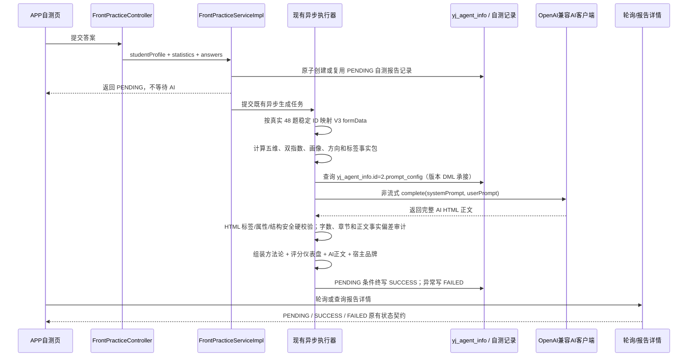

# [程序设计]PD-049-20260825-DEV-049-自测报告生成逻辑精确迁移

**文档编号**：PD-049
**Story编号**：DEV-049（承接 DEV-013 自测结果管理 + AI 报告）
**关联需求文档**：当前版本未建立独立 DEV-013 需求文档；业务事实以 [DEV-049 任务详情](../020-任务详情/DEV-049-自测AI报告故障修复.md) 和 [版本计划](../02-版本详细计划.md) 为准。
**关联版本计划**：[02-版本详细计划.md](../02-版本详细计划.md)
**关联版本出口条件**：AC-ASSESSMENT-AI-001、101、201、301 全部通过，测试环境真实报告可追溯，用户复验前不得发布。
**创建日期**：2026-08-25

## 1. 需求引用

本设计只迁移源工程 D:\飞机\-APP--main (2)\-APP--main\skills\evaluation-report\ 实际导出的 V3 兼容链路，目标是更新当前自测报告运行时提示词及其事实准备边界。https://caacyj.com/ 仅作为报告信息层级与视觉效果的辅助参考，不复制网站实现、内容或外部服务。

### 1.1 来源冲突裁决

- 迁移事实以 `scripts/evaluation-report-core.mjs` 文件末尾真实 `export` 列表及 `prepareEvaluationV3 -> buildUserPromptV3 -> validateReport -> assembleReportV3` 调用链为最高优先级；`prepareEvaluationCurrent`、`validateReportCurrent`、`generateReportCurrent`、`assembleReportCurrent` 均未导出，不得混入本次 V3 基线。
- `D:\飞机\migration-guide.md` 中关于 `processingConsent`、`sanitizeHtml`、`corePublishable/reviewRequired` 的说明与实际导出 V3 行为冲突时，只视为宿主接入建议，不得用来改写源 V3 的默认 8 章、动态 A-G、2500-3800 字提示词、确定性事实或组装顺序。Java 宿主仍须在发布前执行自己的纯 HTML 安全校验，这是宿主加固，不冒充源 V3 导出行为。
- 2026-08-27 用户已明确撤回流式传输改造。本任务保持现有异步任务 + `DeepSeekOpenAiClient.complete(...)` 非流式调用，不新增流式协议、流式配置、30 秒阶段写库、流式执行器或阶段正文展示。

### 1.2 迁移白名单

- references/form-data-v3.schema.json、references/input-contract.md 定义的 V3 输入契约及规范枚举。
- scripts/evaluation-report-core.mjs 的 V3 导出：prepareEvaluationV3、buildBundle、computeScoresV3、directionMatch、concernTags、learningStage、careerStructure、sideBusinessTag、buildUserPromptV3、validateReport、buildMethodologyHTML、buildScoreDashboardV3、assembleReportV3。
- VERIFIED_KNOWLEDGE 完整文本及其限制；报告正文只能引用该知识包，未知事实写“需要进一步核实”。
- tests/fixtures/form-data-v3.json 作为固定回归 fixture；其确定性结果必须为发展潜力 83.8、当前入行成熟度 63.3、画像“高潜力准备型”、主方向“航拍传媒”。

### 1.3 明确排除

- 不迁移 prepareEvaluationCurrent、generateReportCurrent、validateReportCurrent、assembleReportCurrent 等 *Current 候选实现；它们不是源工程实际 V3 导出兼容范围。
- 不把 sanitize-limited-html.mjs 当作 V3 规则或数据库提示词门禁；现有 Java 报告校验/清洗契约按独立验收保持。
- 不迁移源工程 CLI、OpenAI 适配器、网络/保存/通知、知识库检索、部署脚本、密钥或 uni_modules/**。
- 不用自测题数、答对/答错、questionCount、correctCount、wrongCount、statistics.score 参与画像、分数或正文。

## 2. 技术实现时序

### 2.1 确定性事实层

1. 先按分类 13 真实题库 `132026081810001` 至 `132026081810048` 的稳定题目 ID 映射 V3 formData；题干只用于校验题库漂移，不作为主要路由。未知 ID、ID/题干冲突、必填值缺失或非规范值必须失败，禁止静默保留默认值。
2. Q1-Q5 映射身份、背景、无人机接触、CAAC 认知和设备；Q6-Q15 映射 likert.a1-e2；Q16-Q48 分别映射顾虑、报告目标、moduleA-E、补充、称呼、联系方式、真实性和授权。Q17 未选择或无法识别时才按产品既有约定默认 A；已作答但无法识别不得默认 A。
3. 按源工程 V3 规则计算五维：行业认知、职业动机、自我效能、学习准备度、现实推进可行性；保留一位小数。
4. 由规则计算发展潜力指数、当前入行成熟度指数及等级，计算画像类型；固定 fixture 必须得到 83.8 / 63.3 / 高潜力准备型。
5. 只有报告目标包含 A 时计算主方向/备选/暂不优先及证据、限制、验证；主方向由规则决定，fixture 主方向为“航拍传媒”。
6. 顾虑标签始终由规则生成且不扣分；B/C/D 仅在目标已选择时生成学习、就业、兼职/副业事实；E/F/G 使用契约字段和 VERIFIED_KNOWLEDGE 约束。系统事实先注入提示词，LLM 禁止重算、改判或补填。

### 2.2 正文与组装顺序

- 提示词要求正文从“一、评测摘要”开始，并以默认 8 章为生成目标：评测摘要、发展潜力指数、当前入行成熟度指数、用户画像类型、五维测评解读、核心优势、主要顾虑与限制、当前阶段下一步建议。
- 提示词要求 reportGoals 选中的 A-G 按 A-G 顺序追加到第 9 章起，未选目标不生成；精确标题分别为：细分方向匹配、学习、实操、考证与培训路径、就业与转行准备、副业、自由接单与创业可行性、本地学习与项目资源、合规飞行与安全注意事项、未来30—90天行动计划。后端对标题、编号、顺序、数量和唯一性偏差只记录审计，不以正文内容偏差阻断入库。
- assembleReportV3 的顺序固定为：方法论说明 -> 评分仪表盘（两指数、画像、五维）-> LLM 正文 -> 宿主固定品牌区。品牌区只在末尾出现一次，不能由 LLM 生成。
- AI 正文的允许标签、无属性和标签闭合属于安全硬门禁；去除标签并解码受支持实体后的可见文本以 2500-3800 Unicode 码点为生成目标，越界仅记录审计。方法论、评分仪表盘和品牌区不计入 AI 正文字数。
- 保持现有 `DeepSeekOpenAiClient.complete(sceneCode, systemPrompt, userPrompt, null)` 非流式协议和现有模型配置行为；不新增或改造共享客户端传输协议，知识库业务和其他 AI 场景保持行为不变。

## 3. API接口设计

### 接口清单

| 接口名称 | HTTP方法 | 接口路径 | 对应出口条件ID | 说明 |
| --- | --- | --- | --- | --- |
| 提交自测并创建 AI 报告任务 | POST | 现有 APP 自测提交接口（保持当前 Controller 路径） | AC-ASSESSMENT-AI-001、101、201、301 | 维持现有认证、PENDING 写入和异步生成契约 |
| 查询自测报告状态/详情 | GET | 现有 APP 自测报告详情接口（保持当前 Controller 路径） | AC-ASSESSMENT-AI-001、201 | 维持 PENDING/SUCCESS/FAILED、历史简版不可用判定与轮询契约 |

### 3.1 提交接口内部契约

- 输入：现有 studentProfile、statistics、answers；服务内部必须形成 V3 formData，不能直接把统计分数当作 V3 指数。
- 处理：先创建/复用 `PENDING` 记录并把生成任务提交给现有异步执行器；工作线程查询 yj_agent_info.id=2.prompt_config，完成确定性事实层后通过现有非流式 `complete(...)` 获取完整正文。业务线程只返回现有 `PENDING` 契约，不等待完整 AI 正文。
- 成功：AI 返回及映射成功、正文 HTML 标签/属性/结构安全、可信固定块组装成功且记录可持久化后，以 `PENDING` 条件更新写 `SUCCESS`；正文业务偏差写审计日志，不改写后端规则事实。
- 失败：映射、网络、鉴权、模型、参数、超时、空响应、不安全 HTML/结构、固定块组装或持久化失败写 `FAILED` 和脱敏原因；不得返回、保存或展示简版 HTML 或阶段正文。

### 3.2 详情/轮询接口内部契约

- PENDING：报告仍生成，APP 按现有轮询策略继续等待，详情接口返回空正文。
- SUCCESS：只返回通过最终校验的完整 HTML；报告必须与请求记录 ID 一致。
- FAILED：返回失败状态和用户可理解的失败提示；不回退为成功报告。

错误码统一引用项目现有错误码表；本设计不新增错误码体系。

## 4. 前置验证入口与红灯标准

| 验证点 | 用例路径 / 脚本路径 | 执行命令 | 预期红灯原因 | 对应出口条件ID |
| --- | --- | --- | --- | --- |
| 非流式调用契约 | 当前工程 `FrontPracticeServiceImplAssessmentHtmlTest` / AI 客户端合同测试 | 目标测试命令 | 自测路径未继续使用现有 `complete(...)`、出现流式分支或其他 AI 场景行为回归 | AC-ASSESSMENT-AI-101、301 |
| V3 fixture 确定性基线 | 源工程 skills/evaluation-report/tests/evaluation-report.test.mjs fixture 测试；当前工程新增对应 Java 合同测试 | npm test（源 fixture）；当前工程按 Maven 目标测试命令执行 | 当前服务无 formData 映射/规则事实层，不能得到 83.8/63.3/高潜力准备型/航拍传媒 | AC-ASSESSMENT-AI-301 |
| 真实 48 题映射与阈值边界 | 分类13题库 SQL + V3 schema + 固定 fixture | 目标测试命令 | Q1-Q48 错映射、默认值掩盖未知输入、背景副本未写回或 fixture 不再为 83.8/63.3/高潜力准备型/航拍传媒 | AC-ASSESSMENT-AI-101、301 |
| 正文长度与目标动态章节 | Unicode 码点 2499/2500/3800/3801、reportGoals A-G 组合测试 | 目标测试命令 | 内容偏差未记录审计，或仅因长度、标题/章节偏差阻断安全 HTML 持久化 | AC-ASSESSMENT-AI-001、301 |
| LLM 不重算事实 | 伪造错误分数/画像/方向的 AI HTML | 目标测试命令 | 内容偏差未记录审计，或可信仪表盘被 AI 正文覆盖；AI 正文本身的业务偏差不得触发失败 | AC-ASSESSMENT-AI-201、301 |
| 组装与品牌区 | 方法论/仪表盘/正文/品牌区顺序及品牌只出现一次测试 | 目标测试命令 | 方法论不在正文前、品牌不在末尾或重复追加 | AC-ASSESSMENT-AI-001、301 |
| 状态及异常路径 | PENDING/SUCCESS/FAILED、兼容 INSERT、历史简版读取测试 | 当前工程现有 FrontPractice*ContractTest 目标测试 | fallback 成功、失败记录被当成功、轮询状态破坏或持久化失败未阻断 | AC-ASSESSMENT-AI-101、201、301 |
| 数据库提示词入口 | 050-执行脚本索引中的 V3 基线、证照和等级自然解释正向/回滚脚本链 | 测试库备份后执行并查询 yj_agent_info.id=2 | 当前指纹未命中 `2627 / 6770 / 3f2a5361...dbc1`、直接前驱未命中 `2440 / 6243 / 974ef05f...d414`、VERIFIED_KNOWLEDGE 不完整或存在未解析占位符 | AC-ASSESSMENT-AI-201 |

## 5. 数据结构

### 5.1 V3 输入映射对象

| 字段名 | 类型 | 必填 | 校验规则 | 说明 |
| --- | --- | --- | --- | --- |
| evalVersion | Integer | 是 | 固定数值 3 | 版本门禁 |
| likert | Object | 是 | a1-e2 共10项，1-5整数 | 五维评分唯一量表来源 |
| identity/backgroundFields/droneExposure/caacAwareness/equipmentAccess | String/String[] | 是 | 仅 V3 规范枚举 | 基础画像 |
| concerns / reportGoals | String[] | 是 | 顾虑最多3项，目标 A-G 最多3项 | 驱动标签与动态章节 |
| moduleA-moduleE | Object | 按目标条件 | 选中目标对应模块必填，未选目标不生成附加事实 | 方向、学习、就业、副业、本地资源输入 |
| truthConfirm / consent | String | 否 | 不同意仅影响隐私；truthConfirm=否仅质量标记 | 保留源工程授权语义 |

### 5.2 确定性事实包

bundle.scores 包含五维、小数指数、等级、画像及经验用户标记；bundle.direction、concerns、learning、career、sideBiz 按目标条件生成。所有字段在调用 AI 前完成，提示词仅把它们作为不可改写事实传入。

### 5.3 非流式任务上下文

现有数据库抢占逻辑先创建或复用唯一 `PENDING` 记录，再把 `assessmentResultId`、`recordId`、用户上下文与答案快照提交给现有异步执行器。工作线程一次性完成映射、AI 调用、校验、组装和条件终写；不保存阶段正文，不引入流式 chunk、定时刷新句柄或流式专用状态。

## 6. 数据库表设计

本次不新增表、不改表结构；仅由现有版本 DML 更新 yj_agent_info.id=2.prompt_config，正式入口为 050-执行脚本/20260815120000-dml-update_yj_agent_info_self_test_prompt_from_mjs.sql。自测报告记录继续使用当前表及字段承接 `PENDING/SUCCESS/FAILED`、`report_content`、`failure_reason` 和记录关联。执行前必须按现有数据库规范备份测试库，禁止生产库直接变更。

Mermaid ER 关系：`yj_agent_info`（id、prompt_config）作为运行时提示词来源；自测报告记录（record_id、report_status、report_content、failure_reason）继续承接异步状态和最终报告。本次不新增表、不改变现有关系。

终态写库规则：成功终写使用 `WHERE id = ? AND report_status = 'PENDING' AND deleted = b'0'` 条件更新；映射、AI 调用、不安全 HTML/结构、固定块组装或持久化异常进入既有 `FAILED` 闭环，正文业务内容偏差只审计。不存在阶段正文写库。

## 7. 修订历史

| 版本 | 修订日期 | 修订说明 |
| --- | --- | --- |
| v1.0 | 2026-08-25 | 按源工程 V3 实际导出链路补齐精确迁移边界、事实层、提示词结构、红灯入口和 DML 承接；未进入代码实施。 |
| v1.1 | 2026-08-26 | 曾补充真流协议、30 秒阶段写库、独立线程池组件和绝对超时；该方案已由 v1.3 按用户决定撤回。 |
| v1.2 | 2026-08-26 | 曾补充流式任务占位、初始化回滚和 read timeout 约束；流式部分已由 v1.3 撤回。 |
| v1.3 | 2026-08-27 | 按用户撤回流式改造后的真实代码现场重写为非流式链路；明确实际导出 V3 优先于 migration-guide 冲突描述，补齐真实48题、Unicode码点2500-3800、精确章节与可信固定块组装口径。 |
| v1.4 | 2026-08-28 | 按实际运行要求把字数、章节和正文业务事实改为审计项，仅保留 HTML 标签/属性/结构安全硬门禁；同步数据库当前指纹与直接前驱。 |
