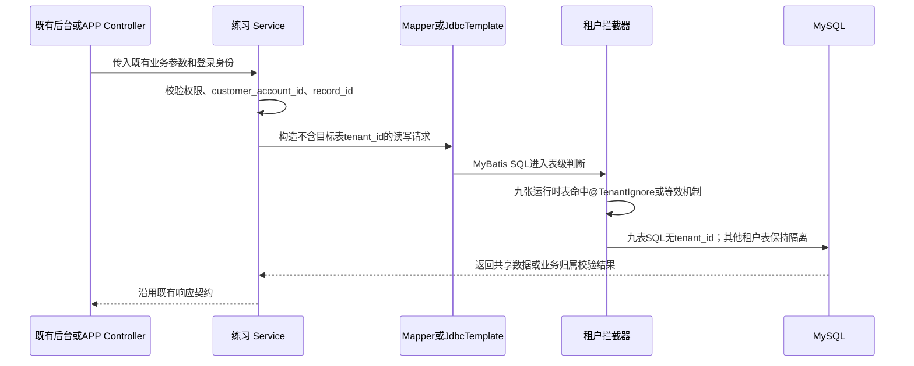
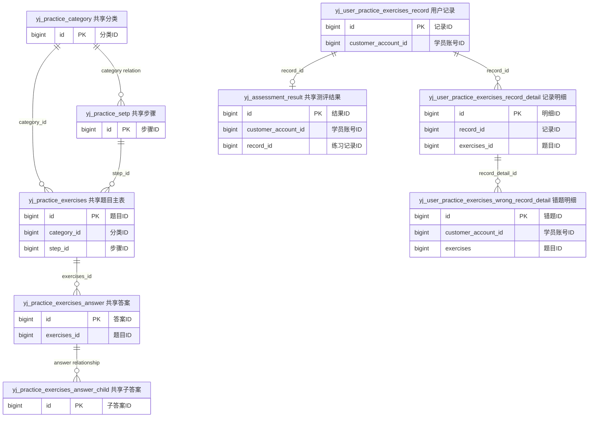

# [程序设计]PD-050-20260817-Story-050-练习数据跨组织共享

**文档编号**：PD-050
**Story编号**：Story-050
**关联需求文档**：[REQ-050-20260817-练习数据跨组织共享](../030-需求文档/[需求文档]REQ-050-20260817-练习数据跨组织共享.md)
**关联版本计划**：[02-版本详细计划.md](../02-版本详细计划.md)
**关联正式验收**：[00-验收标准索引.md](../061-验收标准/00-验收标准索引.md)
**创建日期**：2026-08-17

## 1. 需求引用

- 业务范围与排除项：参见 `REQ-050` 第 5 章。
- 正式验收项：`AC-PRACTICE-SHARED-001`、`101`、`201`、`301`。
- 运行时实施表：
  1. `yj_practice_category`
  2. `yj_practice_setp`
  3. `yj_practice_exercises`
  4. `yj_practice_exercises_answer`
  5. `yj_practice_exercises_answer_child`
  6. `yj_user_practice_exercises_record`
  7. `yj_user_practice_exercises_record_detail`
  8. `yj_user_practice_exercises_wrong_record_detail`
  9. `yj_assessment_result`
- 条件性数据库兼容表：`yj_assessment_question`、`yj_assessment_answer`。仅在正式 DDL / 物理表确认存在且继续保留时处理，不新增 Java 访问路径，不伪称已核验真实库。
- 范围扩大依据：用户原文“yj_practice_exercises也需要不要租户”和“即考题整体都不要租户”。
- 明确排除：`yj_agent_info`、知识库、客户账号、登录日志、统计表和独立 `yk_*` 旧模型。

## 2. 技术实现时序

### 2.1 自动租户拦截收口

1. 七个现有目标 DO：`PracticeCategoryDO`、`PracticeExercisesDO`、`PracticeExercisesAnswerDO`、`PracticeExercisesAnswerChildDO`、`UserPracticeExercisesRecordDO`、`UserPracticeExercisesRecordDetailDO`、`UserPracticeExercisesWrongRecordDetailDO` 全部从 `TenantBaseDO` 改为 `BaseDO`，删除租户字段承接。
2. 七个目标 DO 使用框架既有 `@TenantIgnore` 表级声明；`yj_practice_setp`、`yj_assessment_result` 通过精确 `ignore-tables` 或等效表级机制排除自动租户拦截，使 9 张运行时表统一无租户。
3. 不在 Controller 整类添加宽泛 `@TenantIgnore`，避免 `yj_agent_info`、`yj_customer_account` 等非目标表被连带放开。
4. `application.yaml` 全局租户开关保持启用；表级配置必须精确列出运行时目标表，不能使用考题域通配。

### 2.2 通用资源服务拆分

1. `AbstractPracticeResourceService<T extends TenantBaseDO>` 调整为可承接 `BaseDO`，移除对所有资源无条件执行的 `ensureTenantId` / `setTenantId`。
2. `PracticeCategoryServiceImpl`、`PracticeExercisesServiceImpl`、`PracticeExercisesAnswerServiceImpl`、`PracticeExercisesAnswerChildServiceImpl` 的 `writableColumns()` 全部删除 `tenant_id`。
3. `PracticeExercisesServiceImpl` 不再允许、填充或筛选 `tenant_id`；`AbstractPracticeResourceService` 彻底删除题目租户填充钩子。
4. `UserPracticeExercisesRecordServiceImpl` 的记录和明细可写列删除 `tenant_id`；分页、详情和错题相关原生 JDBC 删除 `TenantContextHolder` 条件。
5. `yj_practice_setp` 与 `yj_assessment_result` 的动态资源注册、原生 JDBC、查询别名、INSERT/UPDATE 字段映射同步清除显式 tenant 逻辑。

### 2.3 APP 练习链路

1. `FrontPracticeServiceImpl` 中针对三张用户记录表的 helper 不再接收或判断 `tenantId`，查询仅保留 `customer_account_id`、`record_id`、`exercises_id`、逻辑删除和状态条件。
2. 创建练习记录、记录明细和错题明细时删除 `setTenantId`，运行时 INSERT 列表不得出现 `tenant_id`。
3. 错题查询、增加、更新和删除统一使用 `customer_account_id + exercises`；`UserPracticeExercisesWrongRecordDetailMapper` 删除 `tenantId` 参数，方法按业务键重命名。
4. `PracticeRuntimeSession` 不得再把 tenant 用于 9 张运行时目标表；若调用 `yj_agent_info` 等非目标表仍需租户上下文，必须使用独立变量和独立查询边界。
5. `findSelfReportContent`、`findAssessmentTime`、测评结果新增/查询等原生 JDBC 删除目标表 tenant 条件与 INSERT 列，继续以 `customer_account_id` / `user_id`、`record_id` 等业务键隔离结果。

### 2.4 后台 JDBC 与用户信息关联

1. `UserPracticeExercisesRecordServiceImpl` 的 `buildPracticeRecordWhere`、`buildPracticeWrongDetailWhere` 删除 `r.tenant_id`、`d.tenant_id` 条件。
2. `PRACTICE_RECORD_FROM_SQL`、`PRACTICE_WRONG_DETAIL_FROM_SQL` 删除 `ci.tenant_id = r.tenant_id`，改由 `customer_account_id` 关联学员信息。
3. 前置验证必须确认同一 `customer_account_id` 在有效 `yj_customer_info` 中的基数；若存在多条有效记录，使用项目既有主记录规则或确定性单行子查询，禁止用 tenant 条件恢复单行，也禁止静默放大分页结果。
4. `YjAdminTableRegistry` 的题目、答案、步骤、测评结果等目标资源移除 `tenant_id` 可写列；`YjAdminService` 对目标别名的查询、筛选、更新和创建全部移除租户字段与条件。
5. `YjAdminService.fillCreateAuditValues` 不得向 9 张运行时目标表补写 `tenant_id`；非目标资源保持现有行为。

## 3. API 接口设计

### 3.1 接口清单

本次不新增、不删除、不改名任何接口；以下既有接口只改变服务端数据范围。前端全局认证 `tenant-id` 请求头和未绑定组织登录门禁保持不变，但目标表操作不读取该值作为业务条件。

| 接口组 | HTTP 方法 | 接口路径 | 对应验收项 | 变更说明 |
| --- | --- | --- | --- | --- |
| 后台练习分类 | GET/POST/PUT/DELETE | `/admin-api/practice/practice-category/{page|get|create|update|delete}` | `101` | 分类读写不再按租户过滤或填值 |
| 后台练习题目 | GET/POST/PUT/DELETE | `/admin-api/practice/practice-exercises/{page|get|create|update|delete}` | `101` | 题目主表与所有组织共享，不使用 tenant |
| 后台答案 | GET/POST/PUT/DELETE | `/admin-api/practice/practice-exercises-answer/{page|get|create|update|delete}` | `101` | 答案与关联题目均全局共享 |
| 后台子答案 | GET/POST/PUT/DELETE | `/admin-api/practice/practice-exercises-answer-child/{page|get|create|update|delete}` | `101` | 子答案共享，不写租户列 |
| 后台练习记录 | GET/POST/PUT/DELETE | `/admin-api/practice/user-practice-exercises-record/{page|get|create|update|delete}` | `101` | 记录按业务筛选，不按租户筛选 |
| 后台记录明细 | GET/POST/PUT/DELETE | `/admin-api/practice/user-practice-exercises-record/detail/{page|get|create|update|delete}` | `101` | 明细按记录关系查询，不按租户筛选 |
| APP 练习查询 | GET | `/app-api/yj/practices/current`、`statistics`、`records`、`records/{recordId}`、`assessment-result/completed` | `001/101` | 共享范围与用户归属同时成立 |
| APP 作答 | POST/GET | `/app-api/yj/practices/{practiceId}/start`、`sessions/{sessionId}/question`、`sessions/{sessionId}/answers` | `001/101` | 分类、步骤、题目、答案及记录读写均不带租户 |
| 测评结果与动态资源 | 既有方法 | 现有 `yj_practice_setp`、`yj_assessment_result` 原生 JDBC / 动态资源入口 | `101/201` | 不新增接口；目标表条件与 INSERT 均不含 tenant |
| APP 兼容入口 | POST | `/api/practices/{practiceId}/start` | `101` | 与正式 APP 入口保持同一服务口径 |

### 3.2 请求参数

| 参数 | 来源 | 处理规则 |
| --- | --- | --- |
| `id`、`recordId`、`practiceId`、`sessionId` | 既有路径或请求参数 | 沿用既有校验，不与 tenant 共同定位目标表记录 |
| `customer_account_id` | 当前登录学员或后台授权筛选 | 用于用户级归属和筛选，不允许前端伪造越权 |
| `tenantId` / `tenant_id` | 全局请求头或历史请求体 | 全局请求头继续参与认证上下文；目标表接口不得接收为业务字段、拼接条件或回填值 |

### 3.3 响应与错误

- 响应字段与状态码保持现有契约，不新增 `tenant_id` 展示字段。
- 统一错误码继续引用项目现有错误码表；本次不新建错误码体系。
- 本接口特有业务失败：记录不属于当前学员、跨租户历史重复导致唯一性无法收口、用户信息关联出现多行。前两类不得转成“查询为空即成功”，数据风险必须有明确日志和止损结论。

## 4. 前置验证入口与红灯标准

计划中的测试资产目录为 `061-验收标准/03-测试验证/DEV-051/`，由 `DEV-051` 先写验证入口并执行红灯；本设计不伪造已执行结果。

| 验证点 | 用例/脚本入口 | 执行命令 | 预期红灯原因 | 对应验收项 |
| --- | --- | --- | --- | --- |
| 自动租户拦截 | `DEV-051/verify_practice_shared_tenant_contract.py` | `python .../DEV-051/verify_practice_shared_tenant_contract.py --phase red` | 七 DO 仍继承 `TenantBaseDO`，步骤/测评结果尚未表级忽略 | `301` |
| 显式条件与写入 | 同上 | 同上 | Service、Mapper、JDBC、writableColumns、setter 仍命中 tenant | `101/201/301` |
| 双租户接口结果 | `DEV-051/TC-API-PRACTICE-SHARED-001-双租户共享.md` | 后续按项目测试入口执行 | 相同业务数据在不同租户上下文结果不同 | `001/101` |
| 用户记录隔离 | `DEV-051/TC-DATA-PRACTICE-OWNER-001-用户归属.md` | 后续按测试库入口执行 | 当前实现依赖 tenant，尚未仅以账号/记录关系证明归属 | `001/201` |
| 错题唯一性 | `DEV-051/TC-DATA-PRACTICE-WRONG-001-错题唯一性.md` | 测试库只读重复检查 | 历史唯一键为 `(tenant_id, customer_account_id, exercises)` | `201` |
| 当前版本迁移入口 | `DEV-051/TC-CODE-PRACTICE-MIGRATION-001-迁移SQL列审计.md` | 静态检查 `050-执行脚本/20260610-yj-practice-data-migration.sql` | 目标表 INSERT 仍可能包含 `tenant_id` 列和值 | `201/301` |
| 条件兼容表 | `DEV-051/TC-DATA-PRACTICE-COMPAT-001-兼容表存在性.md` | DDL/测试环境只读存在性检查 | 不能假定两张兼容表真实存在；存在时租户结构尚待兼容 SQL | `201` |
| 非目标表反证 | `DEV-051/TC-CODE-PRACTICE-TENANT-GUARD-001-非目标表租户回归.md` | 后续按后端测试入口执行 | 宽泛忽略可能连带放开 `CustomerAccountDO` 等非目标 `TenantBaseDO` 表 | `301` |

红灯通过门禁：失败必须来自上述真实残留，脚本本身语法和扫描范围必须正确；红灯结论只允许说明“当前实现未满足”，不能把正式验收项写成已通过。

## 5. 数据结构

### 5.1 目标实体

| 表 | DO | 实现后基类 | 业务隔离键 | tenant 规则 |
| --- | --- | --- | --- | --- |
| `yj_practice_category` | `PracticeCategoryDO` | `BaseDO` + `@TenantIgnore` | `id`、分类业务字段 | 所有 SQL 不使用/不写入 tenant |
| `yj_practice_setp` | 无新增 DO，现有原生 JDBC / 动态资源 | 精确表级忽略 | `id`、步骤关系 | 同上 |
| `yj_practice_exercises` | `PracticeExercisesDO` | `BaseDO` + `@TenantIgnore` | `id`、`category_id`、`step_id` | 同上 |
| `yj_practice_exercises_answer` | `PracticeExercisesAnswerDO` | `BaseDO` + `@TenantIgnore` | `exercises_id`、答案业务字段 | 同上 |
| `yj_practice_exercises_answer_child` | `PracticeExercisesAnswerChildDO` | `BaseDO` + `@TenantIgnore` | 父答案/题目关系 | 同上 |
| `yj_user_practice_exercises_record` | `UserPracticeExercisesRecordDO` | `BaseDO` + `@TenantIgnore` | `customer_account_id` | 同上 |
| `yj_user_practice_exercises_record_detail` | `UserPracticeExercisesRecordDetailDO` | `BaseDO` + `@TenantIgnore` | `record_id` | 同上 |
| `yj_user_practice_exercises_wrong_record_detail` | `UserPracticeExercisesWrongRecordDetailDO` | `BaseDO` + `@TenantIgnore` | `customer_account_id + exercises` | 同上 |
| `yj_assessment_result` | 无新增 DO，现有原生 JDBC / 动态资源 | 精确表级忽略 | `customer_account_id/user_id`、`record_id` | 同上 |

### 5.2 条件兼容与非目标实体

| 表 | 规则 |
| --- | --- |
| `yj_assessment_question`、`yj_assessment_answer` | 仅在正式 DDL / 物理表存在且继续保留时，由兼容 SQL 取消租户结构和写入口；不新增 Java 路径 |
| `yj_customer_info` | 继续是租户表；目标记录关联不得再以目标记录的 tenant 值做连接条件，需通过账号关系和确定性主记录规则承接 |
| `yj_customer_account` / `CustomerAccountDO` | 明确非目标 `TenantBaseDO` 反证表，租户隔离保持生效 |
| `yj_agent_info`、知识库、登录日志、统计表、独立 `yk_*` 旧模型 | 明确排除，保持现有租户逻辑 |

## 6. 数据库表设计

本次文档阶段不新增表、不改写历史数据。应用运行时对 9 张目标表的 SELECT/UPDATE/DELETE 不使用 `tenant_id`，INSERT 列表也不包含该字段；2 张兼容表只在存在且继续保留时由后续兼容 SQL 处理。

### 练习共享关系图

公共字段统一说明：

- 9 张运行时目标表继续保留 `id`、审计字段、逻辑删除等既有公共字段；应用模型不再把 `tenant_id` 作为公共字段。
- 两张条件兼容表以虚线语义列入关系说明，是否存在必须由正式 DDL / 目标环境只读检查确认。
- 关系图不表示数据库外键已存在，仅表达本次必须保留的业务关联。

### 6.1 当前版本迁移与条件兼容

1. 当前版本正式入口 `050-执行脚本/20260610-yj-practice-data-migration.sql` 仍可能执行；`DEV-052` 必须移除 9 张运行时目标表 INSERT 的 `tenant_id` 列和值，并按 SQL 规范补校验与回滚说明。
2. 旧零散任务历史 SQL 和回滚脚本不回改。
3. `yj_assessment_question`、`yj_assessment_answer` 先由 DDL / 测试环境只读检查确认存在性；存在且继续保留时，新增随版幂等兼容 DDL 与回滚/校验，取消租户相关结构和写入口；不存在时记录不适用，不创建表、不新增 Java 访问路径。

### 6.2 错题唯一键与历史脚本

1. 已确认历史脚本 `20260613130000-ddl-create_yj_user_practice_exercises_wrong_record_detail.sql` 和 `20260613130500-ddl-normalize_user_practice_wrong_detail.sql` 把唯一键定义为 `(tenant_id, customer_account_id, exercises)`；回填脚本也按 tenant 分组。
2. 已执行历史脚本不得回改。`DEV-051` 必须先用只读 SQL 检查按 `(customer_account_id, exercises)` 分组的跨租户重复。
3. 若不存在重复，`DEV-052` 可按 SQL 规范新增随版前向脚本，把唯一键调整为 `(customer_account_id, exercises)`，并同步调整依赖 tenant 的普通索引；脚本必须具备前置校验、幂等和回滚说明。
4. 若存在重复，本 Story 立即停在数据门禁：不得自动删除、合并或覆盖历史记录，需提交样本、影响范围和受审迁移方案。未解决前不得宣称 `AC-PRACTICE-SHARED-201` 通过。
5. 无论物理列是否暂时保留，运行时错题查询、删除和 upsert 都不得再把 tenant 作为唯一性组成部分。

### 6.3 验证与回滚边界

- 只允许在测试环境执行集成和数据验证；本 Story 不直接操作生产数据库。
- 代码回滚恢复目标表租户机制前，必须确认回滚不会让新建共享记录在旧租户条件下不可见。
- 索引变更如需进入发布，必须单独备份、执行前重复检查并走发布审批；本设计文档本身不代表允许执行数据库变更。

## 7. 修订历史

| 版本 | 修订日期 | 修订说明 |
| --- | --- | --- |
| `v1.0` | `2026-08-17` | 建立练习共享自动拦截、显式 SQL、插入、用户归属、错题唯一键和非目标表回归的初始设计。 |
| `v1.1` | `2026-08-17` | 根据用户追加输入扩大为考题整体，覆盖 9 张运行时表和 2 张条件性兼容表。 |
