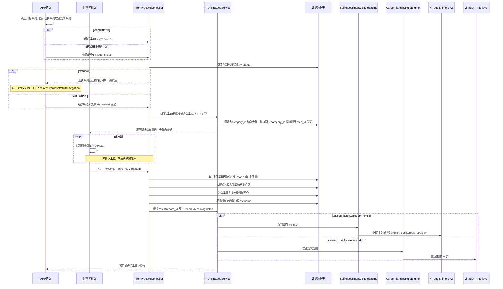
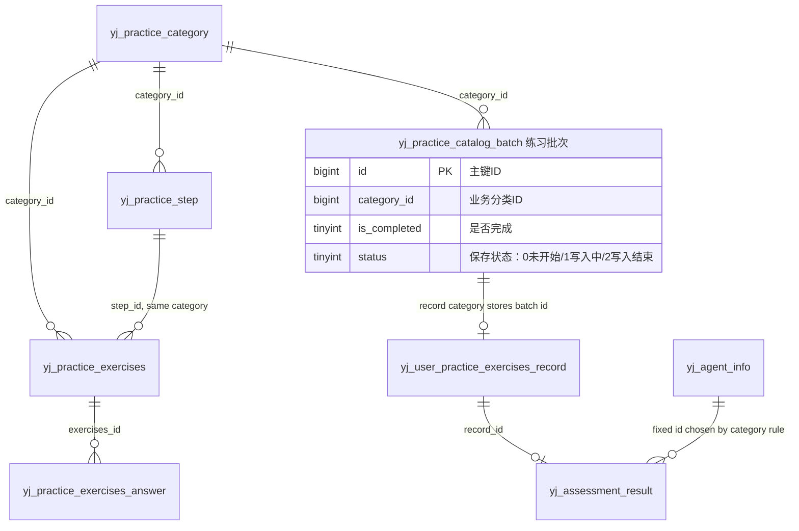

# [程序设计]PD-052-20260829-Story-052-APP职业规划评测与双评测隔离

**文档编号**：PD-052
**Story编号**：Story-052
**关联需求文档**：[REQ-052](../030-需求文档/[需求文档]REQ-052-20260829-APP职业规划评测与双评测隔离.md)
**关联版本计划**：[02-版本详细计划.md](../02-版本详细计划.md)
**关联正式验收**：[Story-052](../061-验收标准/00-验收标准索引.md#story-052app职业规划评测与双评测隔离)
**创建日期**：2026-08-29
**当前状态**：职业规划源规则差异已确认；现有分类14实现错误复用分类13选填规则，DEV-072/073 必须按本设计返工，尚未达到验收条件

## 1. 需求引用与保护边界

- 业务范围统一引用 `REQ-052`，出口条件为 `AC-CAREER-ASSESS-001/002/101/201/202/301/401` 与 `AC-ASSESSMENT-SAVE-001/101/201/301/401`。
- 分类13保护边界是修改前的 `home.vue` `startSelfTest`、`openLatestSelfTestReport`，以及 `self-test-answer.vue`、`assessment.ts` 承接的加载、单题逐页、非末题 `goNext`、末题统一提交、完成提示、重置、报告查询/展示/重试完整行为。
- 分类13现状为：非末题只前端翻页；最后一步遍历已选答案，按既有顺序调用现有答案提交接口，然后生成报告。本 Story 不改变该时机、顺序、参数和错误处理。
- 本 Story 明确排除逐题实时提交、翻页等待保存、退出续答、`latest-only` 恢复和进程重启恢复；这些能力既不改造分类13，也不新增给分类14。分类13仅新增末题统一提交的保存状态跃迁和首页 `status=1` 前置门禁，不得据此扩大内部改造范围。
- 分类14仅新增一套平行能力。可以复用现有通用组件和低层能力，但不能改变分类13旧调用和旧无参接口的语义。
- 分类14题序 14-25 作为一个组页一次性展示 12 道 RIASEC 题，其余题序仍按单题页承载；该组页只改变前端展示组织方式，不改变题序映射、答案保存、前后题边界或分类隔离。
- `yj_practice_step.category_id` 已由人工新增并关联 `yj_practice_category`，是本 Story 后续实现和手工初始化的既有前提；运行时不得创建、迁移或回填该字段。

## 2. 技术实现时序

### 2.1 首页两层外围分流

1. 首页布局继续只保留原有单个“开始评测”按钮；点击该按钮后在当前首页弹出选择层，不新增首页常驻评测按钮，不跳转独立选择页面。
2. 选择层内“自我评测”选项直接调用修改前 `startSelfTest`；不复制、不重写、不追加分类参数，不改变旧请求顺序。
3. 选择层内“职业规划评测”选项调用新增的职业规划启动函数，明确使用 `categoryId=14`，其余页面交互仿写自我评测。
4. 首页布局继续只保留原有单个“评测结果/自测报告”入口；点击后在当前首页弹出报告选择层，不新增首页常驻报告按钮，不跳转独立选择页面。
5. 报告选择层内“自我评测报告”直接调用修改前 `openLatestSelfTestReport`；“职业规划评测报告”调用新增的分类14报告查询函数。
6. 关闭、取消或未选择选项时只收起对应弹窗，不创建、提交、重置、查询、跳转或触发任何原业务动作。
7. 层内“自我评测”或“职业规划评测”被选中后，先调用对应分类 latest-status；返回批次保存状态1时显示独立的初始化分析提示并终止本次动作，返回0/2时才进入原重新评测判断、启动或导航。
8. 初始化分析提示只复用现有“是否需要重新测评”弹窗的样式组件，不复用原弹窗 resolver 或控制状态；确认、关闭、取消和遮罩只关闭自身提示。

### 2.2 分类14答题模式

1. 分类14加载自身题库，题序 1-13、26、27-47 继续按单题页承载，题序 14-25 作为一个组页一次性展示 12 道 RIASEC 题，使用与自我评测相同的题号、上一题/下一题、选择状态和末题提交体验。
2. 非末题只更新前端答案集合并执行 `goNext`，不得调用答案写入接口；题间切换不显示全屏 loading 弹窗。
3. 最后一步统一校验分类14全部答案，再按现有自我评测模式依次提交已选答案；所有答案提交成功后才触发职业规划报告生成。这里的“统一提交”只复用提交时机，不复用分类13的 `is_required`、空答放行或报告规则。
4. “末题统一提交”指提交动作集中发生在最后一步，不要求新增批量 HTTP 接口，也不得把循环提交提前到每次翻页；最终提交时可以保留等待弹窗，但题间切换不再显示全屏 loading。
5. 末题统一提交进入第一条答案明细持久化事务时，批次只以 `status=0` 为条件更新为1；如果同页幂等重试看到状态1则继续剩余写入，如果状态2则禁止回退为1。主表 record 已在开始答题时创建，`startBatch` 和主记录插入逻辑不得设置状态1；状态条件不得读取、替代或改写 `is_completed`。
6. 分类13继续执行原统一答案保存完成流程；分类14继续执行现有 report-entry 完成流程。两处原流程及其 `is_completed` 判断、赋值、SQL和事务边界全部保持不变；原流程完成后再执行只更新 `status=2` 的状态动作，不得合并进原完成更新。
7. 任一答案插入或持久化事务失败时先让原事务回滚并保留原异常，再调用独立事务执行 `UPDATE yj_practice_catalog_batch SET status=2 ...`；补偿事务不得加入原事务，只允许更新 `status`，绝不更新 `is_completed`。补偿成功后仍返回原异常，补偿自身失败时记录可定位错误但不得覆盖原异常。
8. 报告生成失败时必须落入可诊断的 FAILED 状态，等待弹窗立即终止，页面展示失败原因和重试入口；不得长期停留在“报告正在生成中”的假等待态。
9. 任一答案提交或报告生成失败时保留明确失败状态，不将分类13或14伪造成已完成；`status=2` 只代表写入流程结束，不能替代 `is_completed` 或报告状态判断。

### 2.2.1 分类14源表单契约与服务端规则引擎

1. 分类14答题页可继续保持本项目“一题一页”的交互，不要求改成源项目的多字段同页；但必须按职业规划源 `formVersion=2` 的六组数据语义收集、前端提示并在服务端重建输入。不得把分类14当作“分类13题库加 `categoryId=14`”或以通用题目 `is_required` 规则决定是否可提交。
2. 分类14固定映射为：题序1-9基本情况、10-13经历与成果、14-25十二道兴趣题、26兴趣方向、27-38十二道工作风格题、39工作价值Top3、40最不看重项、41-47目标计划。映射必须由受版本控制的分类14题序/题型契约提供；不得以题干文本模糊匹配、不得接受客户端已计算的兴趣或风格结果。
3. 完成校验只服从源 schema：`name`、`achievements`、12项 `riasecAnswers`、`values.top3`（刚好3项且互异）为必填；工作风格12题在题库/答案写入层保持选填，不传额外skip字段：12题全为 `a/b` 规范化为 `source=quiz`，12题全为空规范化为 `source=skip`，部分作答部分空为无效；`values.least` 可为空，但存在时不得包含于Top3。年龄、学历、经历、目标计划等其余字段为可选，仍受源字段长度与枚举约束。
4. 前端分类14必须在离开相应题目或末题提交前提示上述缺失和冲突，不能让一个源必填字段以空答案进入提交；工作风格允许整组12题空答，但不能部分作答。后端以同一契约作最终裁决。分类13现有“仅非必填题允许空答”规则只保留在分类13，不能作为分类14空答或必答判断的兜底。题间切换不得出现全屏 loading。
5. `CareerPlanningRuleEngine` 在服务端将原始答案重建为 `{ mode: "self", formVersion: 2, ... }`，随后按源 `buildAssessmentBundle()` 等价规则重新计算：每项兴趣分数为对应两题0/1/2之和，排序平分按 `R,I,A,S,E,C`，最高分不高于2为探索状态；工作风格按四个维度各3题计数，平分取 `a`。客户端传来的分数、排序、风格结论、报告HTML均不得作为计算依据。

### 2.3 分类状态与接口兼容

1. 分类13现有无参 `completed`、`latest-status`（或当前真实 latest 入口）、`reset`、`start`、`record`、`report`、`regenerate` 调用保持原路径、原请求和原业务语义；latest-status 只允许加法返回批次保存状态，不删除、改名或重释既有字段。
2. 分类14使用新增平行方法或在新增调用中显式传 `categoryId=14`；共用服务底层时必须显式校验分类14，不能改变缺省分类13语义。
3. 分类14的 `completed`、`latest-status`、`reset`、`start`、`record`、`report`、`regenerate` 只处理当前用户的分类14记录；分类13旧无参 latest 和其他旧查询不得因为新增分类14而改变请求、响应或结果。
4. 记录分类判断统一通过 `result.record_id -> record.category_id(catalogBatchId) -> catalog_batch.id -> catalog_batch.category_id`。不得把 `record.category_id` 直接与13/14比较，也不得按报告文本、`catalog_type`、Agent名称猜分类。
5. 重置分类14只作用于分类14相关记录；本 Story 不借机改造分类13重置实现。
6. 所有运行时“按步骤取数”、步骤详情、步骤下题目、题目反查步骤或以 `step_id` 关联的查询/校验，均必须同时带目标 `category_id` 条件。分类13走 `category_id=13` 并保持既有结果；分类14走 `category_id=14`。不得仅凭相同或传入的 `step_id` 跨分类命中数据。
7. 分类14题目必须满足 `yj_practice_exercises.category_id=14`、其 `step_id` 指向 `yj_practice_step.category_id=14` 的步骤；步骤缺失、题目未映射、步骤分类不匹配或题目分类不匹配均为不可启动/不可提交的初始化错误。分类13的既有题目与步骤结果保持不变。
8. 分类13 latest-status 读取当前用户分类13最新批次，分类14 latest-status 显式以 `categoryId=14` 读取当前用户分类14最新批次；返回 `batchSaveStatus`（映射 `yj_practice_catalog_batch.status`），没有批次按0处理。不得以另一分类批次或报告状态代替保存状态。
9. `batchSaveStatus=1` 是首页开始入口的正常短路状态，不触发 reset/start/navigation；服务端仍须保持本人、分类和最新批次约束。`batchSaveStatus=0/2` 仅放行既有后续逻辑，不自行决定是否重测。

### 2.4 报告规则和固定主键 Agent

1. 分类13继续走现有 `SelfAssessmentV3RuleEngine`。`FrontPracticeServiceImpl` 当前以 `ASSESSMENT_AGENT_INFO_ID=2L` 固定读取 `yj_agent_info.id=2` 并消费 `prompt_config/reply_strategy`，该常量、记录和路径保持不动。
2. 分类14新增 `CareerPlanningRuleEngine` 或等价独立策略，按职业规划源 `self-assessment.schema.json` 与 `career-core.mjs` 处理分类14答案，而不是调用或分支进入 `SelfAssessmentV3RuleEngine`。
   - 完成门禁：姓名、成果经历、12道 RIASEC 和刚好3项工作价值必填。
   - 工作风格12题在题库/答案写入层选填；12题空答时由后端规范化为源规则定义的 `source=skip`，12题全答时为 `source=quiz`，部分空答无效。最不看重项可不选，选择后不得与工作价值 Top3 重复。
   - 其他字段是否必填只服从源 schema；缺失、互斥冲突、跨分类答案或题库不完整时不生成报告。
   - 将服务端重算后的事实组装为 `<submitted_data>`，使用id=3的源 `SELF_SYSTEM_PROMPT` 和既有 `practice_assessment` 模型生成职业专属报告；不得把分类13报告模板、固定事实区块、V3长度标准或分类13 Agent提示词用于分类14。
   - 模型输出只允许职业规划源允许的HTML标签，必须经过消毒、可见字符300-3500、职业报告3个固定 `h1` 标题、危险标记和错误规则校验；校验有警告或错误时进入待复核，不能发布或展示为成功报告。
   - 生成链路必须输出结构化日志，至少包含 `recordId / categoryId / batchId / agentId / model / stage / status / errorType`，日志只记录阶段与结果，不记录答案全文、提示词全文或其他敏感原文；报告失败时必须能据日志定位失败阶段。
3. 同库只读已确认：`yj_agent_info` 已占id=1、2、6、7，id=3、4、5空闲，`AUTO_INCREMENT=8`；分类13现有id=2、tenant_id=1保持不动。
4. 分类14严格参考分类13固定主键方式，业务常量明确为 `CAREER_ASSESSMENT_AGENT_INFO_ID=3L`，只读人工提前插入的 `yj_agent_info.id=3`。运行时禁止按 `agent_id` 或 `name` 查询、创建或更新 Agent。
5. 系统运行时的唯一前置事实是人工已合法写入id=3且字段回读通过；业务只按 `CAREER_ASSESSMENT_AGENT_INFO_ID=3L`读取该记录，不负责Agent冲突判断、插入、更新或换号。
6. 模型仍从 `yj_ai_model_config` 的 `practice_assessment` 场景读取；不把模型配置固化到职业规划 Agent 记录。

### 2.5 两个独立人工初始化工具

1. 允许在项目仓库独立人工工具目录保存两个 Python 程序，但必须是两个独立文件、独立命令入口、独立 dry-run/apply 回执：
   - 题库与步骤导入工具：只处理分类14的 `yj_practice_step`、`yj_practice_exercises`、`yj_practice_exercises_answer`，并按源 `web` 步骤回填题目 `step_id`。
   - Agent 初始化工具：只处理一条职业规划 `yj_agent_info` 记录。
2. 两个工具均不进入应用业务源码模块，不被 Maven/前端依赖、应用启动、依赖注入、migration、build hook、资源初始化、定时任务、发布任务或业务接口引用。未运行工具时，项目必须正常构建和启动。
3. 两个工具只连接当前程序实际运行配置所指向的同一数据库 `114.111.30.111:13306/yunjikeji`。人工从当前程序真实运行配置确认连接参数后显式传入；项目不新增连接配置，账号、密码、Token 和含凭据连接串不得写入代码、配置、回执或 Git。
4. 题库与步骤工具从 `D:\飞机\-APP--main (4)\-APP--main\skills\career-planning-coach` 提取题目、选项、规则映射及 `web` 步骤。默认 dry-run，显式 apply；目标部分数据、源节点不能映射步骤、题目/步骤分类不一致或源校验差异立即中止。
5. 已确认源 `web/index.html:27-34,40-108` 有6个步骤：题序1-9“基本情况”、10-13“经历与成果”、14-26“兴趣倾向”、27-38“工作风格”、39-40“工作价值”、41-47“目标计划”。题干真值是带来源路径、步骤位置、题序、题型和选项序的题目节点，而非单独的 `question_stem` 文本。
6. 已确认测试库分类14全部47题 `step_id` 为空；题干“姓名”共19行，除排序1外的排序2-7、9-13、41-47共18行不是源重复，而是 `career_question_import.py` 的跨 label 正则错误。题库与步骤工具必须在备份成功后，以一个事务原子修复这18条题干、写入6个步骤并回填47个 `step_id`；不得由运行时兼容、遮蔽或去重掩盖该数据缺陷。
7. Agent 工具从 `scripts/career-core.mjs` 提取 `SELF_SYSTEM_PROMPT` 原文；默认 dry-run，apply 必须显式传入固定主键3。
8. 两个工具均执行写前检查、精确备份、单事务写入、异常回滚和写后回读。Agent工具执行apply时只要id=3已存在，无论内容是否相同，本次apply都立即安全中止并保证零修改；不得更新或换号。题库与步骤工具在备份失败时必须零修改中止；只有备份成功后才允许执行前述分类14原子修复，并在差异时整体回滚。

## 3. API 接口设计

### 3.1 接口兼容矩阵

| 能力 | 分类13调用 | 分类14新增调用 | 兼容要求 | 对应验收项 |
| --- | --- | --- | --- | --- |
| 已完成判断 | 既有 `GET /app-api/yj/practices/assessment-result/completed`，无新增参数 | 同路径新增显式 `categoryId=14` 或等价专用方法 | 参数缺省时仍严格保持分类13原语义 | `001/101` |
| 最新状态 | 既有无参 `GET /app-api/yj/practices/assessment-result/latest-status` 或当前真实 latest 入口 | 新增分类14专用方法或显式 `categoryId=14` | 旧无参请求、既有响应字段及分类13语义不变；两类均加法返回对应批次 `batchSaveStatus` | `001/002/101` |
| 保存中门禁 | 复用分类13 latest-status 的加法字段 | 复用分类14显式 latest-status 的加法字段 | `batchSaveStatus=1` 只短路首页开始动作；0/2继续原逻辑，不调用reset/start/navigation | `AC-ASSESSMENT-SAVE-001/101` |
| 重置/重测 | 既有 `POST /app-api/yj/practices/assessment-result/reset` 原样 | 新增显式 `categoryId=14` | 只清理所选分类，旧无参调用不变 | `002/101` |
| 启动 | 既有 `POST /app-api/yj/practices/{practiceId}/start` 原样 | 新调用显式 `categoryId=14` | 分类13不改参数；分类14精确加载14 | `001/101` |
| 题目 | 既有 session question 接口原样 | 复用接口并由分类14会话约束 | 一次只返回/显示一道题 | `002/101` |
| 答案提交 | 既有 session answers 接口，仅末题统一调用 | 同样仅末题统一调用；提交前后按职业规划 `formVersion=2` 契约校验和重建 | 不新增翻页保存语义；分类13 `is_required` 放行规则不进入分类14 | `002/101/202` |
| 记录/报告 | 既有 record/result 查询原样 | 新增分类14专用查询或显式参数 | 通过 record-batch-category 反查隔离 | `002/101/202` |
| 报告重试 | 既有 regenerate 原样 | 对分类14 record 新增平行调用 | 分类和当前用户不一致时拒绝 | `002/101/202` |

具体 Controller 路径以实现前对现有正式接口的核对结果为准；不得为了文档表格虚构第二套旧接口。统一错误码引用项目正式入口，本 Story 特有业务错误至少包括：分类14不存在/题库未初始化、记录分类不一致、职业规划必答缺失、互斥冲突、职业规划 Agent 未初始化或固定主键不匹配。

### 3.2 请求与响应字段

| 字段 | 类型 | 必填 | 规则 | 说明 |
| --- | --- | --- | --- | --- |
| `categoryId` | Long | 分类14新增调用是 | 只能为14；分类13旧调用不新增必填要求 | 新增分类上下文 |
| `recordId` | Long | 报告/重试是 | 当前用户所有，且经批次反查为目标分类 | 评测记录 |
| `catalogBatchId` | Long | 服务内部是 | 与record和category真实关系一致 | 批次 |
| `answers` | Array | 末题提交是 | 前端已选答案集合，沿用既有逐项提交顺序；分类14由服务端按固定源映射重建 `formVersion=2` | 最后一步统一提交输入 |
| `reportType` | String | 报告响应是 | `SELF_ASSESSMENT` 或 `CAREER_PLANNING` | 报告展示路由 |
| `batchSaveStatus` | Integer | latest-status响应是 | `0未开始 / 1写入中 / 2写入结束`；无批次按0 | 映射 `yj_practice_catalog_batch.status`；前端只拦截1，2继续原判断且不与完成/报告状态混用 |

## 4. 前置验证入口与红灯标准

测试资产统一落到 `061-验收标准/03-测试验证/DEV-070/`；DEV-070 先建立验证入口和正确红灯，不得伪造执行证据。

| 验证点 | 场景 | 预期红灯原因 | 对应验收项 |
| --- | --- | --- | --- |
| 开始评测弹窗 | `home-start-options` | 当前原单个“开始评测”按钮点击后尚无“自我评测/职业规划评测”弹窗二选一 | `001/301` |
| 分类13开始零回归 | `self-start-protection` | 当前尚无外围层；新增后必须证明内部调用序列与基线相同 | `001/002/301` |
| 题间无 loading | `topic-next-without-mask` | 当前题间切换仍可能出现全屏 loading；新增后必须证明仅最终提交保留等待弹窗 | `002/301` |
| 14-25 组页 | `career-riasec-group-page` | 当前题序 14-25 仍未按同组页面展示 12 题；新增后必须证明第 26 题不进入该组 | `002/301` |
| 末题统一提交 | `final-submit-only` | 当前没有分类14平行流程；测试必须同时锁定分类13现有非末题零请求基线 | `002/101/301` |
| 报告选择弹窗 | `home-report-options` | 当前原单个报告入口点击后尚无“自我评测报告/职业规划评测报告”弹窗二选一 | `001/002/301` |
| 分类13报告零回归 | `self-report-protection` | 新增外围层后必须证明仍直接调用旧入口及旧查询/重试序列 | `002/101/301` |
| 分类14记录路由 | `career-record-routing` | 当前不存在按record-batch-category路由职业规划规则，也没有 FAILED 报告终止与失败原因承接 | `101/202` |
| 步骤分类隔离 | `step-category-isolation` | 当前步骤关联和按步骤查询尚未强制同时校验 `yj_practice_step.category_id` | `101/201/301` |
| 分类14源步骤与题干修复 | `career-source-web-data` | 已知源6步骤、47题`step_id`全空和18条跨label正则错误题干；现工具未实现备份成功后的原子修复 | `201/301` |
| 固定主键 Agent 运行前置 | `career-agent-fixed-id` | 人工初始化回读尚未提供合法id=3，业务中尚无 `CAREER_ASSESSMENT_AGENT_INFO_ID=3L`固定只读 | `202/301` |
| 源表单与空答隔离 | `career-source-form-contract` | 当前分类14错误沿用分类13选填放行，空答案可进入后端并触发“答案不能为空” | `002/101/202/301` |
| 源规则报告校验 | `career-source-report-validation` | 当前不存在分类14服务端重算、职业专属标题/HTML/长度校验、失败阶段日志与待复核阻断 | `202/301` |
| 两工具隔离 | `manual-tools-boundary` | 当前两份独立工具尚未建立 | `201/301` |
| 双评测保存状态门禁 | `assessment-save-gate` | 当前首页无法区分未开始与答案明细写入中，且未锁定首条明细置1、原流程结束后单独置2、失败独立补偿只写status和独立提示不进入原重测resolver | `AC-ASSESSMENT-SAVE-001/101/201/301` |

红灯测试不得要求分类13或14逐题保存、退出续答或恢复。前端浏览器验收按项目规则优先 Playwright；如使用其他通道必须有当前会话明确授权。

## 5. 数据结构

### 5.1 运行时分类上下文

| 字段 | 来源 | 规则 |
| --- | --- | --- |
| `businessCategoryId` | 旧分类13缺省语义或分类14新增请求 | 13保持原调用；14显式进入平行逻辑 |
| `catalogBatchId` | `yj_practice_catalog_batch.id` | 连接题目复制、record和结果 |
| `stepCategoryId` | `yj_practice_step.category_id` | 每一个步骤关联或按步骤查询均须等于当前业务分类；13/14不可交叉 |
| `exerciseStepId` | `yj_practice_exercises.step_id` | 必须指向同分类步骤；分类14由手工工具从源 `web` 步骤回填 |
| `recordCategoryId` | `yj_user_practice_exercises_record.category_id` | 现状保存catalogBatchId，不等于13/14 |
| `agentInfoId` | 服务固定常量 | 13=2；14=3（`CAREER_ASSESSMENT_AGENT_INFO_ID=3L`） |
| `reportStrategy` | 经record-batch-category反查 | 13=V3；14=CareerPlanning |
| `batchSaveStatus` | `yj_practice_catalog_batch.status` | 0未开始、1答案明细写入中、2写入结束；2不等于业务完成，禁止2回1 |

### 5.2 职业规划规则输入

| 数据组 | 校验/输出 |
| --- | --- |
| 源输入 | 必须为 `mode=self`、`formVersion=2`；由47个分类14原始答案按固定题序映射重建，不能接受客户端派生结论；前端题序 14-25 仅改变展示为组页，不改变服务端输入契约 |
| RIASEC | 12题、每题0/1/2；服务端重算六维分数和源定义的稳定排序/探索状态 |
| 工作风格 | 12题全答为a/b时规范化为`source=quiz`，12题全空规范化为`source=skip`，部分空答拒绝；服务端重算四维结果 |
| 价值观 | `top3`必须恰3且互异；`least`可空但不得与Top3重复 |
| 现实条件 | 按源 schema 的可选字段长度/枚举校验并用于职业规划建议 |
| 报告 | 只用id=3 `SELF_SYSTEM_PROMPT`，对HTML白名单、三标题、300-3500可见字符和源安全规则校验 |
| Agent prompt | `SELF_SYSTEM_PROMPT` 原文 hash 与初始化回读一致 |

## 6. 数据库表设计

本 Story 不新增表，也不修改分类14的 `catalog_type=2`。在人工已增加字段的现场上，正式补齐 `yj_practice_catalog_batch.status` 的字段定义、历史回填和版本SQL；`yj_practice_step.category_id` 仍为人工已完成的现有字段，运行时只能使用它做分类隔离。数据库初始化写入只来自两个独立人工工具，业务运行时只读初始化数据并写正常评测结果。

### 双评测与 Agent 关系图

公共字段统一说明：沿用各表现有审计、逻辑删除和租户字段；关系图只表达应用使用关系，不声明新增数据库外键。

### 6.1 题库与步骤工具事务、重复核验与回读

- 只写分类14对应的 `yj_practice_step`、`yj_practice_exercises`、`yj_practice_exercises_answer`，不修改分类13或分类表。步骤来自源 `web`，每道分类14题必须回读到同分类步骤的 `step_id`。
- dry-run 校验真实表字段、分类14、源步骤/题目/选项节点集和目标状态；以完整来源路径、步骤位置、题序、题型、题干、选项序和规则映射比较。已知源6步骤及区间为1-9、10-13、14-26、27-38、39-40、41-47；部分数据、无步骤映射、跨分类映射或冲突立即中止。
- 已知现库分类14为47题/111答案、全部47题 `step_id` 为空；“姓名”除排序1外的18条（2-7、9-13、41-47）是 `career_question_import.py` 跨 label 正则错误，源数据不重复。该结论是修复输入，不得由运行时绕过。
- apply 前必须成功生成分类14目标行精确备份；随后以单事务原子修复18条题干、写入6个步骤、回填47个 `step_id`，并回读步骤、`step_id`、题目、选项、顺序、题型、必答和规则映射。备份失败或任一回读差异时整体回滚，且不得产生部分修复。

### 6.2 Agent 工具事务与回读

- 只写固定主键 `id=3` 的一条 `yj_agent_info`，不修改 `id=2`。只读基线为1、2、6、7已占，3、4、5空闲，AUTO_INCREMENT=8。
- dry-run 校验真实字段、id=3仍为空、现有同名/同 prompt 记录和 `SELF_SYSTEM_PROMPT` hash；`agent_id`按NULL写入，不作为选择或冲突换号依据。
- apply 必须显式提供 `--id 3`；写前备份相关检查结果，单事务插入，回读主键、agent_id=NULL、name、status=1、tenant_id=1、knowledge_base_id=NULL、prompt hash 和reply_strategy=NULL。
- apply时只要id=3已存在，无论现有字段和prompt hash是否完全相同，本次apply都必须判定为中止且零修改；不得更新，也不得自动换 ID。

### 6.3 `yj_practice_catalog_batch.status` 字段与状态机

公共字段统一说明：本次只新增/规范并更新 `status`，表内既有 `id/category_id/is_completed` 及审计、逻辑删除、租户字段保持原定义；DEV-078 禁止新增、替换、合并或修改任何 `is_completed` 逻辑，不新增物理外键。

| 字段 | 类型 | 必填 | 默认值 | 说明 |
| --- | --- | --- | --- | --- |
| `status` | `TINYINT` | 是 | `0` | 评测保存状态：`0未开始、1写入中、2写入结束`；2不等于业务完成 |

- 版本SQL：`050-执行脚本/20260831103000-ddl-add_yj_practice_catalog_batch_status.sql`。脚本幂等兼容字段已由人工创建，先记录字段存在性与状态快照，再补齐/规范字段定义；历史回填只把 `is_completed=1` 作为只读筛选条件并仅更新 `status=2`，绝不更新 `is_completed`。脚本提供后置校验与按快照回滚口径；本设计阶段不执行SQL。
- 状态0在批次创建和正常答题期间保持；禁止在 `startBatch` 或主记录创建时置1。首条答案明细持久化与 `0 -> 1` 条件更新同事务执行，后续串行请求保持1。
- 分类13原统一答案保存完成流程、分类14原 report-entry 完成流程及各自 `is_completed` 更新保持原样；原流程完成后单独执行 `UPDATE ... SET status=2 WHERE ... AND status IN (0,1)`。DEV-078 的置1、置2语句均只能更新 `status`，所有置1条件必须排除状态2，防止 `2 -> 1`。
- 答案插入或持久化事务的异常处理必须跨事务分两步：先结束并回滚原事务，保留原异常；再由独立事务按批次条件只补偿 `status=2`。补偿 SQL 禁止包含 `is_completed` 更新；无论补偿成功与否，调用方收到的仍是原写入异常。
- latest-status 只投影保存状态。前端仅在1时短路，0/2均继续原 completed/restart/reset/start/navigation 决策；不得用状态2推导完成态。
- 本字段不单独新增数据库索引：latest-status 仍先按现有用户、分类和批次时序定位唯一最新批次，再读取 `status`；避免为低区分度三值字段增加无效索引并突破单表索引约束。

## 7. 人工依赖门禁

1. 两个工具使用的连接必须是当前程序实际运行配置所指向的同一数据库 `114.111.30.111:13306/yunjikeji`；数据库地址或权限不可用时停止，不枚举其他数据库。
2. 先分别 dry-run 并由人工审核，再分别备份和 apply；题库与步骤工具必须先完成源步骤、题目重复和 `step_id` 回读核验，Agent 工具不得合并执行入口或共享隐式写入。
3. Agent固定主键已确定为3；dry-run必须复核id=3仍为空，apply和回读完成前，`DEV-072` 不得落 `CAREER_ASSESSMENT_AGENT_INFO_ID=3L`。id=3冲突时中止并请求人工处理，不自动换号。
4. 当前仅完成设计返工，未授权任何数据库写操作。

### 7.1 保存中断残余风险

- 当前客户端逐题串行 HTTP。第一条答案已提交后客户端进程退出、断网或长时间中断，可能使批次保留 `status=1`。
- 本轮不得擅自增加 TTL、状态3、后台自动复位或批量答案新接口；同一答题页对已为1的批次做幂等重试时继续写剩余答案，并在原完成流程结束后单独推进到2。
- 自动恢复、人工解锁或超时判定仅作为后续恢复设计输入，未形成新需求和验收前不得实现。

## 8. 修订历史

| 版本 | 修订日期 | 修订说明 |
| --- | --- | --- |
| `v1.0` | `2026-08-29` | 建立职业规划评测初版设计。 |
| `v1.1` | `2026-08-29` | 曾错误加入逐题持久化、续答和分类13内部改造。 |
| `v2.0` | `2026-08-29` | 撤销错误范围；保留首页两个原单入口并在点击后分别弹出选择层，分类13原样保护，分类14末题统一提交，固定主键 Agent 与两个独立人工工具。 |
| `v2.1` | `2026-08-29` | 纳入既有 `yj_practice_step.category_id` 分类隔离、源 `web` 步骤初始化与题目 `step_id` 回填；题干重复以源节点核验和受备份保护的人工修复为唯一口径。 |
| `v2.2` | `2026-08-29` | 依据源文件和测试库只读证据确认6步骤、47个空`step_id`及18条跨label正则错误题干；规定备份成功后才可单事务原子修复，不得由运行时掩盖。 |
| `v2.3` | `2026-08-31` | 新增双评测提交保存状态机、latest-status加法字段、首页状态1独立提示、字段幂等SQL与串行HTTP中断残余风险；分类14 report-entry完成语义保持。 |
