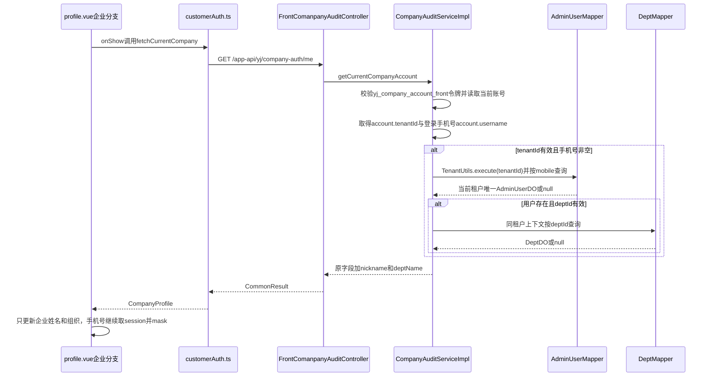

# [程序设计]PD-053-20260831-Story-053-企业端教员我的页姓名与组织真实数据展示

**文档编号**：PD-053
**Story编号**：Story-053
**关联需求文档**：[REQ-053](<../030-需求文档/[需求文档]REQ-053-20260831-企业端教员我的页姓名与组织真实数据展示.md>)
**关联版本计划**：[02-版本详细计划.md](../02-版本详细计划.md)
**关联正式验收**：`AC-PROFILE-001/101/201/301`
**创建日期**：2026-08-31
**当前状态**：程序设计资产已完成；前置红灯、业务代码和独立验收均未开始

## 1. 需求引用

- 业务范围与角色边界：[REQ-053](<../030-需求文档/[需求文档]REQ-053-20260831-企业端教员我的页姓名与组织真实数据展示.md>)。
- 版本出口条件：[02-版本详细计划.md#story-053-出口条件](../02-版本详细计划.md#story-053-出口条件)。
- 正式任务链：`DEV-080 -> DEV-081 -> DEV-082 -> DEV-083`。
- 保护边界：不修改数据库，不修改 `uni_modules/**`；学员及其他角色、手机号脱敏、登录流程保持不变。

## 2. 技术实现时序

### 2.1 后端关联规则

1. 入口继续由 `requireCompanyFrontLoginUser()` 校验 `yj_company_account_front` 身份，不得按 `system_users` 登录身份解释。
2. 关联手机号取当前 `CompanyAccountFrontDO.username` 的规范化值；当前登录/注册链已将手机号写入 `username`。
3. 必须使用当前账号已绑定的 `tenantId` 进入 `TenantUtils.execute(tenantId, ...)`，再调用 `AdminUserMapper.selectByMobile(mobile)`；查询只允许当前租户内 `0` 或 `1` 条。
4. 禁止复用 `getCompanyAuthPostCodes` 的 `TenantUtils.executeIgnore + users.stream().findFirst()` 候选逻辑；该逻辑会跨租户搜索后选择候选租户，不满足本接口隔离要求。
5. 用户存在时取 `AdminUserDO.nickname`；仅当 `deptId` 有值时，在同一租户上下文用 `DeptMapper.selectById(deptId)` 取 `DeptDO.name`。
6. 未绑定租户、手机号为空、后台用户不存在、用户未设部门或部门不存在时，`nickname` / `deptName` 按对应缺失项返回 `null`；不跨租户回退、不随机挑选、不改账号绑定。

### 2.2 前端展示规则

1. `customerAuth.ts` 新增 `CompanyProfile` 类型与 `fetchCurrentCompany()`，复用 `COMPANY_AUTH_BASE`、认证头及 `/me`。
2. `profile.vue` 的 `onShow` 保持单一入口：企业身份只调用企业 `/me` 并更新独立的企业资料状态；学员身份继续执行原学员资料、审核和练习统计链路。
3. 企业姓名优先使用 `/me.nickname`，所属组织优先使用 `/me.deptName`；空值使用既有兼容文案，不回退为其他租户、岗位或地域数据。
4. 企业手机号继续取 `appState.userSession.phone` 并复用现有 `maskPhone`，不把 `/me.username` 作为新的展示或持久化来源。
5. 不向学员 `PROFILE_STORAGE_KEY` 写入企业昵称或部门，避免角色资料相互污染。

## 3. API接口设计

### 3.1 接口清单

| 接口名称 | HTTP方法 | 接口路径 | 对应出口条件ID | 说明 |
| --- | --- | --- | --- | --- |
| 当前企业账号资料 | GET | `/app-api/yj/company-auth/me` | `EXIT-STORY-053-01/02` | 原位扩展真实用户昵称和部门名称 |

### 3.2 当前企业账号资料

- **路径**：`GET /app-api/yj/company-auth/me`
- **认证**：企业端 Bearer Token，令牌 scope 为 `company-front`
- **租户边界**：以当前 `CompanyAccountFrontDO.tenantId` 为唯一租户，不接受客户端传入 tenantId 或 mobile
- **请求参数**：无

**响应参数（`data`）**：

| 参数名 | 类型 | 必填 | 说明 |
| --- | --- | --- | --- |
| `companyAccountFrontId` | Long | 是 | 当前企业前端账号编号，保持既有字段 |
| `tenantId` | Long | 否 | 当前账号已绑定租户编号，保持既有字段 |
| `tenantName/tenantContactName/tenantContactMobile` | String | 否 | 既有租户字段，保持原契约 |
| `username` | String | 是 | 当前企业账号用户名/登录手机号，保持既有字段 |
| `status/auditStatus` | Boolean/Integer | 是 | 既有账号状态字段 |
| `nickname` | String | 否 | 当前租户内与登录手机号唯一关联的后台用户昵称 |
| `deptName` | String | 否 | 同一后台用户 `deptId` 对应的部门名称 |

**统一错误码**：沿用项目统一错误码和既有“组织账号令牌不能为空”“组织账号不可用”等认证错误。
**本接口特有业务错误**：无。未关联后台用户或部门按受控 `null` 返回，不转为跨租户候选查询。

## 4. 前置验证入口与红灯标准

正式红灯资产由 `DEV-081` 建立在 `061-验收标准/03-测试验证/DEV-081/`。本 PD 只定义待建入口与预期，不伪造脚本或执行证据。

| 验证点 | 用例路径 / 脚本路径 | 执行命令 | 预期红灯原因 | 对应出口条件ID |
| --- | --- | --- | --- | --- |
| 正常返回 | `061-验收标准/03-测试验证/DEV-081/` 后端契约测试（待建） | DEV-081 固化实际 Maven 命令 | 响应尚无 `nickname/deptName`，服务尚未按当前租户+手机号查询用户和部门 | `EXIT-STORY-053-01` |
| 租户隔离 | 同目录后端契约测试（待建） | DEV-081 固化实际命令 | 尚无同手机号跨租户隔离断言，且不得复用 post-codes 候选 first 逻辑 | `EXIT-STORY-053-02` |
| 缺失关联 | 同目录后端契约测试（待建） | DEV-081 固化实际命令 | 尚无用户/部门缺失时的受控空值契约 | `EXIT-STORY-053-02` |
| 企业页面展示 | 同目录前端契约或页面自动化（待建） | DEV-081 固化 type-check、测试与 Playwright 命令 | 企业分支尚未调用 `/company-auth/me`，仍显示会话/历史值 | `EXIT-STORY-053-01` |
| 重新进入刷新 | 同目录重新进入用例（待建） | DEV-081 固化实际命令 | 页面重新进入不会刷新企业昵称与部门 | `EXIT-STORY-053-01` |
| 回归保护 | 同目录角色矩阵与禁区检查（待建） | DEV-081 固化实际命令 | 尚无学员/其他角色、手机号脱敏、登录流程和 `uni_modules/**` 零改动保护证据 | `EXIT-STORY-053-03` |

红灯成立条件：测试本身可运行，保护基线为绿，目标断言仅因缺少本 Story 能力而失败。DEV-081 未形成正确红灯前，DEV-082 不得启动。

## 5. 数据结构

### 5.1 请求对象

本接口无业务请求体、查询参数或客户端租户参数；身份、租户和手机号均从当前已认证企业账号取得。

### 5.2 响应对象扩展

| 字段名 | 类型 | 必填 | 校验规则 | 默认值 | 说明 |
| --- | --- | --- | --- | --- | --- |
| `nickname` | String | 否 | 去除首尾空白；只来自唯一命中的 `AdminUserDO.nickname` | `null` | 企业端姓名 |
| `deptName` | String | 否 | 去除首尾空白；只来自同一用户部门 `DeptDO.name` | `null` | 企业端所属组织 |

### 5.3 关联对象

| 对象 | 关键字段 | 约束 | 用途 |
| --- | --- | --- | --- |
| `CompanyAccountFrontDO` | `id/tenantId/username` | 当前令牌账号，tenantId已绑定且username为手机号时才关联 | 决定租户和手机号 |
| `AdminUserDO` | `tenantId/mobile/nickname/deptId` | 当前tenantId上下文按mobile唯一命中 | 提供昵称与部门编号 |
| `DeptDO` | `tenantId/id/name` | 同一tenantId上下文按deptId查询 | 提供部门名称 |

## 6. 数据库表设计

本 Story 无数据库变更：不新增表、字段、索引、约束或 SQL 入口，不执行数据库写入。实现仅读取既有 `yj_company_account_front`、`system_users` 和 `system_dept` 数据；租户隔离由当前账号 `tenantId` 与租户上下文共同保证。

## 7. 文件边界与任务依赖

- 后端预计白名单：`AppCompanyAuthMeRespVO.java`、`CompanyAuditServiceImpl.java`，以及目标测试；如需 `DeptMapper` 注入，只在同一服务类内完成。
- 前端预计白名单：`src/services/customerAuth.ts`、`src/pages/profile.vue`，以及目标测试。
- 只读参考：`appState.ts`、`AdminUserDO.java`、`DeptDO.java`、`UserController.java`、`UserConvert.java`。
- 禁区：`uni_modules/**`、数据库脚本、学员及其他角色业务链路。
- 依赖：`DEV-080（已完成） -> DEV-081（未开始） -> DEV-082（未开始） -> DEV-083（未开始）`；DEV-082 实施代理与 DEV-083 独立验收代理必须不同。

## 8. 修订历史

| 版本 | 修订日期 | 修订说明 |
| --- | --- | --- |
| v1.0 | 2026-08-31 | 建立接口扩展、tenantId+mobile唯一关联、前置红灯和零数据库变更设计 |
