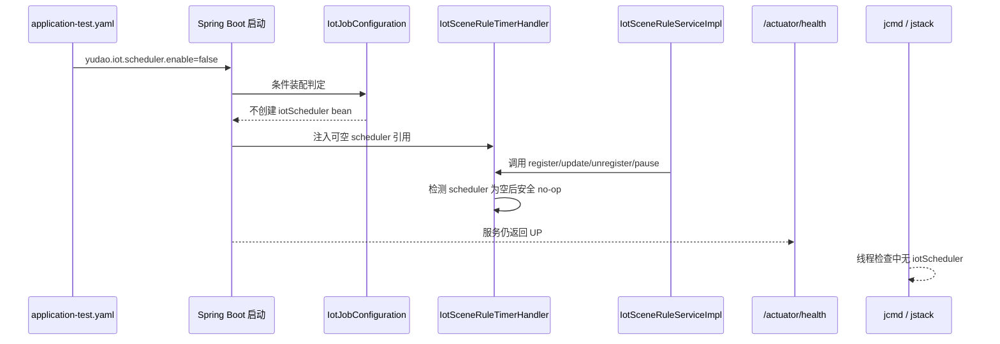

# [程序设计]PD-068-20260828-DEV-068-测试环境关闭异常IoT-Quartz

**文档编号**：PD-068
**任务编号**：DEV-068
**关联任务详情**：[DEV-068-测试环境关闭异常IoT-Quartz](../020-任务详情/DEV-068-测试环境关闭异常IoT-Quartz.md)
**关联版本计划**：[02-版本详细计划.md](../02-版本详细计划.md)
**关联正式验收**：[00-验收标准索引.md](../061-验收标准/00-验收标准索引.md)
**创建日期**：2026-08-28

## 1. 需求引用

- 正式目标：仅关闭测试环境 `yunjikeji-admin-server` 内独立 IoT Scheduler `iotScheduler`，让测试环境服务保持健康但不再自动执行 IoT TIMER。
- 正式验收项：`AC-IOT-QUARTZ-001`、`AC-IOT-QUARTZ-101`、`AC-IOT-QUARTZ-201`、`AC-IOT-QUARTZ-301`。
- 当前已确认事实：
  1. 测试服务器正式入口为 `ssh test-3dapp`。
  2. 测试服管理端后端为 `TEST-3DAPP-MICRO-01` 的 `yunjikeji-admin-server`，端口 `18081`。
  3. 当前代码中 `IotJobConfiguration` 直接创建 `IotSchedulerManager`，`IotSceneRuleTimerHandler` 直接依赖该调度器。
  4. `application-test.yaml` 已排除 Spring Boot 全局 Quartz 自动配置，但并未提供独立 IoT Scheduler 开关。

## 2. 技术实现时序

实现要点：

1. `IotJobConfiguration` 增加 `@ConditionalOnProperty(prefix = "yudao.iot.scheduler", name = "enable", havingValue = "true", matchIfMissing = true)`。
2. `application-test.yaml` 显式设置 `yudao.iot.scheduler.enable=false`，只关闭测试 profile 下的 IoT Scheduler。
3. `IotSceneRuleTimerHandler` 将 `IotSchedulerManager` 改为可空依赖，缺失时对注册、更新、注销、暂停四个入口直接 no-op。
4. `IotSceneRuleServiceImpl` 的设备消息、定时触发和其它业务分支保持现有逻辑，不删除 DEVICE 路径。
5. 部署仍沿用现有测试服脚本与启动脚本，不改远端目录结构，不改 `uni_modules/**`。

## 3. API 接口设计

### 3.1 运行入口清单

| 入口 | 作用 | 对应验收项 | 说明 |
| --- | --- | --- | --- |
| `application-test.yaml` | 测试 profile 开关 | `AC-IOT-QUARTZ-201` | 显式关闭 IoT Scheduler，不改变全局 Quartz 排除口径 |
| `IotJobConfiguration` | IoT Scheduler 装配入口 | `AC-IOT-QUARTZ-301` | 仅在开关开启时创建调度器 bean |
| `IotSceneRuleTimerHandler` | 定时触发注册与注销入口 | `AC-IOT-QUARTZ-301` | 关闭时安全 no-op，不影响 DEVICE 路径 |
| `/actuator/health` | 服务健康检查入口 | `AC-IOT-QUARTZ-101` | 部署后必须返回 `UP` |
| `jcmd <pid> Thread.print` / `jstack <pid>` | 线程与实例检查入口 | `AC-IOT-QUARTZ-101` | 检查是否仍存在 `iotScheduler` 线程或实例 |

### 3.2 配置参数

| 参数 | 来源 | 处理规则 |
| --- | --- | --- |
| `yudao.iot.scheduler.enable` | `application-test.yaml` | `true` 时保留 IoT Scheduler，`false` 时不创建 scheduler bean |
| `yudao.iot.tdengine.table-init.enable` | 既有配置 | 保持原值，不与本次开关耦合 |
| Spring Boot 全局 Quartz 排除项 | `application-test.yaml` | 保持现有排除项，不改全局 Quartz 口径 |

## 4. 前置验证入口与红灯标准

| 验证点 | 用例 / 脚本入口 | 执行命令 | 预期红灯原因 | 对应验收项 |
| --- | --- | --- | --- | --- |
| 配置开关落位 | `application-test.yaml` | `rg -n "yudao\\.iot\\.scheduler\\.enable|QuartzAutoConfiguration" yunjikeji-admin-server/src/main/resources/application-test.yaml` | 测试 profile 未显式关闭独立 IoT Scheduler | `201` |
| Bean 条件装配 | `IotJobConfiguration` | `mvn -pl yunjikeji-admin-server -am -DskipTests compile` 后检查源码与启动日志 | 仍在测试 profile 装配 `iotScheduler` bean | `301` |
| handler no-op | `IotSceneRuleTimerHandlerTest` | `mvn -pl yunjikeji-admin-server -am -Dtest=IotSceneRuleTimerHandlerTest test` | scheduler 为空时仍抛异常或仍调用 Quartz | `301` |
| 测试服健康检查 | `/actuator/health` | `curl -fsS http://127.0.0.1:18081/actuator/health` | 服务未 UP 或重启失败 | `101` |
| 线程 / 实例检查 | `jcmd` / `jstack` | `jcmd <pid> Thread.print` | 仍存在 `iotScheduler` 线程或相关实例 | `101` |
| 日志检查 | `yunjikeji-admin-server.log` | `rg -n "DataSourceClosedException|iotScheduler|Quartz" /home/soft/logs/yunjikeji-admin-server/yunjikeji-admin-server.log` | 仍持续新增调度器关闭异常或相关错误日志 | `201` |

红灯通过门禁：

1. 失败必须来自真实启动、线程或日志证据，不得只凭猜测判断已关闭。
2. 只允许关闭 IoT 独立 scheduler；若发现其它调度链路异常，必须另起问题，不得在本任务中扩大关闭范围。
3. 红灯脚本与检查命令必须可重复执行，不能把一次性人工截图当成正式证据。

## 5. 数据结构

### 5.1 配置结构

| 配置项 | 类型 | 默认值 | 测试 profile 取值 | 说明 |
| --- | --- | --- | --- | --- |
| `yudao.iot.scheduler.enable` | Boolean | `true` | `false` | 独立 IoT Scheduler 总开关 |
| `yudao.iot.tdengine.table-init.enable` | Boolean | `true` | `false` | 既有 TDengine 初始化开关，保持原有语义 |

### 5.2 运行时对象边界

| 对象 | 作用 | 处理规则 |
| --- | --- | --- |
| `IotJobConfiguration` | IoT Scheduler bean 装配 | 仅在开关开启时创建 `IotSchedulerManager` |
| `IotSchedulerManager` | Quartz 任务管理 | 测试 profile 关闭时不应存在于 Spring 容器 |
| `IotSceneRuleTimerHandler` | 场景规则定时入口 | scheduler 为空时直接 no-op |
| `IotSceneRuleServiceImpl` | 场景规则主服务 | 保留 DEVICE / 事件路径，不删除现有业务分支 |

## 6. 数据库表设计

本次不新增、不修改数据库表结构，不写 SQL 脚本，不调整 Quartz 持久化表。

### 6.1 保留边界

1. Quartz 相关系统表保持现状，不迁移、不删表、不清表。
2. 仅通过测试 profile 与代码条件控制 IoT Scheduler 是否装配。
3. 若部署后仍有残留调度异常，只允许通过日志和线程定位，不通过数据库变更硬清理。

## 7. 回滚方案

1. 若测试服重启后健康检查失败，先恢复备份目录中的 `yunjikeji-admin-server.jar` 和启动脚本。
2. 若仅 IoT Scheduler 开关造成业务回归，先把 `yudao.iot.scheduler.enable` 恢复为 `true`，再重建部署。
3. 若只需回退到现网稳定状态，保留 `application-test.yaml` 其它配置不变，只恢复 scheduler bean 装配。

## 8. 修订历史

| 版本 | 修订日期 | 修订说明 |
| --- | --- | --- |
| `v1.0` | `2026-08-28` | 建立测试环境关闭异常 IoT Quartz 的正式设计，明确测试 profile 开关、handler no-op、健康检查与线程检查入口。 |
