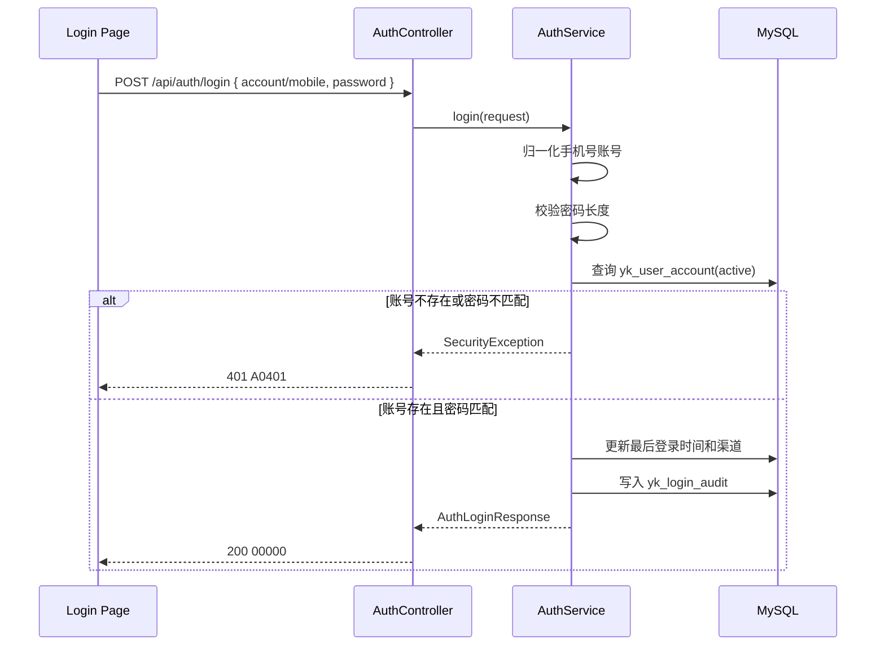

# TASK-005 登录后端与数据库规范化闭环

## 1. 目标

1. 在现有 `/api/auth/login` 基线上改为手机号账号 + 密码登录，不再走验证码放行。
2. 在当前版本目录内补齐本轮登录相关数据库结构、SQL 脚本入口和联调种子数据。
3. 为 `TA-VAPP-API-001`、`TA-VAPP-DB-001`、`BA-VAPP-E2E-001` 提供真实后端闭环。

## 2. 技术时序图

## 3. API 设计

### 3.1 登录接口

- 路径：`/api/auth/login`
- 方法：`POST`
- 验收引用：`TA-VAPP-API-001`、`BA-VAPP-E2E-001`

请求参数：

| 字段 | 类型 | 必填 | 说明 |
| --- | --- | --- | --- |
| `account` | `string` | 否 | 手机号账号；优先使用该字段 |
| `mobile` | `string` | 否 | 兼容旧请求字段；后端仍按手机号归一化 |
| `password` | `string` | 是 | 登录密码，长度 6 到 32 位 |

响应结构：

| 字段 | 类型 | 说明 |
| --- | --- | --- |
| `userId` | `number` | 用户主键 |
| `mobile` | `string` | 登录手机号账号 |
| `nickname` | `string` | 用户昵称，空值时回填 `Flight Student` |
| `token` | `string` | 当前最小闭环使用的 Base64 token |

错误分支：

| 场景 | HTTP | 错误码 | 说明 |
| --- | --- | --- | --- |
| 手机号格式错误 | `400` | `A0400` | 非 11 位手机号 |
| 密码缺失或长度不合法 | `400` | `A0400` | 密码为空或长度不在 6 到 32 位 |
| 账号不存在或密码不匹配 | `401` | `A0401` | 返回统一口径，避免暴露账号存在性 |
| 数据源未配置 | `500` | `B0001` | 测试环境必须提供真实数据源 |

## 4. 前置验证入口

1. 正常返回：请求体传 `account=13800138000`、`password=Yk@20260513`，接口返回 `00000`。
2. 参数校验：手机号格式错误时返回 `A0400`。
3. 关键错误分支：密码为空或长度不合法时返回 `A0400`；账号不存在或密码错误时返回 `A0401`。
4. 关键状态变化：登录成功后更新 `yk_user_account.last_login_at`、`last_login_channel`，并新增一条 `yk_login_audit`。
5. 预期红灯原因：测试库未执行 `TASK-005` DDL 或未执行联调种子脚本时，登录会因缺少密码字段或测试账号而失败。

## 5. 数据结构

### 5.1 `AuthLoginRequest`

| 字段 | 类型 | 说明 |
| --- | --- | --- |
| `account` | `String` | 手机号账号，优先字段 |
| `mobile` | `String` | 兼容旧字段 |
| `password` | `String` | 登录密码 |

### 5.2 `AuthLoginResponse`

| 字段 | 类型 | 说明 |
| --- | --- | --- |
| `userId` | `Long` | 用户主键 |
| `mobile` | `String` | 手机号账号 |
| `nickname` | `String` | 用户昵称 |
| `token` | `String` | 登录 token |

## 6. 数据库设计

### 6.1 复用表

`yk_user_account`

- 继续作为手机号账号登录主表。
- 保持 `mobile` 唯一约束。
- 新增密码相关字段：
  - `password_salt`
  - `password_hash`
  - `password_initialized_at`
- 新增登录快照字段：
  - `last_login_at`
  - `last_login_channel`

### 6.2 登录审计表

`yk_login_audit`

| 字段 | 类型 | 说明 |
| --- | --- | --- |
| `id` | `BIGINT UNSIGNED` | 主键 |
| `user_id` | `BIGINT UNSIGNED` | 用户主键 |
| `mobile` | `VARCHAR(32)` | 登录手机号冗余值 |
| `login_channel` | `VARCHAR(32)` | 当前固定 `password` |
| `login_result` | `VARCHAR(32)` | 当前成功登录固定 `success` |
| `password_match_flag` | `TINYINT(1)` | 当前成功登录固定 `1` |
| `created_at` | `DATETIME` | 创建时间 |
| `update_time` | `DATETIME` | 更新时间 |
| `is_deleted` | `TINYINT(1)` | 逻辑删除标记 |

索引设计：

1. 主键：`id`
2. 普通索引：`idx_yk_login_audit_user_time (user_id, created_at)`
3. 普通索引：`idx_yk_login_audit_mobile_time (mobile, created_at)`

## 7. 密码口径

1. 当前版本不引入注册、找回密码或验证码校验。
2. 后端仅接受“已存在账号 + 已初始化密码”的登录场景。
3. 密码校验规则：`SHA-256(salt + ":" + rawPassword)`，与测试库种子脚本保持一致。
4. 若账号存在但密码字段为空，按未初始化密码处理，统一返回 `A0401`。

## 8. SQL 脚本入口

1. DDL：`050-执行脚本/TASK-005/20260513093000-ddl-login-audit-and-account-extension.sql`
2. 联调种子数据：`050-执行脚本/TASK-005/20260513101000-dml-account-password-login-seed.sql`
3. 测试库执行顺序：先执行 `TASK-017/001-baseline-ddl.sql`，再执行本轮 DDL，最后执行种子脚本。
4. 本轮仅输出版本脚本资产，不直接操作生产库。
