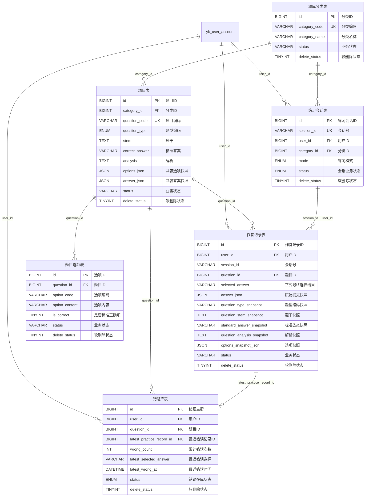

# TASK-008 练习页题库与 SQL 资产设计

## 1. 目标

1. 在当前版本内正式落地练习页题库的数据模型与 SQL 资产，覆盖题目分类、题目、选项、标准答案、解析、练习会话、作答记录和错题库。
2. 保留 `yk_question` 作为题目主表，按增量方式补齐正式字段，不再继续依赖 `options_json`、`answer_json` 作为唯一正式结构。
3. 在 `yk_practice_record` 中补齐“正式作答字段 + 题目快照字段”，其中 `answer_json` 保留为原始提交快照，`selected_answer` 作为正式最终选择结果。
4. 新增 `yk_wrong_question_book` 作为错题库主表，支持按 `user_id + question_id` 唯一管理错题的加入、移除、累计错误次数和最近错误信息。
5. 补齐 `delete_status` 软删除口径；`status` 仅承担业务状态职责，不再兼任软删除语义。
6. 当前题型继续采用“题型编码 + 枚举值”方案，不新增独立字典表；当前外键继续保持物理外键口径。

## 2. 核心设计结论

### 2.0 库表关系图



### 2.1 表职责划分

本轮最终正式结构范围只保留 6 张业务表：`yk_question_category`、`yk_question`、`yk_question_option`、`yk_practice_session`、`yk_practice_record`、`yk_wrong_question_book`。`yk_question_import_staging` 与 `yk_question_import_option_staging` 不再属于本轮正式结构范围。

1. `yk_question_category`：题库分类主数据，只负责分类维度。
2. `yk_question`：题目主数据，只负责题目当前正式版本。
3. `yk_question_option`：题目选项主数据，只负责当前正式选项。
4. `yk_practice_session`：一次练习会话的起止、模式和进度聚合。
5. `yk_practice_record`：一次会话下某题最终作答结果，同时冗余题目快照，支撑作答结果查询和错题入库。
6. `yk_wrong_question_book`：用户错题在库状态与累计错误信息，不承载每次作答明细。

### 2.2 题型编码口径

| 编码 | 含义 | 说明 |
| --- | --- | --- |
| `single_choice` | 单选题 | 仅允许 1 个正确选项 |
| `multiple_choice` | 多选题 | 允许多个正确选项 |
| `judge` | 判断题 | 固定两项：`T=正确`、`F=错误` |

1. `question_type` 当前正式口径是“题型编码”。
2. 数据库存储继续用枚举值收口，不新增独立字典表。
3. 作答记录中的 `question_type_snapshot` 保存的是提交当时的题型编码快照。

### 2.3 `status` 与 `delete_status` 口径

1. `delete_status` 统一表示软删除状态，正式取值为 `0=未删除`、`1=已删除`。
2. 所有正式查询默认按 `delete_status = 0` 过滤。
3. `status` 只承担业务状态，不再表达软删除。
4. `yk_question_category.status`、`yk_question.status` 沿用当前业务状态口径，如 `draft / online / offline`。
5. `yk_question_option.status`、`yk_practice_record.status` 采用有效性口径，如 `active / invalid`。
6. `yk_practice_session.status` 保持会话生命周期口径，如 `in_progress / completed / abandoned`。
7. `yk_wrong_question_book.status` 表示错题是否仍在库，正式取值为 `active / removed`。

### 2.4 正式作答字段与快照字段

1. `yk_practice_record.selected_answer`：正式最终选择结果。
2. `yk_practice_record.answer_json`：原始提交快照，保留客户端原始提交结构。
3. `selected_answer` 的正式存储规则与 `correct_answer` 一致：
   - 单选题：`A`
   - 多选题：`A,C,D`
   - 判断题：`T` 或 `F`
4. 作答记录冗余以下题目快照字段：
   - `question_code_snapshot`
   - `question_type_snapshot`
   - `question_stem_snapshot`
   - `standard_answer_snapshot`
   - `question_analysis_snapshot`
   - `category_id_snapshot`
   - `category_code_snapshot`
   - `category_name_snapshot`
   - `options_snapshot_json`
5. 快照字段在作答写入时从题目主数据复制，后续题库主数据调整不回写历史作答快照。

### 2.5 历史迁移清洗与兜底口径

1. `yk_question.question_type` 的枚举收紧不能直接执行，正式顺序必须是“先清洗历史值，再 `ALTER ... ENUM(...)` 收口”。
2. `question_type` 历史清洗分三层：
   - 第一层：直接识别并归一常见旧值，如 `single`、`single-choice`、`单选`、`单选题` 统一回填为 `single_choice`。
   - 第二层：`multiple`、`multiple-choice`、`multi`、`多选`、`多选题` 统一回填为 `multiple_choice`；`judge`、`judgement`、`true_false`、`判断`、`判断题` 统一回填为 `judge`。
   - 第三层：对仍未命中的旧值，按 `correct_answer` 做最小推断回填：含多答案分隔符的收口为 `multiple_choice`，判断题答案口径收口为 `judge`，其余兜底为 `single_choice`。
3. 第三层推断命中的题目，统一在 `source_ref` 前增加 `[LEGACY-TYPE-INFERRED]` 标记，便于执行后人工抽查，不再无痕覆盖。
4. `yk_practice_record.selected_answer` 的历史回填也必须先做兼容清洗，再把字段收紧为正式非空列。
5. `selected_answer` 历史回填优先级：
   - 先保留已有非空正式值，并统一清洗分隔符、空格和大小写。
   - 再兼容 `answer_json.selectedAnswer`、`selected_answer`、`answer`、`submitAnswer`。
   - 再兼容 `selectedOptionCodes`、`selected_option_codes`、`optionCodes`、`option_codes`、`answers`、`answerList`、根数组等常见数组结构。
6. 若以上规则仍无法解析出正式答案，统一落为 `PENDING_MANUAL_CONFIRM`，作为历史异常兜底标记，不再留空字符串。
7. 正式 SQL 资产必须同时给出两类校验：
   - 枚举收紧前后的 `question_type` 清洗校验与推断命中清单。
   - `selected_answer='PENDING_MANUAL_CONFIRM'` 的未命中清单与格式异常清单。

## 3. 正式会话承载

### 3.1 `sessionId` 落库方案

本轮正式采用“会话表 + 作答记录冗余会话号 + 错题库引用最近错误会话”的方案：

1. `yk_practice_session.session_id`：练习会话正式主标识，唯一。
2. `yk_practice_record.session_id`：作答记录冗余保存会话号，用于按会话聚合作答结果。
3. `yk_wrong_question_book.latest_session_id`：保存最近一次错误所属会话号，便于按会话回溯最近错误现场。

### 3.2 会话表字段

`yk_practice_session`

| 字段 | 类型 | 说明 |
| --- | --- | --- |
| `id` | `BIGINT UNSIGNED` | 主键 |
| `session_id` | `VARCHAR(64)` | 会话号，唯一，不可空 |
| `user_id` | `BIGINT UNSIGNED` | 用户 ID |
| `practice_code` | `VARCHAR(64)` | 本次练习实例编码 |
| `category_id` | `BIGINT UNSIGNED` | 本次练习分类 |
| `mode` | `ENUM('standard','wrongReview')` | 练习模式 |
| `question_count` | `INT` | 本次会话题数 |
| `answered_count` | `INT` | 已答题数 |
| `correct_count` | `INT` | 答对题数 |
| `wrong_count` | `INT` | 答错题数 |
| `status` | `ENUM('in_progress','completed','abandoned')` | 会话业务状态 |
| `delete_status` | `TINYINT(1)` | 软删除状态 |
| `started_at` | `DATETIME` | 开始时间 |
| `completed_at` | `DATETIME` | 完成时间，可空 |
| `created_at` | `DATETIME` | 创建时间 |
| `updated_at` | `DATETIME` | 更新时间 |

## 4. API 与库表映射

### 4.1 当前练习元数据

- 路径：`GET /api/practices/current`
- 返回：
  - `categoryList[] -> yk_question_category`
  - `questionCount -> yk_question` 聚合
  - `wrongQuestionCount -> yk_wrong_question_book` 聚合，过滤 `status='active' and delete_status=0`

### 4.2 开始练习

- 路径：`POST /api/practices/{practiceId}/start`
- 请求：
  - `categoryId`
  - `mode`
- 落库：
  - 新增 `yk_practice_session`
- 返回：
  - `sessionId`
  - `categoryId`
  - `questionCount`
  - `firstQuestionIndex`

### 4.3 题目拉取

- 路径：`GET /api/practices/{practiceId}/sessions/{sessionId}/question`
- 查询链路：
  - `sessionId -> yk_practice_session`
  - `categoryId -> yk_question`
  - `question.id -> yk_question_option`
- 查询过滤：
  - `yk_question.delete_status = 0`
  - `yk_question_option.delete_status = 0`

### 4.4 提交答案

- 路径：`POST /api/practices/{practiceId}/sessions/{sessionId}/answers`
- 正式落库：
  - `yk_practice_record.session_id`
  - `yk_practice_record.question_id`
  - `yk_practice_record.selected_answer`
  - `yk_practice_record.answer_json`
  - `yk_practice_record.correct_flag`
  - `yk_practice_record` 全套题目快照字段
- 同步更新：
  - `yk_practice_session.answered_count`
  - `yk_practice_session.correct_count`
  - `yk_practice_session.wrong_count`
- 错题库同步：
  - 本次答错：按 `user_id + question_id` upsert `yk_wrong_question_book`，累加 `wrong_count`，刷新最近错误信息并置 `status='active'`
  - 本次答对且错题已在库：更新 `yk_wrong_question_book.status='removed'`，写入 `removed_at`

### 4.5 进度查询

- 路径：`GET /api/practices/{practiceId}/sessions/{sessionId}/progress`
- 正式口径：
  - 优先查 `yk_practice_session`
  - 兜底按 `yk_practice_record.session_id` 聚合复核

## 5. 数据关系与约束口径

### 5.1 唯一约束

1. `yk_question_category.category_code` 唯一。
2. `yk_question.question_code` 唯一。
3. `yk_question_option (question_id, option_code)` 唯一。
4. `yk_practice_session.session_id` 唯一。
5. `yk_practice_record (session_id, question_id)` 唯一，表示同一会话同一题只保留一条最终正式作答记录。
6. `yk_wrong_question_book (user_id, question_id)` 唯一，表示同一用户同一题在错题库内只有一条管理记录。

### 5.2 物理外键

1. `yk_question.category_id -> yk_question_category.id`
2. `yk_question_option.question_id -> yk_question.id`
3. `yk_practice_session.user_id -> yk_user_account.id`
4. `yk_practice_session.category_id -> yk_question_category.id`
5. `yk_practice_record.question_id -> yk_question.id`
6. `yk_practice_record (session_id, user_id) -> yk_practice_session (session_id, user_id)`
7. `yk_wrong_question_book.user_id -> yk_user_account.id`
8. `yk_wrong_question_book.question_id -> yk_question.id`
9. `yk_wrong_question_book.latest_practice_record_id -> yk_practice_record.id`

### 5.3 非空与枚举

1. `yk_question.question_type`、`yk_practice_session.mode`、`yk_practice_session.status`、`yk_wrong_question_book.status` 用枚举值收口。
2. `selected_answer`、`question_code_snapshot`、`question_type_snapshot`、`standard_answer_snapshot` 等正式查询必需字段统一设为不可空字符串字段。
3. `options_snapshot_json`、`question_stem_snapshot`、`question_analysis_snapshot` 允许为空，兼容历史回填。

## 6. 题目主表正式字段

`yk_question`

| 字段 | 类型 | 说明 |
| --- | --- | --- |
| `id` | `BIGINT UNSIGNED` | 主键 |
| `course_id` | `BIGINT UNSIGNED` | 课程 ID |
| `category_id` | `BIGINT UNSIGNED` | 分类 ID，不可空 |
| `question_code` | `VARCHAR(64)` | 题目编码，唯一，不可空 |
| `question_type` | `ENUM('single_choice','multiple_choice','judge')` | 题型编码 |
| `stem` | `TEXT` | 题干 |
| `correct_answer` | `VARCHAR(128)` | 标准答案，不可空 |
| `analysis` | `TEXT` | 解析 |
| `score` | `INT` | 分值 |
| `sort_no` | `INT` | 分类内顺序 |
| `source_ref` | `VARCHAR(255)` | 来源定位 |
| `options_json` | `JSON` | 兼容选项快照 |
| `answer_json` | `JSON` | 兼容答案快照 |
| `difficulty` | `VARCHAR(32)` | 难度 |
| `status` | `VARCHAR(32)` | 业务状态 |
| `delete_status` | `TINYINT(1)` | 软删除状态 |
| `created_at` | `DATETIME` | 创建时间 |
| `updated_at` | `DATETIME` | 更新时间 |

## 7. 作答记录正式字段

`yk_practice_record`

| 字段 | 类型 | 说明 |
| --- | --- | --- |
| `user_id` | `BIGINT UNSIGNED` | 作答用户 |
| `course_id` | `BIGINT UNSIGNED` | 课程 ID |
| `session_id` | `VARCHAR(64)` | 本次练习会话号，不可空 |
| `question_id` | `BIGINT UNSIGNED` | 题目 ID |
| `selected_answer` | `VARCHAR(128)` | 正式最终选择结果 |
| `answer_json` | `JSON` | 原始提交快照 |
| `question_code_snapshot` | `VARCHAR(64)` | 题目编码快照 |
| `question_type_snapshot` | `VARCHAR(32)` | 题型编码快照 |
| `question_stem_snapshot` | `TEXT` | 题干快照 |
| `standard_answer_snapshot` | `VARCHAR(128)` | 标准答案快照 |
| `question_analysis_snapshot` | `TEXT` | 解析快照 |
| `category_id_snapshot` | `BIGINT UNSIGNED` | 分类 ID 快照 |
| `category_code_snapshot` | `VARCHAR(64)` | 分类编码快照 |
| `category_name_snapshot` | `VARCHAR(128)` | 分类名称快照 |
| `options_snapshot_json` | `JSON` | 选项快照 |
| `correct_flag` | `TINYINT(1)` | 是否答对 |
| `status` | `VARCHAR(32)` | 业务状态，默认 `active` |
| `delete_status` | `TINYINT(1)` | 软删除状态 |
| `answered_at` | `DATETIME` | 作答时间 |

推荐 `answer_json` 结构：

```json
{
  "selectedOptionCodes": ["A", "C"],
  "selectedAnswer": "A,C",
  "submitSource": "practice_page",
  "clientTimestamp": "2026-05-13T19:00:00+08:00"
}
```

## 8. 错题库表设计

`yk_wrong_question_book`

| 字段 | 类型 | 说明 |
| --- | --- | --- |
| `id` | `BIGINT UNSIGNED` | 主键 |
| `user_id` | `BIGINT UNSIGNED` | 用户 ID |
| `question_id` | `BIGINT UNSIGNED` | 题目 ID |
| `latest_practice_record_id` | `BIGINT UNSIGNED` | 最近一次错误对应的作答记录 ID |
| `latest_session_id` | `VARCHAR(64)` | 最近一次错误所属会话号 |
| `wrong_count` | `INT` | 累计错误次数 |
| `latest_selected_answer` | `VARCHAR(128)` | 最近一次错误的正式选择结果 |
| `latest_wrong_answer_json` | `JSON` | 最近一次错误的原始提交快照 |
| `latest_standard_answer` | `VARCHAR(128)` | 最近一次错误时的标准答案快照 |
| `latest_wrong_at` | `DATETIME` | 最近一次错误时间 |
| `status` | `ENUM('active','removed')` | 错题当前是否在库 |
| `removed_at` | `DATETIME` | 移除时间，可空 |
| `delete_status` | `TINYINT(1)` | 软删除状态 |
| `created_at` | `DATETIME` | 创建时间 |
| `updated_at` | `DATETIME` | 更新时间 |

说明：

1. `wrong_count` 只累加错误次数，不因移除错题而清零。
2. `status='removed'` 表示当前不在错题库展示，但历史错误次数与最近错误信息保留。
3. 错题库不重复冗余整套题目快照，最近错误现场通过 `latest_practice_record_id` 回溯到作答记录快照。

## 9. 11 个正式分类种子

| 顺序 | 分类编码 | 分类名称 |
| --- | --- | --- |
| 1 | `overview` | 概述 |
| 2 | `system_components` | 系统组成及介绍 |
| 3 | `air_traffic_control` | 空中交通管制 |
| 4 | `flight_manual_and_regulations` | 无人机飞行手册、法律法规及其他 |
| 5 | `operation_precautions` | 无人机操作注意事项 |
| 6 | `meteorology` | 气象 |
| 7 | `rotary_uav` | 旋翼无人机 |
| 8 | `mission_planning` | 无人机任务规划 |
| 9 | `flight_principles_and_performance` | 飞行原理与飞行性能 |
| 10 | `comprehensive_qa` | 综合问答 |
| 11 | `instructor_question_bank` | 无人机教员题库 |

## 10. SQL 资产入口

1. DDL：`050-执行脚本/TASK-008/20260513190000-ddl-question-bank-schema.sql`
2. 分类种子：`050-执行脚本/TASK-008/20260513191000-dml-question-category-seed.sql`
3. 录题模板：`050-执行脚本/TASK-008/20260513192000-dml-question-import-template.sql`
4. 资产说明：`050-执行脚本/TASK-008/database-assets.md`
5. 目录入口：`050-执行脚本/TASK-008/README.md`

## 11. 当前边界

1. 本轮只修程序设计文档与 SQL 资产，不改 Java、前端、计划文件、验收文件。
2. 当前仓内练习接口仍是内存假数据实现，后续实施任务要把读写链路正式切到本轮库表。
3. 历史数据回填以最小兼容为原则：先补 `selected_answer`、题目快照、会话表和错题库聚合；`selected_answer` 未命中记录统一落为 `PENDING_MANUAL_CONFIRM` 并输出核对 SQL，`question_type` 推断回填记录统一追加 `[LEGACY-TYPE-INFERRED]` 标记后再进入人工抽查。
