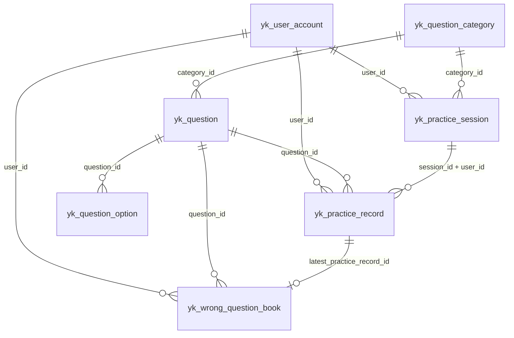

# TASK-008 题库数据库整理与测试库落地说明

## 1. 文档目的

本文件用于给当前版本直接查看两类正式结果：

1. 本轮题库数据库整改后的最终库表结构、表关系、字段口径、迁移口径、执行顺序与人工抽查点。
2. 测试库 `yunjikeji` 的真实执行、校验与回写结果。

## 2. 本轮正式范围

本轮正式范围包括以下对象：

1. `yk_question_category`：题目分类主表。
2. `yk_question`：题目主表增量扩展。
3. `yk_question_option`：题目选项表。
4. `yk_question_import_staging`：题目导入暂存表。
5. `yk_question_import_option_staging`：题目选项导入暂存表。
6. `yk_practice_session`：练习会话表。
7. `yk_practice_record`：作答记录表增量扩展。
8. `yk_wrong_question_book`：错题库主表。

## 3. 最终表关系

## 4. 最终字段口径

### 4.1 题型编码

正式口径继续采用题型编码枚举，不单独拆字典表：

| 编码 | 含义 |
| --- | --- |
| `single_choice` | 单选题 |
| `multiple_choice` | 多选题 |
| `judge` | 判断题 |

### 4.2 `status` 与 `delete_status`

1. `delete_status` 统一表示软删除状态：
   - `0`：未删除
   - `1`：已删除
2. `status` 只表示业务状态，不再承载软删除语义。

### 4.3 作答正式字段与快照字段

1. `yk_practice_record.selected_answer`：正式最终选择结果。
2. `yk_practice_record.answer_json`：原始提交快照。
3. `yk_practice_record` 冗余题目快照字段：
   - `question_code_snapshot`
   - `question_type_snapshot`
   - `question_stem_snapshot`
   - `standard_answer_snapshot`
   - `question_analysis_snapshot`
   - `category_id_snapshot`
   - `category_code_snapshot`
   - `category_name_snapshot`
   - `options_snapshot_json`

### 4.4 错题库口径

`yk_wrong_question_book` 单独维护“是否仍在错题库中”的状态，不再只从作答记录实时推导：

1. `status='active'`：当前仍在错题库。
2. `status='removed'`：曾进错题库，后续已移出。
3. `wrong_count`：累计答错次数。
4. `latest_selected_answer` / `latest_wrong_answer_json` / `latest_standard_answer`：最近一次错答快照。

## 5. 迁移与执行口径

### 5.1 `question_type` 迁移口径

1. 先清洗历史脏值，再收紧为正式枚举。
2. 直接命中的旧值归一到正式编码。
3. 未直接命中的旧值，允许按 `correct_answer` 做最小推断。
4. 推断命中的记录，在 `source_ref` 前缀追加 `[LEGACY-TYPE-INFERRED]`。
5. 为避免 `source_ref` 长度超限，前缀追加时对原值做截断保护。

### 5.2 `selected_answer` 迁移口径

1. 先保留已存在的正式值。
2. 再兼容解析 `answer_json` 中常见的标量和数组字段。
3. 未能自动解析的历史数据统一落为 `PENDING_MANUAL_CONFIRM`。

### 5.3 正式执行顺序

1. 执行基线 DDL（若尚未执行）。
2. 执行 `20260513190000-ddl-question-bank-schema.sql`。
3. 抽查：
   - `source_ref LIKE '[LEGACY-TYPE-INFERRED]%'`
   - `selected_answer = 'PENDING_MANUAL_CONFIRM'`
4. 执行 `20260513191000-dml-question-category-seed.sql`。
5. 后续按暂存表 + 批量导入 SQL 走正式入库。

## 6. 本轮人工抽查点

1. `source_ref LIKE '[LEGACY-TYPE-INFERRED]%'`：
   - 代表题型由历史答案内容推断而来。
2. `selected_answer = 'PENDING_MANUAL_CONFIRM'`：
   - 代表历史 `answer_json` 未被当前兼容规则自动识别。
3. 模板导入脚本示例题：
   - 当前仅用于导入链路验证，不应直接视为正式题库内容。

## 7. 测试库正式执行结果

### 7.1 执行前事实

执行前测试库 `yunjikeji` 已存在部分对象，但未完整落地：

1. `yk_question_category` 已存在，但缺少 `delete_status`。
2. `yk_question_option` 已存在，但缺少 `status`、`delete_status`。
3. `yk_practice_session` 已存在，但缺少 `delete_status`。
4. `yk_practice_record` 仍是旧结构，缺少 `selected_answer` 与快照字段。
5. `yk_wrong_question_book` 不存在。

### 7.2 本轮执行修正

1. 修复了 DDL 顺序问题：
   - 先补 `yk_question_category.delete_status`
   - 再执行依赖该字段的 bootstrap 分类插入
2. 修复了 `source_ref` 推断标记的长度保护。

### 7.3 本轮验证目标

本轮执行后必须核对：

1. 6 张正式目标表存在。
2. 2 张暂存表存在。
3. `yk_question` 关键字段齐全，`question_type` 为正式枚举。
4. `yk_practice_record` 已补齐 `selected_answer` 与全部快照字段。
5. `yk_wrong_question_book` 已创建。
6. 11 个正式分类已在库。
7. 外键与关键唯一索引已存在。

### 7.4 最终正式结论

本节由本轮真实测试库执行与验证完成后继续回填。
