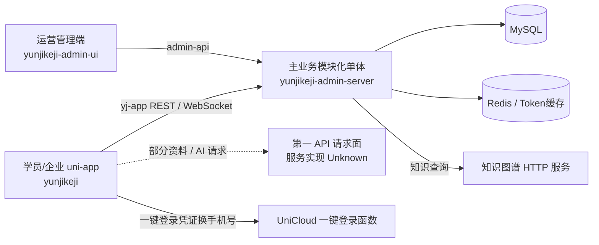
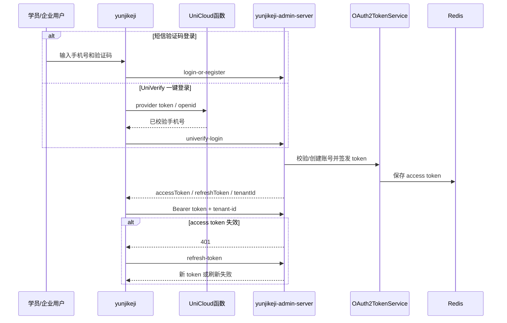
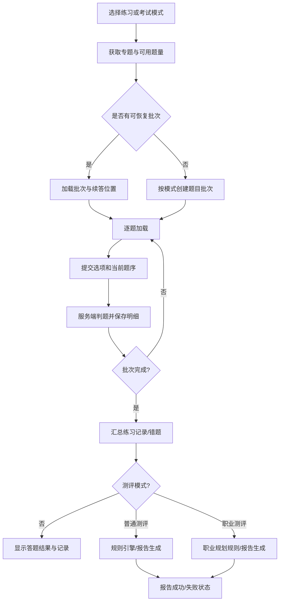
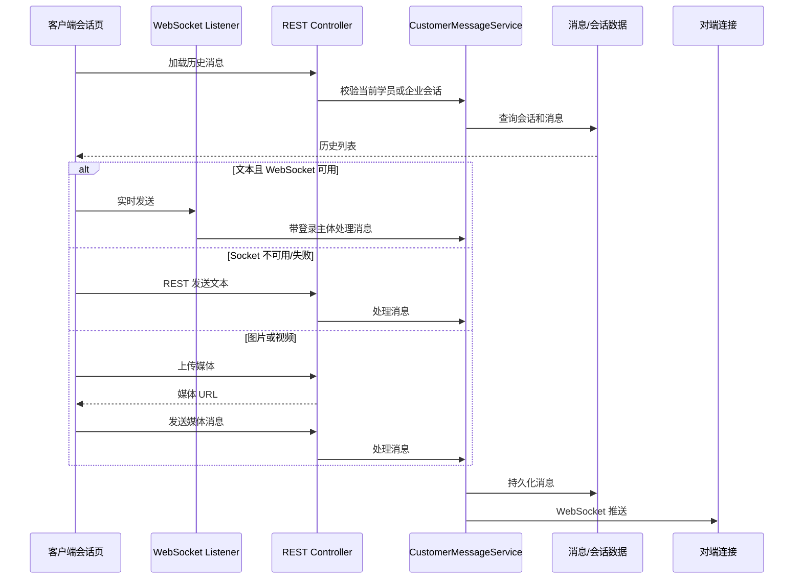

# 飞行学院项目架构与功能实现技术文档

> 调研基线：2026-09-01 当前工作区源码（`HEAD 7d7af1ca`）。本文按真实一方源码、配置、SQL 与测试资产编写；README、历史文档和页面文案只作为线索，不作为运行事实。

## 1. 文档边界与证据等级

### 1.1 目标

本文面向后续研发、测试和运维人员，说明飞行学院项目在当前仓库中的工程组成、运行边界和主要调用关系。本文不会把“目录存在”“依赖已声明”或“页面有文案”直接等同于功能已启用。

### 1.2 证据等级

| 等级 | 含义 | 写法 |
| --- | --- | --- |
| Fact | 能从当前源码、配置、SQL 或测试资产直接确认 | 直接陈述，并给出 `相对路径:行号` |
| Inference | 多项源码事实共同支持，但缺少运行态或部署态证据 | 显式标记为 **Inference** |
| Unknown | 当前仓库不能确认 | 显式标记为 **Unknown**，不猜测 |

### 1.3 关键限制

- 本文描述的是当前工作区快照，不代表任一线上环境已经部署到同一提交。
- `yunjikeji-admin-server` 中存在大量通用后台模板模块。模块目录或 Maven 依赖存在，不等于该能力已经通过菜单、配置和部署启用。
- `guanwang-site` 与 `xiaoji-site` 是静态 HTML/CSS/图片站点；其中的宣传文案只能证明展示内容，不能证明对应后端机制已实现或已部署。
- 受控配置中存在密钥类字段。本文只说明配置来源和边界，不复制任何敏感值。

## 2. 项目定位

从当前源码可确认，飞行学院不是单一 Web 应用，而是一组围绕无人机职业教育、考试测评、岗位服务与运营治理构建的客户端和服务端工程：

1. `yunjikeji` 提供学员与企业双身份的 uni-app 客户端。身份类型在同一个状态模型中定义为 `student | enterprise`，不是两个独立安装包（`code/develop/yunjikeji/src/stores/appState.ts:7`）。
2. `yunjikeji-admin-ui` 提供 Vue 3 管理后台，按后端下发菜单生成动态路由（`code/develop/yunjikeji-admin-ui/src/permission.ts:80`）。
3. `yunjikeji-admin-server` 是主业务后端：一个 Maven 多模块工程最终由单个 Spring Boot 启动单元装配业务与通用模块（`code/develop/yunjikeji-admin-server/pom.xml:11`、`code/develop/yunjikeji-admin-server/yunjikeji-admin-server/src/main/java/cn/iocoder/yudao/server/YunjikejiAdminServerApplication.java:9`）。其准确形态是“模块化单体”，不是已证实的注册发现微服务集群。

从功能入口看，产品主线覆盖身份登录、企业注册审核、组织绑定与学员审核、练习和多类考试、普通/职业测评、错题 AI 深解、知识查询、岗位浏览、客服会话及管理端资源治理。页面注册表直接包含这些入口（`code/develop/yunjikeji/src/pages.json:19`、`code/develop/yunjikeji/src/pages.json:61`、`code/develop/yunjikeji/src/pages.json:141`、`code/develop/yunjikeji/src/pages.json:197`）。

## 3. 仓库与工程矩阵

### 3.1 主要工程

| 工程 | 类型与启动入口 | 当前源码职责 | 可信度与边界 |
| --- | --- | --- | --- |
| `code/develop/yunjikeji` | Vue 3 + uni-app；`src/main.ts` | 学员/企业共用客户端，页面、状态、API 封装与 UniCloud 一键登录函数 | 高；实际各端发布状态 Unknown |
| `code/develop/yunjikeji-admin-ui` | Vue 3 + TypeScript + Vite；`src/main.ts` | 管理登录、动态权限、仪表盘、审核、题库、岗位采集、知识库等运营界面 | 高；通用模板目录不代表启用 |
| `code/develop/yunjikeji-admin-server` | Java 8、Spring Boot 2.7.18、Maven reactor | 主业务 API、OAuth2 token、租户/权限、MyBatis 数据访问、定时任务、WebSocket | 高；部署实例数量 Unknown |
| `code/develop/guanwang-site` | 静态 HTML/CSS | 官网展示资产 | 高；不证明业务后端能力 |
| `code/develop/xiaoji-site` | 静态 HTML/CSS/图片 | 产品展示与交互示意资产 | 高；不证明业务后端能力 |
| `tests/mobile-e2e` | Node + Appium + UiAutomator2 | Android 真机认证、导航、练习、岗位等流程脚本 | 高；本次未执行，不代表当前通过 |

### 3.2 技术栈证据

- 学员端使用 uni-app、Vue 3.4.21 和 Vite 5.2.8（`code/develop/yunjikeji/package.json:41`、`code/develop/yunjikeji/package.json:58`、`code/develop/yunjikeji/package.json:72`）；入口使用 `createSSRApp`（`code/develop/yunjikeji/src/main.ts:7`）。
- 管理端使用 Vue 3.5.34、Pinia 3、Vue Router 5、Element Plus 2.13.7 和 Vite 8.0.10（`code/develop/yunjikeji-admin-ui/package.json:54`、`code/develop/yunjikeji-admin-ui/package.json:70`、`code/develop/yunjikeji-admin-ui/package.json:80`、`code/develop/yunjikeji-admin-ui/package.json:83`、`code/develop/yunjikeji-admin-ui/package.json:135`）。README/描述中的 “Vite 4” 与实际依赖冲突时，以 `package.json` 为准。
- 主后端父工程声明 Java 8、Spring Boot 2.7.18，并聚合 system、infra、member、BPM、report、pay、mall、IoT、MES、WMS、IM 等模块（`code/develop/yunjikeji-admin-server/pom.xml:28`、`code/develop/yunjikeji-admin-server/pom.xml:37`、`code/develop/yunjikeji-admin-server/pom.xml:44`）。聚合只证明可参与构建，不证明所有模块均在产品菜单和运行配置中启用。
- 主后端数据访问依赖 MyBatis-Plus 3.5.16，并提供 Redis/WebSocket 等 starter（`code/develop/yunjikeji-admin-server/yudao-dependencies/pom.xml:30`、`code/develop/yunjikeji-admin-server/yudao-dependencies/pom.xml:186`、`code/develop/yunjikeji-admin-server/yudao-dependencies/pom.xml:273`）。
### 3.3 客户端两组 API 请求面

uni-app 明确定义第一 API 基址与 `yj-app` 主业务基址（`code/develop/yunjikeji/src/services/apiBase.ts:7`、`code/develop/yunjikeji/src/services/apiBase.ts:27`）。开发服务器为两组前缀配置独立代理（`code/develop/yunjikeji/vite.config.ts:32`、`code/develop/yunjikeji/vite.config.ts:39`、`code/develop/yunjikeji/vite.config.ts:43`）。

- 身份、组织、测评、岗位、客服和主练习接口使用 `getYjAppApiBaseUrl()`（`code/develop/yunjikeji/src/services/customerAuth.ts:416`、`code/develop/yunjikeji/src/services/assessment.ts:133`、`code/develop/yunjikeji/src/services/jobs.ts:55`）。
- 个人资料聚合及 AI 深解/追问使用 `getApiBaseUrl()`（`code/develop/yunjikeji/src/services/profile.ts:68`、`code/develop/yunjikeji/src/services/practice.ts:791`）。

这只能证明客户端当前存在两组请求面，不能证明它们对应两个独立后端。第一 API 基址的服务实现、生产反向代理目标和数据主权均为 **Unknown**；本文不把该请求面映射到任何被排除的工程。

## 4. 系统架构

### 4.1 源码确认的运行单元与关系

虚线表示源码只确认客户端请求选择，不能确认请求最终由哪个生产运行单元承接。图中也没有画出静态展示站、负载均衡器、服务注册中心、Kubernetes 或消息队列集群，因为当前仓库没有足够证据证明它们承担生产运行关系。

### 4.2 主业务后端：模块化单体

`yunjikeji-admin-server` 父 POM 聚合多个 Maven 模块，但启动类只有一个主装配入口，并扫描 `cn.iocoder.yudao` 与 `com.huiyitech` 包（`code/develop/yunjikeji-admin-server/pom.xml:14`、`code/develop/yunjikeji-admin-server/pom.xml:28`、`code/develop/yunjikeji-admin-server/yunjikeji-admin-server/src/main/java/cn/iocoder/yudao/server/YunjikejiAdminServerApplication.java:9`、`code/develop/yunjikeji-admin-server/yunjikeji-admin-server/src/main/java/cn/iocoder/yudao/server/YunjikejiAdminServerApplication.java:39`）。因此：

- `com.huiyitech` 承载飞行学院具体业务，如客户、企业审核、练习、岗位采集、知识与客服。
- `cn.iocoder.yudao` 和 `yudao-module-*` 提供系统权限、租户、基础设施及通用业务模块。
- 模块间主要是同 JVM 内 Spring Bean 调用和共享数据层，不是经注册中心发现的独立服务调用。

仓库检索未形成 Nacos、Eureka、Consul、Spring Cloud Gateway 或 OpenFeign 的实际服务拓扑证据。启动 jar 装配多个 Yudao 模块，而默认控制器同时标记部分模块未启用；因此模块依赖已装配是 **Fact**，具体通用模块在生产中的启用状态是 **Unknown**。

## 5. 运行单元职责边界

| 运行单元 | 应负责 | 不应从源码推断为 |
| --- | --- | --- |
| `yunjikeji` | 用户交互、客户端状态、请求编排、原生能力接入 | 持久化业务事实或决定最终权限 |
| `yunjikeji-admin-ui` | 管理交互、动态路由、资源表单与审核操作 | 权限最终裁决者 |
| `yunjikeji-admin-server` | 主业务规则、OAuth2/租户/权限、`yj_*` 数据、任务调度、客服实时通道 | 多个已独立部署的微服务 |
| `guanwang-site` / `xiaoji-site` | 静态展示 | 业务实现证据 |

当前最重要的架构维护原则是先判定请求属于哪一组 API 基址，再进入功能代码排查。对第一请求面只能沿部署配置确认实际服务，不能从 URL 形式反推生产实现或数据主权。

## 6. 鉴权、租户与状态管理

### 6.1 移动端请求身份

uni-app 的通用请求头从本地状态读取访问令牌，按 Bearer 规范写入 `Authorization`；存在租户编号时同时写入 `tenant-id`（`code/develop/yunjikeji/src/services/request.ts:25`、`code/develop/yunjikeji/src/services/request.ts:28`）。当业务响应码为 401 时，公共处理会清理或转移到重新登录流程（`code/develop/yunjikeji/src/services/request.ts:34`）。

学员与企业共用同一客户端状态对象，但分别保存身份、令牌、租户和审核态。身份联合类型在 `appState.ts` 定义，状态以单例形式暴露并将会话、组织绑定等快照写入客户端存储（`code/develop/yunjikeji/src/stores/appState.ts:7`、`code/develop/yunjikeji/src/stores/appState.ts:223`、`code/develop/yunjikeji/src/stores/appState.ts:255`、`code/develop/yunjikeji/src/stores/appState.ts:272`）。这些快照只用于恢复客户端体验，不能替代后端审核记录。

### 6.2 主后端 Token 链

学员登录入口位于 `FrontCustomerController`，登录/注册结果由 `CustomerServiceImpl` 组织，并通过 OAuth2 token 服务创建访问令牌与刷新令牌（`code/develop/yunjikeji-admin-server/yunjikeji-admin-server/src/main/java/com/huiyitech/app/customer/controller/FrontCustomerController.java:53`、`code/develop/yunjikeji-admin-server/yunjikeji-admin-server/src/main/java/com/huiyitech/customer/service/CustomerServiceImpl.java:146`、`code/develop/yunjikeji-admin-server/yudao-module-system/src/main/java/cn/iocoder/yudao/module/system/service/oauth2/OAuth2TokenServiceImpl.java:180`）。OAuth2 服务持久化 token 并写入 Redis DAO（`code/develop/yunjikeji-admin-server/yudao-module-system/src/main/java/cn/iocoder/yudao/module/system/service/oauth2/OAuth2TokenServiceImpl.java:197`、`code/develop/yunjikeji-admin-server/yudao-module-system/src/main/java/cn/iocoder/yudao/module/system/dal/redis/oauth2/OAuth2AccessTokenRedisDAO.java:35`）。

企业账号采用独立的 `company-auth` 接口面，但最终也复用主后端的 token 能力。企业登录、刷新和退出入口分别位于 `FrontComanpanyAuditController`（`code/develop/yunjikeji-admin-server/yunjikeji-admin-server/src/main/java/com/huiyitech/app/comanpany/controller/FrontComanpanyAuditController.java:58`、`code/develop/yunjikeji-admin-server/yunjikeji-admin-server/src/main/java/com/huiyitech/app/comanpany/controller/FrontComanpanyAuditController.java:74`、`code/develop/yunjikeji-admin-server/yunjikeji-admin-server/src/main/java/com/huiyitech/app/comanpany/controller/FrontComanpanyAuditController.java:82`）。

UniVerify 云函数检查凭证后调用 `uniCloud.getPhoneNumber` 获取运营商认证手机号，并对失败结果做显式转换（`code/develop/yunjikeji/uniCloud-aliyun/cloudfunctions/yj-univerify-login/index.js:33`、`code/develop/yunjikeji/uniCloud-aliyun/cloudfunctions/yj-univerify-login/index.js:54`、`code/develop/yunjikeji/uniCloud-aliyun/cloudfunctions/yj-univerify-login/index.js:65`、`code/develop/yunjikeji/uniCloud-aliyun/cloudfunctions/yj-univerify-login/index.js:81`）。该函数是否已部署、部署到哪个 UniCloud 空间以及线上证书配置均为 **Unknown**。

### 6.3 管理端鉴权与动态权限

管理端登录成功后，用户 store 保存权限集合、角色和后端菜单（`code/develop/yunjikeji-admin-ui/src/store/modules/user.ts:65`、`code/develop/yunjikeji-admin-ui/src/store/modules/user.ts:70`）。全局路由守卫在首次进入时调用 `generateRoutes()`，随后逐条 `router.addRoute`（`code/develop/yunjikeji-admin-ui/src/permission.ts:60`、`code/develop/yunjikeji-admin-ui/src/permission.ts:80`、`code/develop/yunjikeji-admin-ui/src/permission.ts:82`）。

Axios 请求拦截器附加 Bearer token；401 时只允许一个刷新请求执行，其余请求进入等待队列，刷新成功后更新 token 并回放（`code/develop/yunjikeji-admin-ui/src/config/axios/service.ts:58`、`code/develop/yunjikeji-admin-ui/src/config/axios/service.ts:152`、`code/develop/yunjikeji-admin-ui/src/config/axios/service.ts:162`、`code/develop/yunjikeji-admin-ui/src/config/axios/service.ts:166`）。这避免并发 401 触发多次刷新，但刷新失败会统一清理状态并要求重新登录。

动态菜单是真实机制；具体生产账号能够看到哪些菜单是数据库和权限分配的运行态结果，属于 **Unknown**。不能因为 `views/` 下存在页面就断言用户可访问。

## 7. 数据与状态边界

### 7.1 主业务持久化模型

主后端使用 MyBatis/MyBatis-Plus 映射 `yj_*` 表，代表性模型如下：

| 领域 | 模型/表 | 作用 |
| --- | --- | --- |
| 学员账号 | `CustomerAccountDO` / `yj_customer_account` | 学员账号、租户与认证主体（`code/develop/yunjikeji-admin-server/yunjikeji-admin-server/src/main/java/com/huiyitech/customer/dal/dataobject/customer/CustomerAccountDO.java:11`） |
| 练习批次 | `PracticeCatalogBatchDO` / `yj_practice_catalog_batch` | 一次练习/考试的题目批次与进度（`code/develop/yunjikeji-admin-server/yunjikeji-admin-server/src/main/java/com/huiyitech/practice/dal/dataobject/practice/PracticeCatalogBatchDO.java:15`） |
| 作答记录 | `UserPracticeExercisesRecordDO` / `yj_user_practice_exercises_record` | 用户级练习记录与报告入口（`code/develop/yunjikeji-admin-server/yunjikeji-admin-server/src/main/java/com/huiyitech/practice/dal/dataobject/practice/UserPracticeExercisesRecordDO.java:10`） |
| 岗位采集任务 | `PostCollectTaskDO` / `yj_post_collection_task` | 渠道、频次、采集键和任务状态（`code/develop/yunjikeji-admin-server/yunjikeji-admin-server/src/main/java/com/huiyitech/postcollect/dal/dataobject/postcollect/PostCollectTaskDO.java:15`） |
| AI 中心消息 | `AiCenterMessageDO` / `yj_ai_center` | 知识问答历史（`code/develop/yunjikeji-admin-server/yunjikeji-admin-server/src/main/java/com/huiyitech/app/knowledge/dal/dataobject/AiCenterMessageDO.java:15`） |

客户、岗位任务等对象继承 `TenantBaseDO`，说明它们具有租户字段；练习批次与部分记录继承普通 `BaseDO`，具体租户隔离必须以 mapper、查询条件和业务服务为准，不能仅凭继承关系推断。

### 7.2 缓存与临时状态

- 主后端 OAuth2 access token 使用 Redis；测试 profile 同时给出 MySQL 数据源和 Redis 配置入口（`code/develop/yunjikeji-admin-server/yunjikeji-admin-server/src/main/resources/application-test.yaml:13`、`code/develop/yunjikeji-admin-server/yunjikeji-admin-server/src/main/resources/application-test.yaml:31`）。这些只证明测试配置意图，不证明线上地址和可用性。
- 移动端保存登录身份、token、企业注册草稿和组织绑定快照；后端仍是审核状态和业务数据的最终来源。
- 管理端 Pinia/cache 保存用户、角色、菜单和 token，用于前端路由与请求恢复，不是权限数据主库。
- 两组客户端请求面的服务实现和数据主权不能由允许范围源码闭环证明，属于 **Unknown**；不能据此前端配置推断存在两套数据库。

## 8. 核心功能的端到端实现

### 8.1 学员与企业登录

**触发入口。** 登录页按学员/企业身份分流登录结果，并根据审核状态决定进入首页、企业审核或注册流程（`code/develop/yunjikeji/src/pages/auth/login.vue:694`、`code/develop/yunjikeji/src/pages/auth/login.vue:707`、`code/develop/yunjikeji/src/pages/auth/login.vue:719`、`code/develop/yunjikeji/src/pages/auth/login.vue:740`）。

**前端处理。** 短信登录调用 `loginCustomer` 或 `loginCompany`，二者分别访问学员和企业 `login-or-register` 入口（`code/develop/yunjikeji/src/services/customerAuth.ts:478`、`code/develop/yunjikeji/src/services/customerAuth.ts:507`）。成功响应归一化为用户编号、手机号、access token、refresh token、租户和审核态，再写入 app 状态。

**后端处理。** 学员请求进入 `FrontCustomerController` 和 `CustomerServiceImpl`；企业请求进入 `FrontComanpanyAuditController` 和 `CompanyAuditServiceImpl`。账号存在时登录，不存在时按接口语义注册，随后签发 OAuth2 token。

**异常与权限。** 未同意协议、验证码无效、UniVerify 换号失败、token 失效或企业审核态不满足时，前端应停留在登录/审核流程。客户端显示的身份不构成后端授权；服务端仍以 token 中主体、租户和接口校验为准。

### 8.2 企业注册与企业审核

**触发入口。** 企业注册页收集企业资料和营业执照（`code/develop/yunjikeji/src/pages/enterprise/register.vue:246`、`code/develop/yunjikeji/src/pages/enterprise/register.vue:280`）。

**前端处理。** 客户端通过 `customerAuth.ts` 保存草稿、上传附件并提交审核；本地注册状态仅用于恢复填写进度（`code/develop/yunjikeji/src/stores/appState.ts:220`）。

**后端处理。** `FrontComanpanyAuditController` 同时提供 JSON/form 草稿保存、审核提交和执照上传入口（`code/develop/yunjikeji-admin-server/yunjikeji-admin-server/src/main/java/com/huiyitech/app/comanpany/controller/FrontComanpanyAuditController.java:104`、`code/develop/yunjikeji-admin-server/yunjikeji-admin-server/src/main/java/com/huiyitech/app/comanpany/controller/FrontComanpanyAuditController.java:116`、`code/develop/yunjikeji-admin-server/yunjikeji-admin-server/src/main/java/com/huiyitech/app/comanpany/controller/FrontComanpanyAuditController.java:128`）。管理端审核通过/拒绝调用 `/admin-api/yj/enterprise-audit/audit`（`code/develop/yunjikeji-admin-server/yunjikeji-admin-server/src/main/java/com/huiyitech/companyaudit/controller/CompanyAuditController.java:26`）。

**数据与边界。** `CompanyAuditServiceImpl` 维护企业前台账号、审核记录、附件及租户关联。草稿、待审、通过和拒绝是后端状态；重复待审、资料不完整和无审核权限应由服务端拒绝。实际审核人员、SLA 和线上审批策略为 **Unknown**。

### 8.3 组织加入与企业审核学员

**触发入口。** 学员在组织绑定页搜索组织、申请绑定或加入；页面将状态归一为 `pending | approved | rejected`（`code/develop/yunjikeji/src/pages/enterprise/organization-bind.vue:307`、`code/develop/yunjikeji/src/pages/enterprise/organization-bind.vue:334`）。

**前端处理。** 已有待审或已通过绑定时禁止重复提交；切换申请目标时要求确认（`code/develop/yunjikeji/src/pages/enterprise/organization-bind.vue:351`、`code/develop/yunjikeji/src/pages/enterprise/organization-bind.vue:380`）。

**后端处理。** 企业端分页查询所属组织的学员申请并审核，入口位于 `/app-api/yj/company/student-audit/page` 与 `/audit`（`code/develop/yunjikeji-admin-server/yunjikeji-admin-server/src/main/java/com/huiyitech/app/comanpany/controller/FrontComanpanyAuditController.java:140`、`code/develop/yunjikeji-admin-server/yunjikeji-admin-server/src/main/java/com/huiyitech/app/comanpany/controller/FrontComanpanyAuditController.java:146`）。管理后台另有学员审核接口（`code/develop/yunjikeji-admin-server/yunjikeji-admin-server/src/main/java/com/huiyitech/customer/controller/CustomerController.java:25`）。

**权限边界。** 企业只能处理当前企业/租户范围内的学员申请；岗位外链与企业客服等能力还会检查组织审核通过状态。UI 中把企业侧联系人称为“教员”的场景不等于后端存在正式教员角色，角色命名为 **Unknown**。

### 8.4 练习与多种考试

**触发入口。** 练习首页、模式页、专题页、作答页和记录页均登记在 `pages.json`（`code/develop/yunjikeji/src/pages.json:141`、`code/develop/yunjikeji/src/pages.json:148`、`code/develop/yunjikeji/src/pages.json:169`、`code/develop/yunjikeji/src/pages.json:176`）。

**前端处理。** `startPractice` 根据 mode 分派到日常练习、章节测试、理论考试、综合考试或教员考试；未知模式回退到普通启动（`code/develop/yunjikeji/src/services/practice.ts:920`、`code/develop/yunjikeji/src/services/practice.ts:948`、`code/develop/yunjikeji/src/services/practice.ts:955`、`code/develop/yunjikeji/src/services/practice.ts:962`、`code/develop/yunjikeji/src/services/practice.ts:969`、`code/develop/yunjikeji/src/services/practice.ts:976`）。作答提交会去重选项编号并携带当前题序（`code/develop/yunjikeji/src/services/practice.ts:1040`）。

**后端处理。** `FrontPracticeController` 暴露当前题目、批次启动、题目分页、答案提交、记录和报告接口（`code/develop/yunjikeji-admin-server/yunjikeji-admin-server/src/main/java/com/huiyitech/app/practice/controller/FrontPracticeController.java:163`、`code/develop/yunjikeji-admin-server/yunjikeji-admin-server/src/main/java/com/huiyitech/app/practice/controller/FrontPracticeController.java:213`）。`FrontPracticeBatchService` 负责按模式选择题目、检查批次、处理配额与过期状态（`code/develop/yunjikeji-admin-server/yunjikeji-admin-server/src/main/java/com/huiyitech/app/practice/service/FrontPracticeBatchService.java:136`、`code/develop/yunjikeji-admin-server/yunjikeji-admin-server/src/main/java/com/huiyitech/app/practice/service/FrontPracticeBatchService.java:200`、`code/develop/yunjikeji-admin-server/yunjikeji-admin-server/src/main/java/com/huiyitech/app/practice/service/FrontPracticeBatchService.java:331`）。`FrontPracticeServiceImpl` 承接题目读取、作答判定、记录汇总与报告状态（`code/develop/yunjikeji-admin-server/yunjikeji-admin-server/src/main/java/com/huiyitech/app/practice/service/FrontPracticeServiceImpl.java:641`、`code/develop/yunjikeji-admin-server/yunjikeji-admin-server/src/main/java/com/huiyitech/app/practice/service/FrontPracticeServiceImpl.java:823`）。

**数据与异常。** 题目、答案、批次、记录明细和错题明细分别持久化。会话失效、批次过期、题目不可用、配额不足或答案格式不合法时由服务层拒绝。客户端不得仅根据本地题序判断考试完成，完成态以服务端响应为准。

### 8.5 普通测评与职业测评

**普通测评。** `fetchAssessmentQuestions` 先读取最近结果状态；存在未完成批次时恢复保存答案和题序，否则创建新测评批次（`code/develop/yunjikeji/src/services/assessment.ts:350`、`code/develop/yunjikeji/src/services/assessment.ts:354`、`code/develop/yunjikeji/src/services/assessment.ts:374`）。提交阶段逐题调用主练习答案接口，只有收到完成记录编号才形成快照；后端报告状态为 FAILED 时直接向用户报错（`code/develop/yunjikeji/src/services/assessment.ts:418`、`code/develop/yunjikeji/src/services/assessment.ts:442`、`code/develop/yunjikeji/src/services/assessment.ts:445`）。轻量报告从专用 self 接口读取（`code/develop/yunjikeji/src/services/assessment.ts:472`）。

**职业测评。** 客户端通过专用 `career-assessment` 启动接口创建批次，复用练习题目分页与答案提交（`code/develop/yunjikeji/src/services/careerAssessment.ts:135`、`code/develop/yunjikeji/src/services/careerAssessment.ts:149`、`code/develop/yunjikeji/src/services/careerAssessment.ts:178`）。完成时同样要求后端记录编号和成功状态，再从职业报告接口读取 HTML 内容（`code/develop/yunjikeji/src/services/careerAssessment.ts:206`、`code/develop/yunjikeji/src/services/careerAssessment.ts:225`）。

**规则与边界。** 主后端包含 `SelfAssessmentV3RuleEngine` 与 `CareerPlanningRuleEngine`，说明两类报告有独立规则处理。测评报告使用数据库锁抢占、PENDING 状态和异步生成，失败后存在重新抢占路径（`code/develop/yunjikeji-admin-server/yunjikeji-admin-server/src/main/java/com/huiyitech/app/practice/service/FrontPracticeServiceImpl.java:755`、`code/develop/yunjikeji-admin-server/yunjikeji-admin-server/src/main/java/com/huiyitech/app/practice/service/FrontPracticeServiceImpl.java:771`、`code/develop/yunjikeji-admin-server/yunjikeji-admin-server/src/main/java/com/huiyitech/app/practice/service/FrontPracticeServiceImpl.java:823`、`code/develop/yunjikeji-admin-server/yunjikeji-admin-server/src/main/java/com/huiyitech/app/practice/service/FrontPracticeServiceImpl.java:496`）。普通/职业测评会话查询显式忽略当前租户（`code/develop/yunjikeji-admin-server/yunjikeji-admin-server/src/main/java/com/huiyitech/app/practice/service/FrontPracticeServiceImpl.java:531`、`code/develop/yunjikeji-admin-server/yunjikeji-admin-server/src/main/java/com/huiyitech/app/practice/service/FrontPracticeServiceImpl.java:740`），这是需要专项验证的数据隔离例外。没有记录编号、批次失效或报告生成失败均不能展示为已完成。

### 8.6 错题与 AI 深解

**触发入口。** 作答结果或记录详情可进入 `pages/practice/ai-answer`（`code/develop/yunjikeji/src/pages.json:197`）。前端把真实题干、选项、学员答案、标准答案和解析材料作为上下文，而不是使用演示题冒充真实题目。

**调用边界。** 客户端同时封装同步、追问和流式请求，并在流式路径校验 `fetch`、`TextDecoder` 和响应 body（`code/develop/yunjikeji/src/services/practice.ts:337`、`code/develop/yunjikeji/src/services/practice.ts:338`、`code/develop/yunjikeji/src/services/practice.ts:776`、`code/develop/yunjikeji/src/services/practice.ts:802`）。允许范围源码只能确认这些请求选择第一 API 基址，无法证明其服务端实现、模型供应商、知识来源、会话持久化或生产代理目标，以上均为 **Unknown**。

**主业务错题。** 主后端作答链维护 `yj_user_practice_exercises_wrong_record_detail` 等记录；错题与 AI 深解是相邻体验，但不能据此前端跳转推断两者共享同一服务端数据模型。

**展示边界。** 页面能够渲染 AI 文本和引用信息，但引用有效性取决于模型服务返回。超时、SSE 断开、上下文缺失或模型配置不可用时应展示失败/重试，不得降级为伪造的“真实 AI 结论”。

### 8.7 普通知识查询

**触发与前端。** AI 中心或练习页调用 `/app-api/yj/knowledge/query`，查询文本为空时前端拒绝，过长时截断到 1200 字符（`code/develop/yunjikeji/src/services/practice.ts:892`、`code/develop/yunjikeji/src/services/practice.ts:897`、`code/develop/yunjikeji/src/services/practice.ts:902`）。

**后端。** `FrontKnowledgeController` 提供 POST ask 和 GET query 两种入口，并记录可识别学员的知识调用（`code/develop/yunjikeji-admin-server/yunjikeji-admin-server/src/main/java/com/huiyitech/app/knowledge/controller/FrontKnowledgeController.java:38`、`code/develop/yunjikeji-admin-server/yunjikeji-admin-server/src/main/java/com/huiyitech/app/knowledge/controller/FrontKnowledgeController.java:46`）。`FrontKnowledgeServiceImpl` 调用 `KnowledgeService.query` 并记录历史（`code/develop/yunjikeji-admin-server/yunjikeji-admin-server/src/main/java/com/huiyitech/app/knowledge/service/FrontKnowledgeServiceImpl.java:47`、`code/develop/yunjikeji-admin-server/yunjikeji-admin-server/src/main/java/com/huiyitech/app/knowledge/service/FrontKnowledgeServiceImpl.java:97`）。

**必须明确的当前实现。** `KnowledgeServiceImpl` 通过 `KnowledgeGraphClient` 查询图谱，直接取 `answer`、sources、route 和 traceId，并固定设置 `llmUsed(false)`（`code/develop/yunjikeji-admin-server/yunjikeji-admin-server/src/main/java/com/huiyitech/knowledge/service/KnowledgeServiceImpl.java:27`、`code/develop/yunjikeji-admin-server/yunjikeji-admin-server/src/main/java/com/huiyitech/knowledge/service/KnowledgeServiceImpl.java:40`）。因此当前普通知识查询**不经过 DeepSeek 润色**。图谱不可用、答案为空或请求异常时应按知识服务异常处理，不能把 AI 模型能力当成默认后备。

### 8.8 岗位浏览与飞书采集

**用户端。** 岗位页通过主业务基址分页读取 `/app-api/yj/posts`，完成加载、筛选、详情跳转和外链门禁（`code/develop/yunjikeji/src/services/jobs.ts:55`、`code/develop/yunjikeji/src/pages/jobs.vue:399`、`code/develop/yunjikeji/src/pages/jobs.vue:423`、`code/develop/yunjikeji/src/pages/jobs.vue:576`、`code/develop/yunjikeji/src/pages/jobs.vue:583`）。后端只返回启用岗位，详情不存在或未启用时拒绝（`code/develop/yunjikeji-admin-server/yunjikeji-admin-server/src/main/java/com/huiyitech/app/post/controller/FrontPostController.java:31`、`code/develop/yunjikeji-admin-server/yunjikeji-admin-server/src/main/java/com/huiyitech/app/post/service/FrontPostServiceImpl.java:55`）。

**采集端。** 调度器在应用就绪后扫描到期任务，并捕获顶层异常避免调度线程中断（`code/develop/yunjikeji-admin-server/yunjikeji-admin-server/src/main/java/cn/iocoder/yudao/server/job/yj/PostCollectionTaskScheduleJob.java:27`、`code/develop/yunjikeji-admin-server/yunjikeji-admin-server/src/main/java/cn/iocoder/yudao/server/job/yj/PostCollectionTaskScheduleJob.java:37`、`code/develop/yunjikeji-admin-server/yunjikeji-admin-server/src/main/java/cn/iocoder/yudao/server/job/yj/PostCollectionTaskScheduleJob.java:60`）。`PostCollectionTaskService` 对单任务做异常隔离，失败时记录状态并释放锁（`code/develop/yunjikeji-admin-server/yunjikeji-admin-server/src/main/java/com/huiyitech/postcollect/service/PostCollectionTaskService.java:92`、`code/develop/yunjikeji-admin-server/yunjikeji-admin-server/src/main/java/com/huiyitech/postcollect/service/PostCollectionTaskService.java:171`、`code/develop/yunjikeji-admin-server/yunjikeji-admin-server/src/main/java/com/huiyitech/postcollect/service/PostCollectionTaskService.java:193`）。飞书目录实现记录访问、抽取和失败审计（`code/develop/yunjikeji-admin-server/yunjikeji-admin-server/src/main/java/com/huiyitech/postcollect/service/FeishuFolderPlatformPostCollectServiceImpl.java:97`、`code/develop/yunjikeji-admin-server/yunjikeji-admin-server/src/main/java/com/huiyitech/postcollect/service/FeishuFolderPlatformPostCollectServiceImpl.java:230`）。

**边界。** 飞书页面权限、结构变化、限流、抽取模型失败或执行锁冲突都会造成失败。仓库有执行锁 SQL，但是否已在各环境执行为 **Unknown**。

### 8.9 客服 REST + WebSocket

**前端。** 客服入口检查登录与企业资格（`code/develop/yunjikeji/src/pages/service/customer-service.vue:134`、`code/develop/yunjikeji/src/pages/service/customer-service.vue:165`）。会话页文本优先通过 WebSocket 发送，失败时回退 REST，并按当前会话过滤推送（`code/develop/yunjikeji/src/pages/service/customer-service-chat.vue:279`、`code/develop/yunjikeji/src/pages/service/customer-service-chat.vue:291`、`code/develop/yunjikeji/src/pages/service/customer-service-chat.vue:461`、`code/develop/yunjikeji/src/pages/service/customer-service-chat.vue:479`）。客服服务封装 token、会话查询与媒体发送（`code/develop/yunjikeji/src/services/customerService.ts:82`、`code/develop/yunjikeji/src/services/customerService.ts:117`、`code/develop/yunjikeji/src/services/customerService.ts:232`）。

**后端。** 服务把客服平台身份统一为用户 `0`、租户 `1`（`code/develop/yunjikeji-admin-server/yunjikeji-admin-server/src/main/java/com/huiyitech/app/message/service/CustomerMessageServiceImpl.java:43`、`code/develop/yunjikeji-admin-server/yunjikeji-admin-server/src/main/java/com/huiyitech/app/message/service/CustomerMessageServiceImpl.java:50`），学员发送链写入会话/消息后定向广播（`code/develop/yunjikeji-admin-server/yunjikeji-admin-server/src/main/java/com/huiyitech/app/message/service/CustomerMessageServiceImpl.java:119`、`code/develop/yunjikeji-admin-server/yunjikeji-admin-server/src/main/java/com/huiyitech/app/message/service/CustomerMessageServiceImpl.java:121`、`code/develop/yunjikeji-admin-server/yunjikeji-admin-server/src/main/java/com/huiyitech/app/message/service/CustomerMessageServiceImpl.java:123`、`code/develop/yunjikeji-admin-server/yunjikeji-admin-server/src/main/java/com/huiyitech/app/message/service/CustomerMessageServiceImpl.java:299`）。WebSocket 上行监听只接受 MEMBER 用户（`code/develop/yunjikeji-admin-server/yunjikeji-admin-server/src/main/java/com/huiyitech/app/message/websocket/AppCustomerServiceMessageWebSocketListener.java:26`、`code/develop/yunjikeji-admin-server/yunjikeji-admin-server/src/main/java/com/huiyitech/app/message/websocket/AppCustomerServiceMessageWebSocketListener.java:31`）。

**权限边界。** 企业发送时必须显式携带学员与会话标识，仓储层校验二者匹配（`code/develop/yunjikeji-admin-server/yunjikeji-admin-server/src/main/java/com/huiyitech/app/message/service/CustomerMessageServiceImpl.java:193`、`code/develop/yunjikeji-admin-server/yunjikeji-admin-server/src/main/java/com/huiyitech/message/dal/CustomerMessageRepository.java:175`、`code/develop/yunjikeji-admin-server/yunjikeji-admin-server/src/main/java/com/huiyitech/message/dal/CustomerMessageRepository.java:179`）。企业只能进入共享客服会话（`code/develop/yunjikeji-admin-server/yunjikeji-admin-server/src/main/java/com/huiyitech/app/message/service/CustomerMessageServiceImpl.java:377`、`code/develop/yunjikeji-admin-server/yunjikeji-admin-server/src/main/java/com/huiyitech/app/message/service/CustomerMessageServiceImpl.java:382`）。媒体类型、文件上传失败、会话越权、Socket 断线和推送失败必须分别处理；REST 回退只保证发送路径可重试，不保证实时推送已到达。

### 8.10 管理后台资源治理与仪表盘

**动态权限。** 后端菜单决定可注册路由，权限字符串决定按钮级操作；页面目录存在不等于角色拥有权限。

**资源治理。** `views/yj/resource/config.ts` 用统一元数据描述企业审核、学员审核、题库、练习记录、岗位、采集任务、协议、测评、知识库、Agent 和客服等资源（`code/develop/yunjikeji-admin-ui/src/views/yj/resource/config.ts:149`、`code/develop/yunjikeji-admin-ui/src/views/yj/resource/config.ts:195`、`code/develop/yunjikeji-admin-ui/src/views/yj/resource/config.ts:320`、`code/develop/yunjikeji-admin-ui/src/views/yj/resource/config.ts:509`、`code/develop/yunjikeji-admin-ui/src/views/yj/resource/config.ts:546`）。`api/yj/index.ts` 将资源键映射到具体端点，并提供分页、查询、创建、更新、删除和审核操作（`code/develop/yunjikeji-admin-ui/src/api/yj/index.ts:55`、`code/develop/yunjikeji-admin-ui/src/api/yj/index.ts:77`、`code/develop/yunjikeji-admin-ui/src/api/yj/index.ts:97`）。

**专项页面。** 飞书文档页面查看运行、文档和抽取项审计；知识库页面提供配置列表及接口测试入口（`code/develop/yunjikeji-admin-ui/src/views/yj/feishu-document/index.vue:269`、`code/develop/yunjikeji-admin-ui/src/views/yj/knowledge-base/index.vue:132`）。仪表盘聚合运营指标和趋势，但指标口径必须沿 API 和后端统计继续确认，不能只凭图表标题解释业务含义。

**异常与权限。** 资源元数据缺失时有 fallback 配置（`code/develop/yunjikeji-admin-ui/src/views/yj/resource/config.ts:576`）；这只避免页面崩溃，不代表目标资源有效。菜单缺失、接口 403、租户不匹配和资源端点未实现均应视为正式失败，而不是展示空列表冒充成功。

### 8.11 移动端一致性与报告展示

- 登录页、首页底部栏、AI 深解页和自测答题页复用统一 AI 助手图形资产（`code/develop/yunjikeji/src/pages/auth/login.vue:191`、`code/develop/yunjikeji/src/components/HomeProfileTabBar.vue:44`、`code/develop/yunjikeji/src/pages/practice/ai-answer.vue:1371`、`code/develop/yunjikeji/src/pages/practice/self-test-answer.vue:715`）。
- 默认头像路径与回退逻辑集中在 `profileAvatar.ts`，避免各页面自行拼接默认资源（`code/develop/yunjikeji/src/utils/profileAvatar.ts:2`、`code/develop/yunjikeji/src/utils/profileAvatar.ts:4`、`code/develop/yunjikeji/src/utils/profileAvatar.ts:18`）。
- 职业测评答题页使用统一蓝色主题，报告页在内容加载前后维护遮罩和就绪态（`code/develop/yunjikeji/src/pages/practice/career-assessment-answer.vue:392`、`code/develop/yunjikeji/src/pages/practice/career-assessment-answer.vue:418`、`code/develop/yunjikeji/src/pages/center/career-assessment-report.vue:17`、`code/develop/yunjikeji/src/pages/center/career-assessment-report.vue:100`、`code/develop/yunjikeji/src/pages/center/career-assessment-report.vue:111`）。对应契约测试约束答案来源和关键视觉标识（`code/develop/yunjikeji/tests/contract/test_career_assessment_answer_source.py:51`、`code/develop/yunjikeji/tests/contract/test_career_assessment_answer_source.py:57`）。

## 9. 配置分层与外部依赖

### 9.1 配置来源

| 单元 | 配置入口 | 能确认的能力 | 不能据此确认 |
| --- | --- | --- | --- |
| uni-app | `.env.*`、`src/services/apiBase.ts`、`vite.config.ts`、`manifest.json` | 双 API 基址、开发代理、App/各小程序构建声明 | 线上代理最终路由、各平台已发布 |
| 管理端 | `.env.*`、`vite.config.ts` | 按 mode 读取环境、开发代理到后端（`code/develop/yunjikeji-admin-ui/vite.config.ts:19`、`code/develop/yunjikeji-admin-ui/vite.config.ts:34`） | 生产域名、实际菜单与角色 |
| 主后端 | `application.yaml` + profile 文件 | 默认 profile、数据源、Redis、WebSocket、AI 配置与知识服务键（`code/develop/yunjikeji-admin-server/yunjikeji-admin-server/src/main/resources/application.yaml:5`、`code/develop/yunjikeji-admin-server/yunjikeji-admin-server/src/main/resources/application.yaml:277`、`code/develop/yunjikeji-admin-server/yunjikeji-admin-server/src/main/resources/application.yaml:359`） | 外部服务已连通、所有模块已启用 |

源码确认的外部依赖入口包括 MySQL、Redis、对象存储、短信/UniVerify、知识图谱 HTTP 服务和飞书公开文档。Maven 中还声明 MQ、向量数据库和多种平台适配能力，但“依赖或配置键存在”不等于运行时已启用。例如主后端通用配置包含 Redis/Qdrant/Milvus 向量能力入口（`code/develop/yunjikeji-admin-server/yunjikeji-admin-server/src/main/resources/application.yaml:151`、`code/develop/yunjikeji-admin-server/yunjikeji-admin-server/src/main/resources/application.yaml:157`、`code/develop/yunjikeji-admin-server/yunjikeji-admin-server/src/main/resources/application.yaml:163`），本文不据此宣称三者均在线。

配置文件和内部配置接口包含密钥类字段。维护时应使用环境变量、密钥管理或受控配置中心注入，并限制内部 AI 配置接口的网络和调用凭证；日志、截图和文档不得输出密钥值。

## 10. 构建、启动与测试环境部署

### 10.1 本地构建与启动入口

- uni-app 的 `package.json` 提供各目标端的 `dev:*`、`build:*` 脚本，入口由 DCloud uni 插件驱动（`code/develop/yunjikeji/package.json:4`、`code/develop/yunjikeji/package.json:41`）。实际 Android 打包还依赖 HBuilderX/自定义基座与签名配置。
- 管理端通过 Vite mode 区分 local、dev、test、stage、prod（`code/develop/yunjikeji-admin-ui/package.json:9`、`code/develop/yunjikeji-admin-ui/package.json:14`、`code/develop/yunjikeji-admin-ui/package.json:17`）。
- 主后端从 Maven reactor 构建 `yunjikeji-admin-server` 可执行 jar；启动类为 `YunjikejiAdminServerApplication`。

### 10.2 测试环境部署脚本的真实语义

主后端 PowerShell 测试部署脚本执行 Maven 打包、上传、远端替换和启动（`code/develop/yunjikeji-admin-server/Operations/deploy-test.ps1:24`、`code/develop/yunjikeji-admin-server/Operations/deploy-test.ps1:28`、`code/develop/yunjikeji-admin-server/Operations/deploy-test.ps1:69`、`code/develop/yunjikeji-admin-server/Operations/deploy-test.ps1:86`）。管理端测试 Nginx 配置把 API 代理到测试后端（`code/develop/yunjikeji-admin-ui/Operations/nginx-test.conf:11`），移动端 H5 也有独立测试部署脚本（`code/develop/yunjikeji/Operations/deploy-test.ps1:12`）。这些文件证明部署“意图与步骤”，不证明当前服务器实际运行版本。

两个部署脚本都显式跳过测试；主后端 CI 也使用 `-Dmaven.test.skip=true`（`code/develop/yunjikeji-admin-server/.github/workflows/maven.yml:30`）。因此“构建脚本成功”不能替代测试通过。

现有容器/CI 资产有失真风险：主后端 Dockerfile 复制 `target/yudao-server.jar`（`code/develop/yunjikeji-admin-server/yunjikeji-admin-server/Dockerfile:9`），而工程产物命名与当前部署脚本采用的 `yunjikeji-admin-server.jar` 不一致；UI workflow 仍引用旧目录（`code/develop/yunjikeji-admin-server/.github/workflows/yudao-ui-admin.yml:16`）。使用前必须校准，不应直接视为可用发布链。

仓库未提供可信的全系统 Kubernetes/Helm 编排，也未提供覆盖所有运行单元的 Compose。局部 Dockerfile 或模板 compose 不能证明整套系统可一键部署。

## 11. 测试资产与覆盖盲区

### 11.1 已存在的测试资产

- `tests/mobile-e2e` 使用 Appium 3 + UiAutomator2 驱动 Android 真机，覆盖认证、核心导航，并列出练习、岗位、头像和布局脚本（`tests/mobile-e2e/README.md:3`、`tests/mobile-e2e/README.md:55`、`tests/mobile-e2e/README.md:61`、`tests/mobile-e2e/README.md:67`）。
- 主后端有企业审核、练习批次、普通/职业测评规则、岗位采集、飞书审计、MCP 与知识客户端测试；职业规则测试入口见 `code/develop/yunjikeji-admin-server/yunjikeji-admin-server/src/test/java/com/huiyitech/app/practice/service/CareerPlanningRuleEngineTest.java:15`。
- uni-app 有职业测评答案来源契约测试（`code/develop/yunjikeji/tests/contract/test_career_assessment_answer_source.py:1`）。
- 岗位调度和单任务异常隔离有针对性测试（`code/develop/yunjikeji-admin-server/yunjikeji-admin-server/src/test/java/cn/iocoder/yudao/server/job/yj/PostCollectionTaskScheduleJobTest.java:13`、`code/develop/yunjikeji-admin-server/yunjikeji-admin-server/src/test/java/com/huiyitech/postcollect/service/PostCollectionTaskServiceTest.java:53`）。

### 11.2 不能声称的事项

本次文档任务**未执行构建、单元测试、集成测试、真机测试或外部依赖连通测试**，因此不能声称当前代码可构建、测试通过或线上可用。仓库也没有可用于证明覆盖率的统一报告。

主要盲区包括：两组请求面的服务归属和数据主权、真实 token/租户隔离、报告异步失败恢复、WebSocket 断线重连与幂等、飞书页面结构变化、生产 profile、数据库脚本实际执行状态，以及静态站点发布状态。

## 12. 扩展与维护指南

1. **新增客户端功能**：先在 `src/pages.json` 注册页面，再在 `src/services/` 明确选择 `getApiBaseUrl()` 或 `getYjAppApiBaseUrl()`；登录态、审核态等跨页状态统一进入 `stores/appState.ts`。不要在页面内硬编码第三个后端地址。
2. **新增主后端业务域**：沿 `com.huiyitech/<domain>/controller -> service -> dal` 分层，并确认启动扫描范围（`code/develop/yunjikeji-admin-server/yunjikeji-admin-server/src/main/java/cn/iocoder/yudao/server/YunjikejiAdminServerApplication.java:9`）。数据库变化必须提供正向、校验和回滚脚本；租户模型要明确继承与查询条件。
3. **新增练习/考试模式**：同时更新客户端 `PracticeStartMode` 分派、主后端 controller 路由、`FrontPracticeBatchService` 组题/配额/过期规则、记录与报告映射，并补恢复未完成批次、最后一题完成和重复提交测试。
4. **新增 AI 场景**：先明确能力属于主后端知识查询还是第一 API 请求面；主后端场景配置应统一登记 scene code，密钥不得写入源码或文档。第一请求面的服务归属未证实时，不得凭接口路径补写调用链。
5. **新增管理资源**：同步更新 `views/yj/resource/config.ts` 与 `api/yj/index.ts` 映射，再由后端菜单/权限开放路由。资源页面出现不代表权限完成，需验证菜单、权限字符串、租户数据和按钮操作。
6. **调整部署配置**：先校验 profile、产物名、端口与代理前缀，再修正部署脚本、Nginx、Docker/CI 的同一事实。部署前备份，测试环境完成集成验证后再进入发布流程。

## 13. 源码确认的风险与技术债

| 风险 | 源码证据与影响 | 建议 |
| --- | --- | --- |
| 两组请求面的服务归属 | 客户端配置两组 API 基址，但允许范围源码无法证明第一请求面的生产实现和数据主权 | 以网关、部署清单和数据字典确认主权；确认前保持 Unknown |
| 测评租户隔离例外 | 普通/职业测评查询显式忽略当前租户（`code/develop/yunjikeji-admin-server/yunjikeji-admin-server/src/main/java/com/huiyitech/app/practice/service/FrontPracticeServiceImpl.java:531`、`code/develop/yunjikeji-admin-server/yunjikeji-admin-server/src/main/java/com/huiyitech/app/practice/service/FrontPracticeServiceImpl.java:740`） | 增加跨租户数据级测试并说明业务豁免条件 |
| 测评 DDL 追踪缺口 | 业务源码读写测评结果表，测试内建表，但主 SQL 目录未形成可确认的同名 DDL 主入口（`code/develop/yunjikeji-admin-server/yunjikeji-admin-server/src/main/java/com/huiyitech/app/practice/service/FrontPracticeServiceImpl.java:1943`、`code/develop/yunjikeji-admin-server/yunjikeji-admin-server/src/test/java/com/huiyitech/app/practice/service/FrontPracticeAssessmentPendingInsertContractTest.java:160`） | 补齐正式迁移、校验和回滚脚本，并纳入发布门禁 |
| 业务上下文日志 | 测评提示词可能包含学员答案或报告上下文，业务层存在完整日志（`code/develop/yunjikeji-admin-server/yunjikeji-admin-server/src/main/java/com/huiyitech/app/practice/service/FrontPracticeServiceImpl.java:2202`、`code/develop/yunjikeji-admin-server/yunjikeji-admin-server/src/main/java/com/huiyitech/app/practice/service/FrontPracticeServiceImpl.java:2376`） | 对题目、答案、报告和个人信息做字段级脱敏与日志最小化 |
| 敏感信息治理 | 配置和内部 AI 接口存在密钥类字段 | 密钥外置、最小权限、轮换，并清理历史暴露 |
| 前端双锁文件 | uni-app 同时存在 npm 与 pnpm lock | 统一包管理器，CI 强制 frozen lockfile |
| 生成物混入工作区 | `dist`、`unpackage`、日志、测试图片等生成资产可见 | 复核 `.gitignore`，产物进入制品库而非源码事实层 |
| 编码与文案一致性 | 中英文错误信息、历史中文路径及跨平台脚本并存 | 统一 UTF-8，构建中增加乱码/非法字符扫描 |
| 文档失真 | 长期架构文档仍称无真实服务；管理 UI 描述为 Vite 4，而实际为 Vite 8 | 当前源码优先，发布后回写唯一长期事实入口 |
| 发布链跳过测试 | 部署脚本和 Maven CI 均跳过测试 | 将单测、契约和关键集成场景设为发布前门禁 |

## 14. Evidence-supported Inference

1. **主后端是模块化单体**：父 POM 多模块聚合、单启动类统一扫描、未见有效注册发现拓扑共同支持该结论。
2. **企业身份可能承担教员式服务角色**：首页以 `hasWtPost === true` 开放对应入口（`code/develop/yunjikeji/src/pages/home.vue:146`、`code/develop/yunjikeji/src/pages/home.vue:147`），企业端也能审核学员；正式岗位名称和 RBAC 语义仍为 **Unknown**。
3. **静态站点是展示资产**：两站只有 HTML/CSS/图片入口，当前可确认展示内容，不能据此推断生产发布或后端能力（`code/develop/guanwang-site/index.html:72`、`code/develop/xiaoji-site/index.html:48`）。

## 15. Unknowns And Limits

- 生产环境中两组移动端 API 基址的真实反向代理拓扑、实例数量和版本。
- 第一 API 请求面的服务实现、部署实例、数据主权及其与主后端的关系。
- 生产 profile、数据库迁移执行状态、Redis/MQ/向量库实际启用情况。
- UniCloud 函数、短信、对象存储、知识图谱与飞书当前连通性和权限。
- 管理后台真实动态菜单、角色权限、租户数据范围和生产账号可见页面。
- 普通/职业测评报告的线上耗时、失败率、重试策略及人工兜底。
- WebSocket 的线上代理、连接容量、消息投递保证和多实例广播方式。
- `guanwang-site` 与 `xiaoji-site` 是否发布；即使发布，也不改变其静态展示资产定位。
- 当前源码整体是否可构建、自动化测试是否通过、运行数据是否符合预期；本次未执行这些验证。

## 16. 结论与建议阅读路径

当前允许范围内，项目应被理解为“uni-app 客户端 + 管理端 + 主业务模块化单体 + UniCloud 函数 + 静态展示资产”，不是已完成服务治理的微服务系统。主业务事实主要集中在 `yunjikeji-admin-server/com.huiyitech` 与 `yj_*` 模型；客户端两组请求面的生产映射必须由部署现场补证。普通知识查询直接走知识图谱，不能与第一请求面的 AI 深解混写。

推荐按问题类型阅读源码：

1. 用户页面问题：`yunjikeji/src/pages.json -> pages -> services -> apiBase`。
2. 登录/审核/练习/岗位/客服问题：对应 `com.huiyitech/app` controller，再进入 service、mapper/DO 与 SQL。
3. 管理端权限或资源问题：`permission.ts -> user/permission store -> views/yj/resource/config.ts -> api/yj/index.ts -> 后端 admin-api`。
4. AI 深解问题：先读移动端 `practice.ts` 与 `ai-answer.vue`，再从正式网关和部署记录确认第一 API 请求面的真实服务；缺少部署证据时停在 Unknown。
5. 部署问题：先核对 profile、端口、代理和 jar 名，再审查 Operations、Nginx、Docker/CI；不要直接信任历史 README 或长期架构文档。长期文档与当前源码冲突时，本次结论以当前源码为准。
